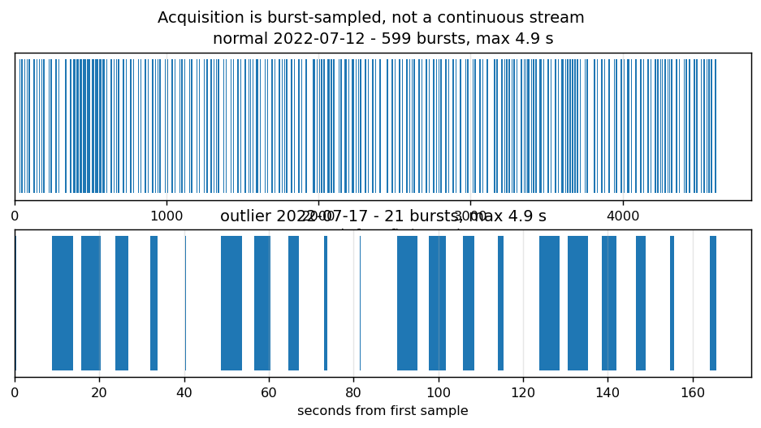
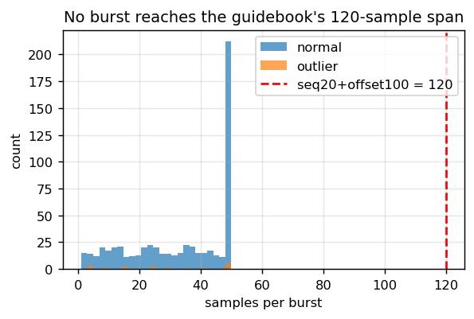
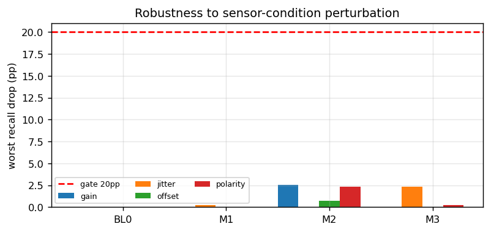

# 제6회 K-인공지능 제조데이터 분석 경진대회 보고서

> 일반국민/대학(원)생 부문 — 결과보고서

---

## 표지

| 항목 | 내용 |
|---|---|
| 프로젝트명 | CARE-Press: 수집 공백을 반영하고 전류 계측 변화를 진동으로 재확인하는 2단계 유압펌프 이상경보 체계 |
| 팀명 | |

### 내용요약

본 과제는 파인블랭킹 프레스 유압펌프의 상·하부 진동과 전류 시계열로 설비이상을 조기에 탐지하되, **정상 운전변화를 이상으로 판단하는 오경보를 함께 줄이는 것**을 목표로 한다.

분석에 앞서 제공 데이터가 연속 시계열이 아님을 확인하였다. 정상 20,000행은 벽시계 4,615.8초에 걸쳐 있으나 10 Hz 관측분은 2,000초뿐이며, 0.5초를 넘는 공백 598개로 끊어진 **599개 수집 버스트**로 구성된다. 가장 긴 버스트도 50샘플(4.9초)이어서, 공식 가이드북이 사용한 20샘플 window + 100시점 offset(=120샘플)이 들어가는 버스트는 **0개**다. 또한 정상은 2022-07-12, 이상은 2022-07-17에 기록되어 라벨이 수집일과 결합되어 있고, 이상 파일은 시작부터 고장상태이므로 독립 고장사건은 1건이며 고장 전 구간이 없다.

이 구조를 반영하여 window를 버스트 내부로 제한하고, 정상 데이터를 버스트 단위 5개 시간블록으로 나누어 3블록 학습 / 1블록 보정 / 1블록 holdout을 순환하는 평가 프로토콜을 고정하였다. 모든 스케일러와 임계값은 해당 fold의 정상 구간만으로 적합하였다. 이 조건에서 베이스라인(학습범위 이탈 규칙)과 공식 LSTM-Autoencoder를 포함한 **5개 모델을 동일 조건으로 비교**하였다.

비교 결과 탐지 지표는 포화되었다. 5개 모델 중 3개가 Recall 1.000, AP 1.000에 도달하였고, 학습 파라미터가 없는 1줄 규칙의 F1이 0.973으로 가장 높았다. 따라서 F1으로는 모델을 변별할 수 없다고 판단하고, **정상 데이터에 센서 이득·오프셋·극성·샘플링 jitter를 가했을 때의 오경보 증가**를 선정 기준으로 삼았다. 이 축에서는 모델이 크게 갈려 최악 증가폭이 M1 +89.7%p, BL-0 +61.3%p, M2 +22.3%p, **M3 PCA-MSPC +17.0%p**로 5배 이상 차이가 났다.

최종 시스템은 1단 M3로 민감하게 포착하고, 2단에서 전류를 제외한 진동 특징만으로 재확인하는 2단계 구조다. 동결된 운영 구성에서 정상 holdout 2,929 window와 고장기록 428 window 기준으로 **빨강 경보는 F1 0.931, Recall 0.876, 오경보 3건(FPR 0.0010)**이다. 1단 단독은 F1 0.780, FPR 0.082이며, 2단 진동 확인(6.9배)과 연속 3 window 규칙(11.7배)이 함께 오경보 window를 80분의 1로 줄인다. 다만 시간으로 환산하면 빨강도 정상 관측 6.3분 동안 2건(시간당 19건, 95% 상한 60건) 발생한다.

본 보고서는 다음 한계를 공개한다. 선정 게이트는 1차 결과 관찰 후 3회 개정되었으며 원 규칙으로는 BL-0가 선택되었다(제2장 표 2-5). 모델 적합과 임계값에는 이상 데이터를 쓰지 않았으나 **선정 게이트 일부에는 이상 라벨이 사용**되었다. 교차검증이 보고한 오경보율과 동결 운영 구성의 오경보율은 같은 블록에서 0.27% 대 8.23%로 30배 차이가 났다. 동결 시스템에 계측 섭동을 가한 결과 전류 계측 변화는 2단에서 걸러졌으나, 하부 진동 센서의 DC 오프셋에는 빨강이 23배 증가하여 2단이 진동 센서 이상까지 분리하지는 못한다. 전류 특징만으로도 정상·고장이 AUROC 0.999로 분리되어, 날짜·세션 교란이 전류에 집중되어 있음을 확인하였다. 제공 데이터로는 실제 고장 전 리드타임, 신규 날짜·설비 일반화, 부품 단위 원인을 주장할 수 없다.

---

상기 본인(팀)은 위의 내용과 같이 제6회 K-인공지능 제조데이터 분석 경진대회 결과보고서를 제출합니다.

2026년    월    일

- 팀장 : ______________ (서명)
- 팀원 : ______________ (서명)
- 팀원 : ______________ (서명)

**(사)중소기업기술혁신협회 귀중**

---

## □ 제1장. 데이터 이해 및 진단 〔15점〕

### 1.1 공정 맥락과 변수 정의

분석 대상은 파인블랭킹 프레스 공정이다. 판재를 잡아주는 클램핑 힘, 위에서 내리찍는 펀치 힘, 아래에서 밀어주는 이젝터 힘으로 블랭크를 만들며, 이 힘은 유압펌프가 공급한다. 펌프 내부 기어가 마모되면 진동과 소음이 커지고 출력 유압이 약해져 프레스 압력이 부족해지고, 이는 제품 불량과 비계획 정지로 이어진다.

| 변수 | 의미 | 본 분석에서의 역할 |
|---|---|---|
| `TimeStamp` | 수집 시각 | 버스트 분할과 누수 차단의 기준 |
| `AI0_Vibration` | 유압펌프 모터 **상부** 진동 | 설비 이상 증거(2단 확인에 사용) |
| `AI1_Vibration` | 유압펌프 모터 **하부** 진동 | 설비 이상 증거(2단 확인에 사용) |
| `AI2_Current` | 유압펌프 모터 전류 | 운전상태에 민감. 1단 탐지에만 사용 |
| `Equipment_state` | 설비 상태(0/1) | 파일 내 상수. 학습에 쓰지 않고 평가에만 사용 |

**세 채널 모두 평균이 0에 가깝다**(전류 +1.45, 진동 ±0.0001). 전류가 −272에서 +273까지 오가는데 평균이 0이라는 것은 센서 회로에 **AC 커플링**이 걸려 직류(DC) 성분이 제거되었음을 뜻한다. 여기서 분석 전체를 제약하는 사실이 하나 따라 나온다.

> **평균 부하 수준 정보는 데이터에 존재하지 않는다.** "펌프가 평소보다 힘들게 일하고 있는가"는 이 데이터로 답할 수 없다. 답할 수 있는 것은 **"출렁임의 크기가 변했는가 / 리듬이 바뀌었는가"** 뿐이다.

따라서 본 보고서에서 전류 RMS는 부하의 *수준*이 아니라 **부하 변동의 크기**를 가리킨다. 또한 평균이 0인 신호를 그대로 평균 내면 항상 0이므로, 모든 특징은 제곱(RMS·분산) 또는 절댓값 기반으로 정의하였다. 이 제약은 제3장 3.3의 운전모드 해석과 제4장의 조치 설계에 그대로 반영된다.

전류를 1단에만 쓰고 2단에서 제외한 이유는 제3장 3.5에서 수치로 제시한다.

### 1.2 데이터 품질 진단

| 항목 | 정상 | 이상 |
|---|---:|---:|
| 행 수 | 20,000 | 600 |
| 결측치 | 0 | 0 |
| 중복 TimeStamp | 1 | 0 |
| 시각 역행 | 0 | 0 |
| 관측 span | 4,615.8초 | 165.6초 |
| 10 Hz 연속 가정 시 | 2,000.0초 | 60.0초 |
| 0.5초 초과 공백 | **598** | **20** |

*근거: `outputs/tables/e0_data_quality.csv`*

결측과 역행은 없으나 **관측 span이 연속 가정의 2.3배**다. 차이는 전부 수집 공백이다.

### 1.3 이 데이터는 연속 시계열이 아니다

공백에서 끊으면 다음 구조가 드러난다.

| 항목 | 정상 | 이상 |
|---|---:|---:|
| 버스트 수 | **599** | **21** |
| 버스트 길이 중앙값 | 37 샘플 | 28 샘플 |
| 버스트 최대 길이 | **50 샘플 (4.9초)** | **50 샘플 (4.9초)** |
| 120샘플 이상 버스트 | **0개** | **0개** |

*근거: `outputs/tables/e0_burst_summary.csv`*





이 사실은 분석 설계를 직접 바꾼다.

**(1) 공식 가이드북의 분석 구간이 성립하지 않는다.** 가이드북은 20샘플 window에 100시점 offset을 더해 "10초 뒤를 탐지한다"고 기술하나, 120샘플이 들어가는 버스트가 양쪽 파일 모두 0개다. 행 인덱스를 균일 시간으로 간주한 결과이며, 실제 offset은 여러 버스트를 건너뛴 통제되지 않은 값이다.

**(2) 단순 sliding window의 상당수가 가짜다.** window를 버스트 내부로 제한하면 정상 기준 길이 10에서 **25.6%**, 길이 20에서 **50.1%**가 제거된다. 제거된 것은 시간상 연속이 아닌 구간을 이어붙인 window다.

| window 길이 | gap-aware window | 단순 sliding | 잔존율 |
|---:|---:|---:|---:|
| 5 | 17,652 | 19,996 | 88.3% |
| **10 (채택)** | **14,871** | 19,991 | **74.4%** |
| 20 | 9,978 | 19,981 | 49.9% |

*근거: `outputs/tables/e1_window_sensitivity.csv`*

길이 10은 프로토콜 동결 시점(`config.yaml`)에 정한 값이다. 잔존율 74.4%로 표본을 유지하면서 lag-2 자기상관 등 시간구조 특징을 안정적으로 계산할 수 있다. 길이 5·20은 민감도로만 보고하며 사후에 바꾸지 않았다.

### 1.4 일반화 한계 — 반드시 공개할 사항

- **정상 2022-07-12 / 이상 2022-07-17.** 라벨이 수집일·부하·제품·센서조건과 결합되어 있다. 두 파일을 구분하는 신호가 고장 때문인지 수집세션 때문인지 데이터만으로 분리할 수 없다.
- **독립 고장사건은 1건이다.** 이상 21버스트는 21건의 고장이 아니라 하나의 약 2분 46초 기록의 조각이다. 길이 10 기준 428 window도 그 조각들이며 독립 표본이 아니다.
- **고장 전 구간이 없다.** 이상 파일은 첫 행부터 `Equipment_state=1`이다. 따라서 **실제 조기예측 리드타임은 측정할 수 없다.**
- **10 Hz는 결함주파수 해석에 못 미친다.** Nyquist 5 Hz로, 기어 맞물림 주파수 대역과 무관하다. 본 보고서는 어떤 스펙트럼 진단도 하지 않는다.

### 1.5 전처리 전 공식 방법의 검증

가이드북은 세 채널 전체에 절댓값을 적용한다. 정상 window 14,871개에서 이 변환의 영향을 측정하였다.

| 통계량 | 절댓값 적용 시 최대 변화 | 판정 |
|---|---:|---|
| RMS | **0.000** | 불변 |
| 평균절댓값(MAV) | **0.000** | 불변 |
| 최대절댓값(PEAK) | **0.000** | 불변 |
| 커토시스 | 4.88 | 변형 |
| 표준편차 | 119.26 | 변형 |
| **부호 있는 평균** | **277.93** | **변형** |
| Peak-to-Peak | 304.18 | 변형 |

*근거: `outputs/tables/e9_abs_invariance.csv`*

RMS는 `|x|² = x²`이므로 절댓값에 **정확히 불변**이다. 즉 이 변환이 제거하는 것은 부호·위상 정보뿐이며, 이는 시계열 딥러닝이 활용할 수 있는 유일한 추가 정보다. 특히 부호 있는 평균의 변화가 큰데, 고장기록의 전류 채널은 정상 대비 큰 DC 오프셋을 가지므로 절댓값은 이 오프셋을 진폭 증가와 뒤섞는다. 본 분석은 **원신호를 사용**한다.

### 1.6 진단이 검증전략으로 이어지는 방식

| 진단 | 검증 설계 결정 |
|---|---|
| 버스트 구조 | window를 버스트 내부로 제한. 경계 버스트는 통째로 한 블록에 배정 |
| 중첩 window | 랜덤 K-fold 금지. 시간블록 CV만 사용 |
| 날짜 교란 | 이상 데이터를 적합·임계값에 쓰지 않음. 전류 의존 방어를 위해 2단 확인 도입 |
| 독립 사건 1건 | window 단위 신뢰구간을 고장 불확실성으로 해석하지 않음 |
| 고장 전 구간 없음 | "조기예측"이 아니라 "이상상태 신속 탐지"로 과제를 재정의 |

---

## □ 제2장. AI 예측모델 개발 및 성능평가 〔40점〕

### 2.1 평가 프로토콜

모델 적합과 임계값은 정상 데이터만으로 정하는 이상탐지로 설계하였다. 고장 데이터는 성능평가와, 결과 관찰 후 개정한 모델 선정 게이트 일부에 사용되었다(2.5–2.6).

- **window**: 10샘플, stride 1, 버스트 내부만
- **모델 입력 특징 23개**: A 진폭(std·p2p·rms) × 3채널 9개, S 형태(lag-1·lag-2 자기상관·영교차율) × 3채널 9개, R 관계(AI0–AI1 상관·절댓값상관·표준편차비) 3개, O 전류수준(평균·절댓값평균) 2개. 수집품질 특징(Q) 2개는 진단 전용으로 분리하여 모델 입력에서 제외
- **분할**: 정상 20,000행을 버스트 단위 5개 시간블록으로 분할. fold마다 3블록 학습 / 1블록 보정 / 1블록 holdout을 순환
- **임계값**: 보정 블록의 정상 점수로 conformal p-value를 계산하고 `p ≤ 0.01`에서 경보

p_normal(x) = ( 1 + #{ i : sᵢ ≥ s(x) } ) / ( n + 1 )　 (sᵢ: 보정 블록의 정상 점수 n개, s(x): 새 window의 점수)

- **누수 차단**: 모든 스케일러·임계값은 해당 fold의 학습·보정 블록만으로 적합. 이 불변식은 테스트 코드로 강제(`tests/test_no_leakage.py`)

### 2.2 비교 모델 (베이스라인 포함 5종)

| ID | 모델 | 역할 |
|---|---|---|
| **BL-0** | 학습범위 이탈 규칙 (특징별 최소·최대만 사용, 반복 최적화 없음) | 설명 가능한 최저 베이스라인 |
| **BL-1** | 공식 가이드북 LSTM-Autoencoder (64-32-Repeat-32-64) | 공식 기준선 |
| M1 | Ledoit-Wolf Shrinkage Mahalanobis | 화이트박스 후보 |
| M2 | Isolation Forest | 비선형 비교군 |
| M3 | PCA-MSPC (T² + SPE) | 제조현장 표준, 기여도 분해 가능 |

### 2.3 공식 LSTM-Autoencoder 재현

공식 구조를 그대로 재현하여 두 조건으로 실행하였다.

| 조건 | Precision | Recall | F1 | FPR |
|---|---:|---:|---:|---:|
| 가이드북 문헌값 | 0.664 | 0.856 | 0.748 | 0.0195 |
| **G0 재현** (3시드, 가이드북 조건) | 0.667 | 0.843 | **0.743 ± 0.029** | 0.0193 |
| **G1** (동일 네트워크, 본 프로토콜, 1시드) | 0.922 | 1.000 | **0.959** | 0.0127 |

*근거: `outputs/tables/e2_bl1_g0_guidebook.csv`, `e2_bl1_g1_planD.csv`*

G0가 문헌값을 시드 노이즈 범위에서 재현하므로, 이후의 성능 차이는 재현 실패가 아니라 **평가·전처리 프로토콜의 효과**다. 동일 네트워크·동일 옵티마이저·동일 학습예산에서 프로토콜만 바꾸어 **F1이 0.743에서 0.959로 +0.216** 상승했다. 참고로 G0는 3시드 모두 800 epoch를 소진해 조기종료가 한 번도 발동하지 않았다(G1은 499~679에서 발동).

### 2.4 동일 조건 5모델 비교

표 2-4. 5블록 교차검증, window 단위, 유병률 약 12.0%

| 모델 | Recall | Precision | F1 | AP | 평균 FP율 | 최악블록 FP율 |
|---|---:|---:|---:|---:|---:|---:|
| BL-0 범위규칙 | 1.000 | 0.949 | **0.973** | 1.000 | 0.0080 | 0.0201 |
| M1 Mahalanobis | 1.000 | 0.935 | 0.965 | 1.000 | 0.0104 | 0.0219 |
| M2 Isolation Forest | 0.932 | 0.928 | 0.929 | 0.983 | 0.0107 | 0.0222 |
| **M3 PCA-MSPC** | 1.000 | 0.928 | 0.962 | 0.999 | 0.0116 | 0.0227 |
| BL-1 LSTM-AE (G1) | 1.000 | 0.922 | 0.959 | 1.000 | 0.0127 | 0.0268 |

*근거: `outputs/tables/e2_model_comparison.csv`, `e3_normal_block_cv.csv`*

**핵심 관찰: 탐지 지표로는 모델을 변별할 수 없다.** 5개 중 3개가 Recall 1.000 · AP 1.000이고, 학습 파라미터가 없는 BL-0의 F1이 가장 높다. 정상·고장이 거의 완전히 분리되어 있으며, 이는 1.4의 날짜 교란과 분리할 수 없다. (엄밀히는 완전분리가 아니다. 최대 AUROC는 0.9999988이다.)

따라서 **F1 최고 모델을 최종모델로 삼지 않았다.**

### 2.5 선정 게이트와 개정 이력 (정직 공개)

탐지가 포화되었으므로, 다음 기준을 순서대로 적용해 탈락시켰다.

1. 수치 유효성(NaN 없음)
2. 섭동 강건성 — 계측 섭동 시 이상 Recall 하락 ≤ 20%p **그리고** 정상 오경보 증가 ≤ 20%p (원안은 Recall 하락만)
3. 최악 블록 오경보 ≤ BL-0 + 허용오차(상대 10% 또는 절대 0.005)
4. 이상 버스트 최소 1개 탐지
5. conformal 교정 오차(α=0.10) ≤ 0.05

표 2-5. **원 게이트와 개정 게이트의 선정 결과**

| 모델 | F1 | 최악블록 FP율 | 섭동 Recall하락 | 섭동 오경보증가 | 교정오차 | 원 게이트 | 개정 게이트 |
|---|---:|---:|---:|---:|---:|:---:|:---:|
| BL-0 | 0.9734 | 0.0201 | 0.00 pp | **61.28 pp** | **0.0872** | **통과** | 탈락 |
| M1 | 0.9654 | 0.0219 | 0.23 pp | **89.72 pp** | 0.0017 | 탈락 | 탈락 |
| M2 | 0.9291 | 0.0222 | 2.57 pp | 22.34 pp | 0.0163 | 탈락 | 탈락 |
| **M3** | 0.9618 | 0.0227 | 2.34 pp | **16.98 pp** | 0.0133 | 탈락 | **통과** |
| BL-1 | 0.9588 | 0.0268 | 미평가 | 미평가 | 미평가 | 탈락 | 탈락 |

*근거: `outputs/tables/r1_gate_before_after.csv`, `e2_selection_gates.csv`*

**게이트는 1차 결과를 본 뒤 3회 개정하였으며, 원 규칙으로는 BL-0가 선택된다.** 개정 내역과 사유는 `decision_log.md`에 날짜·시각과 함께 기록되어 있다.

- **DL-001**: 원안의 강건성 기준은 "이상 Recall 하락"이었으나, Recall이 1.000으로 포화되어 BL-0·M1·M3 모두 하락폭이 0.00~0.23pp로 **변별력이 없었다**. 정상측 오경보 증가를 병행 기준으로 추가하였다.
- **DL-002**: 원안의 "최악 블록 오경보 ≤ BL-0"를 엄격 적용하면 M1(0.0219)·M3(0.0227)이 BL-0(0.0201) 대비 소수점 차이로 전원 탈락하여, "BL-0는 최저 기준선"이라는 설계 취지와 모순된다. 허용오차를 도입하였다.
- **DL-003**: BL-0는 학습범위 내 점수가 전부 0으로 동률이라 p-value 해상도가 없다(α=0.10에서 실제 coverage 0.013). 임계값을 확률로 해석할 수 없는 모델을 주력에서 제외하는 교정 게이트를 신설하였다.

**BL-1의 게이트 2·5는 평가하지 못하였다.** 섭동 시험은 fold×섭동 조합마다 재학습이 필요한데 이 신경망의 5-fold 1회 실행이 CPU로 3.6시간이 걸려 계산예산을 한 자릿수 이상 초과한다. BL-1의 탈락 근거는 **측정된 게이트 3(최악블록 FP율 0.0268 > 허용한도 0.0251) 하나**이며, 모든 기준에서 열등했다고 주장하지 않는다.

### 2.6 이상 데이터 사용 범위 (정정)

| 단계 | 이상 데이터 사용 여부 |
|---|---|
| 특징 설계 | 미사용 |
| 스케일러·PCA 적합 | **미사용** (정상 학습블록만) |
| 임계값 결정 | **미사용** (정상 보정블록만, conformal) |
| 모델 선정 게이트 2 (섭동 시 이상 Recall 하락) | **사용** |
| 모델 선정 게이트 4 (버스트 탐지) | **사용** |
| 동률 해소 2차 정렬키 (Recall) | **사용** |
| 특징군 ablation 해석 | **사용** |

적합과 임계값에는 이상을 쓰지 않았으나, **모델 선정 일부에는 이상 라벨이 사용되었다.** 또한 본 프로토콜 고정 이전의 사전실험에서 이상 데이터를 반복 관찰하였으므로, 본 결과를 완전한 미지 테스트라고 주장하지 않는다.

### 2.7 최종 모델: CARE-Press 2단계 구조

```
원시 CSV → 품질검사 → 버스트 분할 → gap-safe 10샘플 window
        → A/S/R/O 특징 23개
        → [1단] M3 PCA-MSPC (전체 특징)        : 민감 포착
        → [2단] M1 Mahalanobis (전류 제외 진동) : 설비이상 재확인
        → conformal p-value + 특징 기여도
        → 초록 / 노랑 / 빨강 + 확인 후보 + 권고조치
```

| 경보 | 조건 |
|---|---|
| 초록 | `p₁ > 0.01` |
| 노랑 | `p₁ ≤ 0.01` 이고 빨강 아님 |
| 빨강 | `p₁ ≤ 0.01` **이고** `p₂ ≤ 0.01`이 같은 버스트에서 **연속 3 window** |

최종 적합은 학습 블록 0–2, 보정 블록 3이며, 블록 4는 이 구성이 한 번도 보지 않은 구간이다.

### 2.8 성능: 비교용 수치와 운영 수치의 분리

표 2-8. 단위·표본·유병률을 명시한 성능표

| 기준 | 단위 | 표본 | 유병률 | Precision | Recall | F1 | FPR |
|---|---|---|---:|---:|---:|---:|---:|
| BL-0 (CV 5-fold 평균) | window | fold별 정상 holdout + 고장 428 | 12.0% | 0.949 | 1.000 | 0.973 | 0.0080 |
| M3 (CV 5-fold 평균) | window | 〃 | 12.0% | 0.928 | 1.000 | 0.962 | 0.0116 |
| BL-1 (CV 5-fold 평균) | window | 〃 | 12.0% | 0.922 | 1.000 | 0.959 | 0.0127 |
| **1단 경보 (운영)** | window | **holdout 2,929 + 고장 428** | 12.75% | 0.640 | 1.000 | **0.780** | **0.0823** |
| **최종 빨강 (운영)** | window | 〃 | 12.75% | **0.992** | 0.876 | **0.931** | **0.0010** |

*근거: `outputs/tables/r2_operational_performance.csv`, `outputs/predictions.csv`*

- 상단 3행은 **모델 비교용**이다. fold마다 동일한 고장 428 window를 재사용하므로 운영 성능이 아니다.
- 하단 2행이 **동결 운영 구성의 실제 성능**이다. 오경보 window가 241개에서 3개로, FPR이 0.0823에서 0.0010으로 **80분의 1**이 된다. 대가는 Recall 1.000 → 0.876이다.

이 감소가 어디서 오는지 같은 예측으로 분해하였다.

표 2-8b. 오경보 감소의 분해 (holdout 2,929 + 고장 428 window, 유병률 12.75%)

| 판정 규칙 | FP | Recall | F1 | FPR | 1단 대비 FPR 감소 | 정상 경보 사건/h |
|---|---:|---:|---:|---:|---:|---:|
| 1단 단독 | 241 | 1.000 | 0.780 | 0.0823 | 1.0배 | 1287 |
| 2단 단독(진동 M1) | 39 | 0.963 | 0.937 | 0.0133 | 6.2배 | 219 |
| 1단 + 지속성3 | 52 | 0.923 | 0.903 | 0.0178 | 4.6배 | 238 |
| 2단 + 지속성3 | 8 | 0.876 | 0.925 | 0.0027 | 30.1배 | 29 |
| 1단 AND 2단 | 35 | 0.963 | 0.942 | 0.0119 | 6.9배 | 219 |
| 1단 AND 2단 + 지속성3 (=빨강) | 3 | 0.876 | 0.931 | 0.0010 | 80.3배 | 19 |

*근거: `outputs/tables/r8_stage_decomposition.csv`*

2단 진동 확인 단독 효과는 **6.9배**, 연속 3 window 규칙이 추가로 **11.7배**다. 2단 + 지속성 위에 1단을 더하면 FPR이 0.0027에서 0.0010으로 2.7배 더 낮아진다. 즉 오경보 감소의 상당 부분은 지속성 규칙에서 나오며, 그 대가가 Recall 하락(0.963 → 0.876)이다.

### 2.9 확률 제시와 그 한계

본 모델의 `risk_score = 1 − p_normal`은 **순위 통계이지 고장 확률이 아니다.** 이를 확률처럼 쓰면 안 되는 이유를 수치로 공개한다.

| 지표 | risk_score | 상수예측(기저율) |
|---|---:|---:|
| Brier | **0.487** | 0.111 |
| log-loss | 1.695 | 0.382 |

교환가능성이 성립하면 정상 데이터의 `1−p`는 0–1 균등분포여야 한다. 그러나 동결 구성의 정상 holdout에서는 73%가 0.5를 넘는다. 보정 블록과 평가 블록 사이의 분포 이동 때문이며(3.4), 따라서 `risk_score`를 확률로 쓸 수 없다. 확률 해석에는 아래의 **사후확률 민감도표**를 사용한다.

표 2-9. 고장 유병률(window당 사전확률) 가정별 `P(고장 | 빨강)` — 빨강 TPR 0.876(95% 하한 0.841), FPR 0.00102(95% 상한 0.0030)

| 가정 고장 유병률 | 점추정 | 보수적 추정(TPR 하한·FPR 상한) |
|---:|---:|---:|
| 1% | **0.896** | 0.740 |
| 0.1% | 0.461 | 0.220 |
| 0.01% | 0.079 | 0.027 |

*근거: `outputs/tables/r10_posterior_bounds.csv`, `r3_risk_score_calibration.csv`. window는 서로 겹치고 고장은 1건이므로 이 구간도 실제 불확실성보다 좁다.*

현장 고장률이 window당 0.1% 수준이면 빨강 경보의 절반가량(보수적으로는 약 4/5)이 오경보일 수 있다. 이 표는 제4장의 경보 운영 정책을 정하는 근거다.

---

## □ 제3장. 영향요인 및 오류분석 〔15점〕

### 3.1 탐지력을 만드는 변수 (특징군 ablation)

표 3-1. 특징군별 평균 AP (M1 / M3)

| 특징군 조합 | M1 | M3 |
|---|---:|---:|
| 전체 (A·S·R·O) | 1.0000 | 0.9988 |
| A 제외 | 0.9997 | 0.9984 |
| S 제외 | 0.9987 | 0.9810 |
| R 제외 | 1.0000 | 1.0000 |
| O 제외 | 1.0000 | 0.9987 |
| **A(진폭) 단독** | **0.9935** | 0.9772 |
| **S(형태) 단독** | **0.9986** | 0.9956 |
| R(관계) 단독 | 0.6923 | 0.6922 |
| O(전류수준) 단독 | 0.5052 | 0.5058 |

*근거: `outputs/tables/e4_feature_ablation.csv`*

형태(S) 단독으로 AP 0.9986, 진폭(A) 단독으로 0.9935에 도달한다. 어느 한 군을 빼도 AP가 0.98 아래로 떨어지지 않는다. **신호가 여러 특징군에 중복되어 있다는 것은 국소적 고장 메커니즘이 아니라 두 기록 전체의 차이**라는 신호이며, 1.4의 날짜 교란 경고와 일치한다.

### 3.2 모델이 실패하는 조건 — 계측 변화

정상 데이터에 설비 고장이 아닌 변화를 가했을 때 오경보가 얼마나 증가하는지 측정하였다.

표 3-2. 섭동별 최악 오경보 증가폭(%p)

| 모델 | 이득 | 오프셋 | 극성반전 | 샘플링 jitter | 최악 |
|---|---:|---:|---:|---:|---:|
| BL-0 | **61.3** | 30.0 | 0.5 | 16.3 | 61.3 |
| M1 | 8.3 | **89.7** | 5.3 | 23.2 | 89.7 |
| M2 | 22.3 | 5.0 | 1.9 | 6.6 | 22.3 |
| **M3** | 6.3 | 17.0 | 11.3 | 3.5 | **17.0** |

*근거: `outputs/tables/e5_robustness_summary.csv`, `e6_shift_false_alarm.csv`*



M1은 세 채널 모두에 학습 표준편차 절반의 DC 오프셋을 동시에 가하면 정상 window의 89.8%를 이상으로 판정한다. BL-0는 이득 변화에서 무너진다. 이 축이 1단 모델 선정의 실제 근거다. 단, 이 시험은 1단 후보만 대상으로 했다. 최종 2단 시스템의 섭동 결과는 3.7에서 별도로 보고한다.

### 3.3 오경보가 집중되는 조건

표 3-3. 정상 holdout의 조건별 오경보율 (1단 M3, 5-fold CV)

| 조건 | 평균 오경보율 | 최악 블록 |
|---|---:|---:|
| **RMS 하위 3분위** | **2.30%** | 4.69% |
| RMS 중위 3분위 | 1.39% | 3.51% |
| **RMS 상위 3분위** | **0.20%** | 0.46% |
| 버스트 시작 1초 이내 | 1.53% | 3.91% |
| 버스트 시작 1초 이후 | 0.94% | 1.82% |

*근거: `outputs/tables/e7_error_conditions_summary.csv`*

**오경보는 RMS 하위 3분위에 11.5배 집중된다.** 이 RMS는 세 채널 RMS의 평균이며, 전류의 크기가 진동보다 수백 배 커서 사실상 전류 변동 수준을 나타낸다. 버스트 시작부도 1.6배 높다.

#### 3.3.1 낮은 전류 변동 구간의 정체 — 제2의 정상 운전모드

앞 문단의 "RMS 하위 3분위"가 실제로 무엇인지를 버스트 단위로 확인하였다. 정상 파일의 **3,600–4,280초 구간(버스트 79개, 약 11분)** 이 나머지와 통계적으로 뚜렷이 구분된다.

표 3-3b. 운전모드 3분할 (버스트 단위, 길이 10샘플 이상)

| 상태 | 버스트 | 상부 RMS | 하부 RMS | 전류 RMS | 상·하부 상관 |
|---|---:|---:|---:|---:|---:|
| 정상 — 주운전 | 451 | 0.072 | 0.114 | 121.2 | **+0.315** |
| 정상 — **저부하** | **79** | **0.038** | **0.044** | 84.3 | **−0.206** |
| 고장 | 17 | **0.373** | 0.202 | 87.3 | **−0.274** |

*근거: `outputs/tables/d1_operating_modes.csv` (`make_domain_tables.py`)*

이 구간은 `Equipment_state = 0`, 즉 **설비가 정상이라고 라벨된 운전변화**다. 진동·전류가 함께 줄어든 저부하 운전으로, 공정이 잠시 쉬었거나 가벼운 작업으로 전환된 것으로 해석된다. 1.1절의 AC 커플링 제약 때문에 절대 부하를 확인할 수는 없으나, 세 채널의 변동폭이 동시에 감소한 것은 운전 강도가 낮아졌다는 해석과 일관된다.

**여기서 오경보의 구조적 원인이 드러난다.** 저부하 정상과 고장을 두 지표로 비교하면 범위가 완전히 겹친다.

| 지표 | 저부하 정상 | 고장 | 판정 |
|---|---|---|---|
| 전류 RMS | 57.2 – 92.8 | 34.6 – 132.9 | **완전 겹침** |
| 상·하부 상관 | −0.70 – +0.16 | −0.68 – +0.58 | **완전 겹침** |
| **상부 진동 RMS** | 평균 0.038 | 평균 0.373 | **9.8배 분리** |

> **오경보 발생조건**: 전류 또는 채널 간 상관을 판정 기준으로 삼는 탐지기는 **정상적인 저부하 운전을 고장으로 오인할 수밖에 없다.** 임계값 선택의 문제가 아니라 두 상태의 분포가 겹쳐 있어 **어떤 임계값으로도 분리가 불가능**하기 때문이다. 두 상태를 가르는 것은 **상부 진동 RMS 하나뿐**이다.

이것이 본 시스템이 1단(전류 포함)만으로 판정하지 않고 **2단에서 진동만으로 재확인**하는 구조를 택한 직접적 근거다(3.5절). 출제문이 요구한 "정상적인 운전변화를 이상으로 판단하는 오경보"의 실체가 이 구간이다.

### 3.4 교차검증이 운영 오경보를 대표하지 않는다

본 분석에서 가장 중요한 부정적 발견이다.

| 구성 | 블록 4에서의 1단 오경보율 |
|---|---:|
| CV fold (학습 1–3, 보정 **0**) | **0.27%** (8 / 2,929) |
| 동결 운영 구성 (학습 0–2, 보정 **3**) | **8.23%** (241 / 2,929) |

*근거: `outputs/tables/e3_normal_block_cv.csv` 19행, `outputs/predictions.csv`*

**같은 모델, 같은 평가 블록인데 30배 차이가 난다.** 차이의 원인은 보정 블록뿐이다. 블록 3은 CV에서 오경보 3건에 불과한 조용한 구간이라, 여기서 정한 임계값이 블록 4의 운전변화를 견디지 못한다. 비녹색 241개 중 217개가 원본 행 16,000–19,000 구간에 몰려 있고, 블록 4의 106개 버스트 중 54개(51%)에서 노랑이 울린다.

이는 중첩 window와 블록 분할에서 conformal의 교환가능성 가정이 성립하지 않는다는 직접 증거다. 따라서 **본 보고서는 CV 오경보율을 시스템 성능으로 제시하지 않으며**, 제2장 표 2-8에서 운영 수치를 별도로 보고한다. 블록이 5개뿐이고 고장사건이 1건이므로, 이를 더 줄일 여유 데이터가 없다는 점도 함께 밝힌다.

### 3.5 전류 채널 의존과 2단 확인의 필요성

표 3-5. 1단 점수의 1순위 기여 특징이 전류 채널인 비율

| 대상 | window 수 | 전류 1순위 | 비중 |
|---|---:|---:|---:|
| 고장 기록 | 428 | 307 | **71.7%** |
| 정상 holdout | 2,929 | 766 | 26.2% |

*근거: `outputs/tables/r5_stage1_channel_share.csv`*

고장 window의 71.7%에서 1단의 최대 기여 특징이 전류 유래다. 전류는 운전상태에 민감한 동시에 **수집세션(날짜) 차이에도 민감**하므로, 1단 단독 판정은 "다른 날의 전류 계측조건"을 탐지했을 가능성을 배제할 수 없다.

이것이 2단에서 전류를 제외한 진동 특징만으로 재확인하는 이유다. 2단은 고장 window의 96.3%에서 `p ≤ 0.01`이므로, **진동만으로도 독립적인 이상 증거가 존재한다.** 1단만 울리는 경우를 설비 고장이 아니라 계측·운전조건 확인(노랑)으로 분리하는 근거가 여기에 있다.

이 판단을 음성 대조로 확인하였다.

표 3-5b. 음성 대조 — 1단 M3의 입력 채널만 바꾼 결과 (2단·임계값·지속성 동일, 진단 전용)

| 1단 입력 | 특징 수 | 1단 AUROC | 1단 AP | 1단 정상 경보율 | 빨강 Recall | 빨강 정상 경보율 |
|---|---:|---:|---:|---:|---:|---:|
| 제출본 전체 (A·S·R·O) | 23 | 1.0000 | 0.9998 | 8.23% | 0.876 | 0.10% |
| 진동 전용 (전류·O 제외) | 15 | 0.9836 | 0.9465 | 6.01% | 0.801 | 0.17% |
| 전류 전용 (CUR·O) | 8 | 0.9992 | 0.9983 | 1.40% | 0.869 | 0.00% |

*근거: `outputs/tables/r11_negative_control_channels.csv`*

**전류 특징 8개만으로 1단 AUROC가 0.999에 이른다.** 날짜·세션 교란이 전류 채널에 집중되어 있다는 직접 증거다. 진동 전용 1단도 AUROC 0.984로 분리 신호를 가지므로, 2단 진동 확인의 근거는 유지된다. 이 표는 진단용이며, 이를 보고 제출 모델을 바꾸지 않았다(바꾸면 사후선택이 된다).

#### 3.5.1 전류 채널의 역할 재정의

전류에 대한 두 측정 결과는 언뜻 모순으로 보인다.

| 측정 | 결과 | 절 |
|---|---|---|
| 전류 특징 8개 → 정상/고장 분리 | AUROC **0.999** | 3.5b |
| 전류 RMS → 저부하 정상/고장 분리 | **완전 겹침**(57–93 vs 35–133) | 3.3.1 |

둘 다 사실이며, 측정하는 대상이 다르다.

- **전류의 구조**(자기상관·캐리어 성분)는 **수집 세션**을 가른다. 정상은 7월 12일, 고장은 7월 17일이고 두 날짜가 겹치지 않으므로, 세션 차이가 라벨과 완전히 교락되어 AUROC 0.999가 나온다. 이것은 고장 탐지력이 아니라 **교란의 크기**를 재는 수치다.
- **전류의 진폭**(RMS)은 **운전모드**를 가른다(주운전 121 vs 저부하 84). 그러나 고장(87)은 저부하 정상과 구분되지 않는다.

> **따라서 전류는 고장의 증거로 쓰지 않는다.** 세션 교란이 집중되어 있고(구조), 고장 판별력은 없기 때문이다(진폭). 대신 **운전모드 식별에는 판별력이 있으므로 그 용도로만 사용한다.**

이 원칙이 본 시스템의 2단 구조를 결정했다. 1단은 민감도를 위해 전류를 포함하되 그 결과를 **단독 판정으로 쓰지 않고**(노랑 = 기록), 2단에서 **전류를 완전히 제외한 진동만으로 재확인한 경우에만** 빨강으로 승격한다. 1.1절의 AC 커플링 제약 — 평균 부하 수준이 데이터에 없다 — 역시 같은 결론을 지지한다. 전류로 알 수 있는 것은 "지금 어떤 운전모드인가"이지 "펌프가 고장났는가"가 아니다.

### 3.6 미탐지가 발생하는 조건

최종 빨강 기준으로 고장 window 428개 중 53개를 놓친다.

표 3-6. 빨강 미탐 53 window의 원인 (1단 → 2단 → 버스트 길이 → 위치 순으로 판정)

| 원인 | 미탐 window | 비중 |
|---|---:|---:|
| 버스트 첫 2 window(지속성 구조) | 29 | 54.7% |
| 2단(진동) 미확인 | 16 | 30.2% |
| 연속 3 미충족(중간 끊김) | 7 | 13.2% |
| 버스트 window < 3 | 1 | 1.9% |

*근거: `outputs/tables/r9_red_fn_causes.csv`, `r9_burst_detection.csv`*

빨강은 "연속 3 window"를 요구하므로 각 버스트의 첫 2 window는 **구조적으로 빨강이 될 수 없다.** 이 지속성 구조가 미탐의 절반 이상(29건)이고, 16건은 진동 2단이 확인하지 못한 경우, 7건은 연속 3 window가 중간에 끊긴 경우다. 버스트 단위로는 이상 버스트 17개 중 1단이 17개, **빨강이 15개를 탐지**하며, 1 window·6 window짜리 짧은 버스트 2개(19·20번)는 빨강이 한 번도 울리지 않았다.

즉 미탐의 주원인은 확인 조건을 채울 관측량 부족과 진동 증거의 부재이며, 짧은 관측은 제4장에서 판정 보류로 다루도록 제안한다.

#### 3.6.1 진동 증거 자체가 없는 구간 — 모델이 아니라 데이터의 성질

위 표의 "2단(진동) 미확인 16건"이 왜 생기는지를 버스트 단위로 추적하였다. 이상 버스트 17개 중 **3개는 상부 진동 RMS가 정상 전체의 최댓값(0.147)보다도 낮다.**

표 3-6b. 조용한 이상 버스트

| 버스트 | 샘플 | 이벤트 내 시각 | 상부 RMS | 전류 RMS | 상·하부 상관 | 위치 |
|---:|---:|---:|---:|---:|---:|---|
| 2 | 31 | **23.8 s** | 0.029 | 66.6 | +0.18 | 이벤트 초반 |
| 15 | 10 | **154.7 s** | 0.026 | 59.6 | +0.58 | 종료 직전 |
| 16 | 15 | **164.2 s** | 0.021 | 34.6 | +0.18 | 종료 직전 |

*근거: `outputs/tables/d2_quiet_bursts.csv`. 이벤트 전체 길이 165.6 s*

세 버스트는 상부 RMS가 저부하 정상의 평균(0.038)보다도 낮고, **전류와 상·하부 상관 역시 전부 정상 범위 안에 있다.** 어떤 특징량 조합으로도 정상과 분리할 방법이 없다.

> **미탐지 발생조건**: 이상 이벤트 내부에도 **신호가 나타나지 않는 조용한 구간**이 존재하며, 그 위치는 **이벤트 초반(23.8 s)과 종료 직전(154.7 s, 164.2 s)** 이다. 이는 모델 성능의 문제가 아니라 **데이터의 구조적 성질**이다. 버스트 하나만 보고 그 자리에서 판정하는 한, 17개 중 3개는 구조적으로 놓친다.

이 사실은 3.6 표의 "지속성 구조(29건)"와 방향이 같다. 둘 다 **단일 관측 즉시 판정의 한계**를 가리킨다.

#### 3.6.2 시간적 통합 규칙의 맞바꿈 — 느슨한 규칙이 답이 아니다

통상 예지보전에서는 "N개 중 M개 경보 시 확정"과 같은 **느슨한 시간적 통합**이 미탐과 오경보를 동시에 줄이는 수단으로 권고된다. 조용한 구간(3.6.1)을 건너뛸 수 있기 때문이다. 본 제출본의 빨강 규칙은 **연속 3 window**이므로, 이를 (N, M)으로 일반화해 실제로 그러한지 검증하였다.

표 3-6c. 시간적 통합 규칙별 맞바꿈 (고장 버스트 17 · 정상 holdout 2,929 window)

| 규칙 | 탐지 버스트 | window Recall | 오경보 window | 오경보 이벤트 | 지연 중앙 | 지연 최대 |
|---|---:|---:|---:|---:|---:|---:|
| 연속 1 (즉시) | **16/17** | **0.963** | 35 | 23 | 0.0 s | 0.0 s |
| 연속 2 | 15/17 | 0.916 | 12 | 9 | 0.1 s | 0.6 s |
| 3중 2 | 15/17 | 0.893 | 23 | 8 | 0.2 s | 0.6 s |
| **연속 3 (제출본)** | 15/17 | 0.876 | **3** | **2** | 0.2 s | 0.7 s |
| 4중 3 | 15/17 | 0.853 | 8 | 3 | 0.3 s | 0.7 s |
| 5중 3 | 15/17 | 0.829 | 15 | 5 | 0.4 s | 0.7 s |
| 5중 4 | 15/17 | 0.811 | 4 | 1 | 0.4 s | 1.4 s |
| 연속 5 | 14/17 | 0.799 | **0** | **0** | 0.4 s | 1.5 s |

*근거: `outputs/tables/d4_mofn_tradeoff.csv` (`make_mofn_table.py`). 판정 조건은 제출본과 동일(1단∧2단 `p ≤ 0.01`), 창은 버스트를 넘지 않는다.*

**세 가지가 드러난다.**

1. **느슨한 규칙은 이 데이터에서 오히려 나쁘다.** 3중 2는 연속 3보다 오경보 window가 **7.7배(3 → 23)** 많은데 탐지 버스트는 15/17로 같다. 5중 3도 연속 5 대비 오경보가 0 → 15로 늘어난다. 정상 holdout의 빨강 후보 35개가 **산발적으로 흩어져 있어** 창을 넓히면 서로 다른 후보가 같은 창에 들어오기 때문이다. 일반론으로 권고되는 M-of-N이 **이 데이터에서는 성립하지 않는다.**
2. **지연은 사실상 비용이 아니다.** window stride가 0.1초이므로 연속 1에서 연속 5로 가도 지연 중앙값은 0.0 → 0.4초, 최대 1.5초다. 버스트 수집 주기(약 8초)와 비교하면 무시할 수준이다. **따라서 이 설비에서 맞바꿈의 축은 "지연 vs 오경보"가 아니라 "미탐 vs 오경보"다.**
3. **제출본의 연속 3은 사후적으로도 합리적 지점이다.** 연속 1 대비 오경보를 35 → 3으로 **11.7배** 줄이면서 탐지 버스트는 16 → 15로 하나만 잃는다. 연속 5로 더 가면 오경보가 0이 되지만 버스트를 하나 더(15 → 14) 놓친다.

> 이 표는 **진단용이며 제출 모델을 바꾸지 않았다.** 연속 3은 결과를 보기 전에 고정한 값이고, 표는 그 선택이 어느 지점에 있는지를 사후 확인한 것이다. 바꾸면 사후선택이 된다(2.5절과 같은 원칙).

**한계**: 정상 holdout이 0.081시간(약 5분)뿐이라 오경보 이벤트 수를 시간당 비율로 환산하면 추정이 불안정하다. 본 표는 **건수로만** 보고하며, 시간당 경보 예산은 제4장 4.3에서 별도로 다룬다.

### 3.7 최종 2단 시스템의 섭동 시험

3.2의 섭동 시험은 1단 후보만 대상으로 했다. 동결된 최종 시스템 전체(1단 M3 + 2단 진동 M1 + 연속 3 window)에 같은 종류의 섭동을 가하고 임계값을 그대로 둔 채 다시 판정하였다.

표 3-7. 동결 2단 시스템 섭동 시험 (정상 holdout 2,929 window / 고장 428 window, 임계값 불변)

| 섭동 | 정상 1단 경보율 | 정상 2단 경보율 | 정상 빨강 경보율 | 빨강 증가 | 고장 빨강 Recall |
|---|---:|---:|---:|---:|---:|
| 섭동 없음 | 8.23% | 1.33% | 0.10% | 1.0배 | 0.876 |
| 전류(AI2)만 offset +0.5σ | 27.52% | 1.33% | 0.24% | 2.3배 | 0.876 |
| 전류만 gain ×1.25 | 26.12% | 1.33% | 0.17% | 1.7배 | 0.876 |
| 전류 극성 반전 | 8.23% | 1.33% | 0.10% | 1.0배 | 0.876 |
| 상부 진동(AI0)만 offset +0.5σ | 8.19% | 2.39% | 0.31% | 3.0배 | 0.876 |
| 하부 진동(AI1)만 offset +0.25σ | 8.26% | 7.75% | 0.51% | 5.0배 | 0.916 |
| 하부 진동(AI1)만 offset +0.5σ | 9.25% | 83.75% | 2.39% | 23.3배 | 0.897 |
| 상부 진동만 gain ×1.25 | 12.05% | 2.94% | 0.82% | 8.0배 | 0.895 |
| 상부 진동 극성 반전 | 7.31% | 2.46% | 0.68% | 6.7배 | 0.867 |
| 전 채널 gain ×1.25 | 18.81% | 1.91% | 0.55% | 5.3배 | 0.895 |
| 전 채널 offset +0.5σ | 26.43% | 82.72% | 9.90% | 96.7배 | 0.914 |
| 샘플링 jitter 0.05 s | 15.84% | 4.23% | 0.41% | 4.0배 | 0.904 |

*근거: `outputs/tables/r6_frozen_system_stress.csv` (36개 조건 전체)*

전류 쪽 변화(오프셋·이득·극성)는 1단 경보를 늘리지만 2단에서 걸러져 빨강 증가가 2.3배 이내다. **반면 하부 진동(AI1)에 DC 오프셋이 생기면 2단 자체가 정상 window의 84%를 이상으로 보고 빨강이 23배 늘어난다.** 2단 모델은 선정 게이트에서 섭동 시험을 거치지 않았으며, 이 표가 첫 시험 결과다. 따라서 본 시스템은 전류 계측 변화와 설비 이상은 분리하지만, 진동 센서 이상까지 분리하지는 못한다. 이 결과를 제4장의 빨강 처리 절차(센서 확인 선행)에 반영하였다.

---

## □ 제4장. 현장 활용방안 〔10점〕

### 4.0 왜 이 설비를 감시해야 하는가 — 공정상의 위치

파인블랭킹은 일반 블랭킹과 달리 **세 방향의 힘**(펀치, 판재를 붙드는 V-링, 아래에서 받치는 카운터)을 스트로크 내내 **동시에** 유지하여 판 두께의 0.5% 이하라는 극소 틈에서 절단한다. 그 결과 한 번에 100% 매끈한 절단면이 나온다. 세 힘의 동시 유지는 전적으로 **유압 압력의 안정성**에 의존하며, 그 압력을 만드는 것이 본 분석 대상인 유압펌프다.

> 압력이 흔들리면 → V-링이 판재를 붙잡지 못함 → 매끈해야 할 면에 **버(burr)와 파단면** → 치수 산포 → **불량품**. 가이드북은 이 공정이 **1,000톤급** 힘을 전달하며, 펌프 고장 시 수리비와 부품 수급 때문에 **최대 2~3일 가동 중단**이 발생한다고 기술한다.

즉 유압펌프는 이 라인의 급소이고, 고장의 비용은 수리비가 아니라 **2~3일치 생산**이다. 이것이 감시 대상을 펌프로 잡은 이유다.

현재 공정의 보전 수준도 과제문에 적혀 있다 — "주기점검이나 작업자의 경험에 따라 설비상태를 판단".

| 방식 | 언제 고치나 | 한계 |
|---|---|---|
| 사후보전 | 고장난 뒤 | 생산 중단, 2차 피해, 비용 최대 |
| **예방보전** ← 현재 | 정해진 주기마다 | 멀쩡한 부품을 교체 / 주기 사이의 고장은 못 막음 |
| **예지보전** ← 목표 | 징후가 보일 때 | 징후를 제대로 읽어야 함 |

가이드북은 기존 이상징후 판별이 "숙련된 작업자가 **작동 소음**으로 파악"하는 수준이며 비숙련자는 파악이 불가능하다고 적는다. 본 시스템의 목표는 이 판단을 **숙련도에 의존하지 않는 계측 기반 판단**으로 바꾸는 것이다. 4.1의 4단계 경보는 그 판단을 작업자 행동으로 번역한 것이다.

### 4.1 경보 단계와 작업자 조치

모델 출력은 0/1이 아니라 다음 4개 상태다.

| 상태 | 조건 | 화면 표시 | 작업자 조치 | 이관 |
|---|---|---|---|---|
| **초록** | 1단 정상 | 정상범위, 현재 부하상태 | 계속 운전 | 없음 |
| **관측부족** (운영 제안, 현 코드 미구현) | 버스트 < 3 window | 판정 보류 | 다음 버스트 대기 또는 재측정 | 반복 시 DAQ 점검 |
| **노랑** | 1단 이상, 2단 미확인 | 위험순위 + 확인후보 2개 | **기록·누적만. 즉시 조치 없음** | 버스트 대비 노랑 비율이 시범운영 기준선의 2배를 넘으면 정비 통보 |
| **빨강** | 1·2단 동시 이상 연속 3 window | 전류·진동 증거와 점검항목 | ① 진동 센서 DC 수준·체결 확인 → ② 재측정 → ③ 지속 시 생산일정 조정 후 유압펌프 정밀점검 | 설비담당자 승인 |

**노랑을 "즉시 점검"이 아니라 "기록·누적"으로 정의한 것은 3.4의 결과 때문이다.** 동결 운영 구성에서 정상 holdout의 8.13%가 노랑이고 106개 버스트 중 54개에서 1회 이상 울린다. 이 빈도로 교대 내 점검을 지시하면 작업자가 경보를 신뢰하지 않게 된다. 빨강은 2,929 window 중 3개지만, 시간으로 환산하면 정상 관측 6.3분 동안 2건(시간당 19건, 95% 상한 60건)이다(표 4-1b). 따라서 빨강도 곧바로 정지·정비로 이어지지 않게, 3.7의 결과에 따라 **진동 센서 확인과 재측정을 먼저** 하도록 정했다. 노랑 승격 기준도 교대당 횟수가 아니라 버스트 대비 비율로 정의했는데, 노랑은 같은 6.3분에 135건이 발생하여 횟수 기준은 매 교대 발동하기 때문이다. 이 정책들은 holdout 결과를 보고 정했으며, 실제 빈도와 승격 기준선은 교대 단위 시범운영으로 확정해야 한다.

표 4-1b. 정상 holdout의 경보 빈도 (관측 0.105시간 = 약 6.3분)

| 경보 | window | 경보 사건 | 알람 버스트 / 전체 | 사건/시간 | 95% 상한/시간 |
|---|---:|---:|---:|---:|---:|
| 1단 경보(노랑+빨강) | 241 | 135 | 54 / 106 | 1287 | 1484 |
| 노랑 | 238 | 135 | 54 / 106 | 1287 | 1484 |
| 빨강 | 3 | 2 | 2 / 106 | 19 | 60 |

*근거: `outputs/tables/r7_alarm_event_rates.csv`. 사건 = 같은 버스트에서 연속된 경보 window 묶음*

### 4.2 확인 후보와 점검 순서

출력의 `top_reason_1/2`는 **원인 판정이 아니라 우선 확인 후보**다. 특징 기여도에서 기계적으로 생성되며 물리적 인과를 입증하지 않는다.

| 상위 기여 특징 | 우선 확인 후보 |
|---|---|
| 전류 수준·형태 (`O_*`, `*_CUR`) | 전류센서 이득·오프셋·결선, DAQ 시각 |
| 상·하부 진동 관계 (`R_*`) | 체결·정렬 상태, 베어링 유격 |
| 진동 시간구조 (`S_*`) | DAQ 시각 동기화, 샘플링 |
| 진동 진폭 (`A_*`) | 부하·소재·금형 변경 여부 |

#### 4.2.1 두 신호를 함께 읽는 법 — 작업자용 판정표

진동과 전류는 **서로 다른 것을 본다.** 진동은 구조가 어떻게 떨리는지(부품 접촉, 기포 붕괴, 축 정렬)를, 전류는 모터가 얼마나 힘든지(누설, 막힘, 점도)를 반영한다. 그래서 **두 신호가 어긋날 때 정보가 가장 많다.**

| 관찰 | 해석 | 현장 조치 |
|---|---|---|
| 진동 ↑ · 전류 ↑ | 부하가 실제로 늘었다 | **정상적 운전변화일 가능성** — 생산조건 확인 우선 |
| **진동 ↑ · 전류 →** | 부하는 그대로인데 기계만 떤다 | **기계적 이상** — 펌프·커플링·체결 점검 |
| 진동 → · 전류 ↑ | 기계는 멀쩡한데 더 힘들게 일한다 | 유압 계통 — 누설·필터 막힘·작동유 점도 |

**본 데이터는 가운데 줄에 해당한다.** 상부 진동 RMS가 주운전 대비 5.2배인 반면 전류 RMS는 0.72배로 늘지 않았다(표 5-1). 진동과 전류의 상관계수도 정상·고장 모두 0 근처여서 두 신호는 서로 독립이다.

> **읽는 법 주의**: 1.1절의 AC 커플링 때문에 여기서 "전류 →"는 **변동폭 기준**이다. 절대 부하 수준은 데이터에 없으므로 "펌프가 평소보다 힘든가"가 아니라 "전류 출렁임이 커졌는가"로만 판단한다. 이 제약을 현장 화면에도 표기해 오해를 막는다.

### 4.3 경보 예산과 임계값 역산

표 2-9의 사후확률표를 운영 기준으로 사용한다.

- 현장 고장 유병률(window당) **1%** 가정 시 빨강의 사후확률은 **0.896**(보수적 0.740)이므로, 빨강은 확인 절차를 거친 뒤 조치할 대상이다.
- 유병률 **0.1%** 가정 시 0.461(보수적 0.220)로 떨어진다. 이 경우 빨강 1건으로 설비를 정지하지 말고, **연속 2회 빨강 또는 2개 교대 연속 발생**을 정지 검토 조건으로 상향해야 한다.
- 정상 관측 0.105시간에서 빨강 사건은 2건이며 Poisson 95% 상한은 시간당 60건이다. 이 짧은 관측으로 현장 오경보율을 확정할 수 없다.

**자동 정지는 권고하지 않는다.** 단일 고장기록으로는 자동정지의 비용과 안전성을 검증할 수 없다.

### 4.4 모니터링과 재교정

- 주간 모니터링 지표: 노랑·빨강 사건 수, 최악 블록 오경보율, 부하 구간별 분포 변화
- **재교정 조건**: 노랑 비율이 기준 대비 2배 이상 증가, 또는 새 부하상태가 학습범위를 벗어나 `관측부족`·`미지상태` 표시가 급증할 때
- 작업자 override(경보 무시·강제 점검)를 기록하여 다음 재교정의 라벨로 사용

### 4.5 추가 데이터 수집 제안

현재 데이터의 한계를 실제로 해소하는 유일한 방법이다.

1. 여러 부하·제품·교대에 걸친 정상 데이터 최소 3.7시간 이상
2. **서로 다른 날짜에 정상과 이상이 함께 존재하는** 기록 (날짜 교란 해소)
3. 독립 고장사건 10건 이상과 고장 전 정상→열화→고장 전이 구간 (리드타임 측정의 전제)
4. 센서 교체·극성·이득·DAQ 동기화 메타데이터
5. 기어·베어링 진단이 목적이면 수 kHz 이상 진동 채널 추가

---

## □ 제5장. 창의성 및 차별성 〔10점〕

본 분석의 차별성은 새로운 알고리즘이 아니라 **이 데이터에서 무엇을 믿을 수 있는지 가려낸 검증 체계**에 있다.

**1. 수집 공백을 분석 단위로 승격했다.** 제공 데이터가 연속 시계열이 아니라 599개 버스트임을 진단하고(1.3), window·분할·평가를 모두 버스트 단위로 재설계했다. 그 결과 공식 가이드북의 분석 구간이 성립 불가능함을 보였고, 단순 sliding window의 25.6%가 가짜임을 정량화했다. → **제1장**

**2. 탐지 포화를 인정하고 선정 축을 바꿨다.** 5개 중 3개 모델이 Recall 1.000·AP 1.000(반올림)으로 포화되고 학습범위만 쓰는 1줄 규칙이 F1 최고를 기록하는 상황에서(2.4), F1으로 모델을 고르는 것은 의미가 없다. 대신 **정상 데이터에 계측 섭동을 가했을 때의 오경보 증가**를 기준으로 삼아 5배 이상의 변별력을 얻었다(3.2). → **제2·3장**

**3. 전류 교란을 구조로 방어하고, 그 한계까지 시험했다.** 전류 특징 8개만으로 정상·고장이 AUROC 0.999로 분리될 만큼 전류는 날짜 교란의 주경로다(3.5). 1단은 전류 포함, 2단은 전류 제외 진동으로 재확인하여 전류 계측 변화에 의한 빨강 증가를 2.3배 이내로 묶었다(3.7). 동시에 진동 센서 오프셋에는 빨강이 23배 늘어나는 한계를 스스로 찾아 빨강 처리 절차에 반영했다(4.1). → **제2·3·4장**

**4. 점수와 확률을 분리했다.** `1−p`를 고장 확률로 제시하지 않고, Brier 0.487로 확률이 아님을 스스로 수치 공개한 뒤(2.9), 사후확률 민감도표로 현장 의사결정을 지원한다. → **제2·4장**

**5. 교차검증과 운영 성능을 분리했다.** 같은 블록에서 CV 0.27% 대 운영 8.23%의 30배 차이를 발견하고(3.4), 이를 숨기는 대신 운영 수치를 별도 표로 보고했다. 이 발견이 노랑을 "기록"으로 정의하는 운영 정책의 근거가 되었다. → **제3·4장**

**6. 실패조건을 작업자 행동으로 번역했다.** 빨강 미탐 53건을 지속성 구조(29건)·진동 미확인(16건)·연속 끊김(7건)으로 분해하고(3.6), 짧은 관측은 "관측부족 = 판정 보류" 상태로, 진동 센서 오프셋 위험은 "빨강 전 센서 확인"으로 운영 절차에 연결했다. → **제3·4장**

**7. 불리한 결과를 공개했다.** 선정 게이트 3회 개정과 원 규칙에서의 BL-0 선택(2.5), 이상 라벨의 선정 사용(2.6), BL-1의 게이트 미평가(2.5), 사전실험에서의 이상 데이터 관찰(2.6)을 모두 본문에 명시했다.

**8. 제조지식으로 고장모드를 좁히고, 가이드북과 어긋나는 지점을 그대로 보고했다.** 회전기계 진단에서 고장모드는 단일 지표가 아니라 **지표 조합의 패턴**으로 구분된다. 본 데이터의 관측 조합을 문헌의 전형적 서명과 대조하였다.

표 5-1. 유압펌프 고장모드별 신호 서명과 본 데이터의 위치

| 고장모드 | 진동 RMS | 첨도 | 리듬 구조 | 상·하부 위상 | 전류 |
|---|---|---|---|---|---|
| 캐비테이션 | 급증 | 상승 | 붕괴 | 불규칙 | **거의 불변** |
| 마모·내부누설 | 소폭 | 불변 | 유지 | 유지 | **변동(먼저 나타남)** |
| 정렬불량 | 증가 | 소폭 | 유지 | **역위상** | 소폭 |
| 언밸런스 | 증가 | 낮음 | 뚜렷 | 동위상 | 소폭 |
| 베어링 결함 | 소폭 | 급상승 | 고주파 | 국부적 | 거의 불변 |
| **▶ 본 데이터** | **5.2배** | **−0.40 → +1.27** | **백색 → 저주파 상관** | **+0.32 → −0.27** | **0.72배** |

*근거: `outputs/tables/d3_failure_signature.csv`. 리듬 구조는 상부 진동 lag 0.1 s 자기상관(0.024 → 0.628)으로, 정상의 거의 무상관 신호가 고장 시 저주파 상관 운동으로 바뀜을 뜻한다.*

관측 조합(**RMS 급증 + 첨도 상승 + 리듬 붕괴 + 전류 증가 없음**)은 캐비테이션 행과 가장 잘 맞는다. 위상 반전은 정렬불량·마운트 풀림의 특징이기도 하다.

**여기서 가이드북의 서술과 어긋나는 점이 발생한다.** 가이드북은 이 설비의 고장 기전을 "펌프 내부의 **기어 마모**가 발생하여 ... 진동과 소음이 심해지며 출력 유압이 약해져"로 기술한다. 그러나 마모·내부누설이라면 펌프가 같은 압력을 내기 위해 더 큰 토크를 요구하므로 **전류에 먼저 흔적이 남아야 한다.** 본 데이터의 전류 RMS는 오히려 0.72배로, 증가하지 않았다.

**확정하지 않는다.** 캐비테이션 확진에는 고주파 성분(기포 붕괴의 광대역 음향)이 필요한데, 10 Hz 샘플링의 Nyquist 5 Hz에는 그 대역이 없다. 기어펌프의 기어 물림 주파수(축 29 Hz × 잇수 10–13 ≈ 290–380 Hz) 역시 Nyquist의 **60배를 넘어** 진동 FFT로 복원할 수 없다. 따라서 본 보고서는 다음과 같이 기술한다.

> 관측된 신호 서명은 **캐비테이션 계열과 가장 일관되며, 가이드북이 상정한 기어 마모 단독으로는 설명되지 않는다**(전류 미상승). 다만 확진에 필요한 주파수 대역이 샘플링 한계로 부재하므로, **고장 기전은 특정하지 않고 "진동 에너지 급증과 리듬 붕괴를 동반한 기계적 이상"으로만 규정한다.**

기전을 특정하지 않는 것이 특정하는 것보다 정확하다. 이 판단은 3.3절의 "전류로는 저부하 정상과 고장을 가를 수 없다"는 측정 결과와도 방향이 일치한다 — **이 설비에서 전류는 고장의 지표가 아니라 운전모드의 지표다.**

**9. 통용되는 권고를 그대로 쓰지 않고 데이터로 반증했다.** 예지보전에서 "N개 중 M개" 형태의 느슨한 시간적 통합은 미탐과 오경보를 동시에 줄이는 수단으로 널리 권고된다. 본 데이터에 8가지 (N, M) 조합을 적용한 결과 **권고와 반대였다** — 3중 2는 연속 3보다 오경보가 7.7배 많고(3 → 23 window) 탐지 버스트는 같다(3.6.2). 정상 구간의 빨강 후보가 산발적이어서 창을 넓히면 서로 다른 후보가 한 창에 들어오기 때문이다. 아울러 window stride가 0.1초여서 **지연이 사실상 비용이 아님**(연속 1 → 연속 5에서 중앙 0.0 → 0.4초)을 보이고, 맞바꿈의 축이 "지연 vs 오경보"가 아니라 **"미탐 vs 오경보"** 임을 수치로 재정의했다. → **제3·4장**

---

## □ 제6장. 코드 구성 및 재현성 〔10점〕

### 6.1 실행 방법

```bash
pip install -r requirements.txt
python run_all.py --config config.yaml --mode quick    # CPU 약 1분, 표 32개·예측파일·그림
python run_all.py --config config.yaml --mode full     # + LSTM-AE 재현(약 3.6시간)
python -m pytest tests -q                              # 13 passed
# 저장소 루트에서도 동일: python plan_d_submission/run_all.py --config plan_d_submission/config.yaml --mode quick
```

`quick` 한 명령으로 모델 비교·예측파일·그림과 함께 보고서 보충표(r1–r5)와 진단표(r6–r11)가 생성된다. 보충표와 진단표는 모델·임계값을 바꾸지 않는다. **BL-1(LSTM-AE) 행은 예외다.** BL-1 결과는 `full` 실행으로만 만들어지며, 동봉된 BL-1 CSV가 있으면 `quick`에서도 비교표에 반영된다. TensorFlow가 없으면 PyTorch로 동일 구조를 만들고, 둘 다 없으면 BL-1만 건너뛴 채 나머지가 완주한다.

### 6.2 디렉터리 구성

```
plan_d_submission/
├─ README.md / requirements.txt / config.yaml   프로토콜 동결
├─ decision_log.md                              프로토콜 개정·발견 기록
├─ run_all.py / make_report_tables.py / make_audit_tables.py
├─ data/raw/                                    원본 CSV 2개 (미수정)
├─ src/   data windows features models calibration
│         evaluation explain selection plotting deep bl1
├─ tests/ test_windows / test_no_leakage / test_output_schema
├─ outputs/
│   ├─ predictions.csv (15,299행)  run_manifest.json
│   ├─ tables/ (32개)              figures/ (6개)
└─ report/  결과보고서
```

### 6.3 예측 결과 파일

`outputs/predictions.csv` — window 단위 15,299행

| 열 | 의미 |
|---|---|
| `source` / `block` / `split` | 정상·고장 / 시간블록 / fit·calibration·holdout·fault |
| `burst_id`, `original_row_start/end`, `time_start/end` | 원본 추적 |
| `score_stage1`, `score_stage2` | 1단·2단 이상점수 |
| `p_normal_stage1`, `p_normal_stage2` | 정상성 conformal p-value |
| `risk_score` | `1 − p₁`. **위험 순위이며 고장 확률이 아님** |
| `alarm_level` | green / yellow / red |
| `top_reason_1/2`, `recommended_action` | 확인 후보와 권고 |
| `label` | 평가용 상태값 |

`split` 열로 in-sample 행(fit·calibration)을 구분하였으므로, 운영 성능은 `split=='holdout'`과 `'fault'`만으로 재계산할 수 있다.

### 6.4 재현성 보장 장치

| 항목 | 내용 |
|---|---|
| 시드 고정 | `config.yaml` `seed: 20261004` |
| 데이터 무결성 | 원본 미수정. SHA-256을 `run_manifest.json`에 기록 |
| 경로 | 절대경로 0건 (테스트로 강제) |
| 환경 기록 | Python·numpy·pandas 버전, 플랫폼, 실행시간을 manifest에 기록 |
| **clean-room 검증** | 새 가상환경에서 `outputs/`를 지운 복사본으로 1명령 실행 → BL-1 의존 행(비교표·게이트표·r1·r2의 BL-1 행)을 제외한 **모든 표 수치 차이 0**. 원본 데이터 해시 실행 전후 동일 |

### 6.5 불변식 테스트 (13건 전부 통과)

| 테스트 | 검증 내용 |
|---|---|
| `test_windows.py` | window가 수집 공백을 가로지르지 않음 / 버스트가 블록에 쪼개지지 않음 / fold가 모든 블록을 1회씩 holdout |
| `test_no_leakage.py` | 적합이 학습 블록만 사용 / BL-0 범위가 학습구간 min·max와 일치 / conformal p가 보정집합에서 균등 |
| `test_output_schema.py` | 예측파일 필수 열 / 모든 표 생성 / 해시 기록 / 절대경로 부재 |

### 6.6 본 보고서 수치의 출처

본문의 모든 수치는 `outputs/tables/`의 CSV와 `outputs/predictions.csv`에서 나오며, 각 표 아래에 근거 파일명을 명시하였다. 표 2-8b·2-9·3-5b·3-6·3-7·4-1b는 CSV에서 자동으로 옮겨 적었다.

---

## □ 경진대회 만족도 조사 완료 페이지 캡쳐 화면 (필수)

- 만족도 조사 URL : https://naver.me/FetWt7SN

<!-- 캡쳐 이미지 첨부 -->
