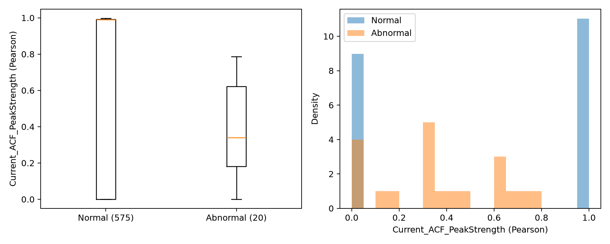

# Logistic Regression: lag-wise Pearson ACF ablation

## Baseline 및 고정 조건

Baseline A는 notebook cell 38의 feature ['AI0_RMS', 'AI0_MaxAbs', 'AI1_RMS', 'AI1_PeakToPeak', 'AI1_Kurtosis']이며 AI0_Kurtosis는 제외한다. B는 Current_ACF_PeakStrength 하나만 추가한다.

정상/이상 CSV concat 후 TimeStamp 정렬, gap>1초 또는 Equipment_state 변경 시 burst 분할. Notebook 원래 signed 진동 feature 함수를 그대로 실행하며 길이 4 미만 burst를 기존과 동일하게 제외한다. 모델 대상 595 burst(정상575/이상20), 총 raw burst620. 새 abs 처리·imputation·추가 필터는 없다.

StandardScaler와 LogisticRegression(class_weight='balanced', random_state=42)의 나머지 defaults를 유지한다. 노트북과 기존 저장 split을 대조한 뒤 동일 index와 순서를 재사용한다. 주 평가는 RepeatedStratifiedKFold(n_splits=5,n_repeats=10,random_state=42)의 동일 50 fold 평균이다. 각 fold train에서만 scaler fit. CV std는 notebook과 동일한 ddof=0. 클래스 기술통계 std는 ddof=1. 기존 baseline 5개 CV 지표가 1e-12 허용 오차 이내 재현됨을 assert했다. 원본 notebook·CSV·공식 LSTM baseline의 실행 전후 SHA256을 검증했다.

## Pearson ACF 정의

각 burst의 전체 signed AI2_Current를 float array로 읽는다. N<4 또는 constant/nonfinite이면 0. 각 lag=1..floor(N/2)에 대해 Pearson(x[:-lag],x[lag:])를 np.corrcoef로 직접 계산한다. 각 lag의 두 부분 신호를 각각 중심화·표준화하는 Pearson 상관이며, np.correlate의 lag0 normalization은 사용하지 않는다. 부분 신호가 constant 또는 correlation이 NaN/nonfinite이면 해당 lag를 0으로 처리한다. 해당 lag sequence에만 find_peaks(height=0)를 적용하고 height>0을 추가 필터한다. 끝점 lag1과 floor(N/2)는 scipy find_peaks의 endpoint 규칙에 따라 peak로 선택되지 않는다. 양수 local peak의 최대 correlation, 없으면0. PeakLag는 분석용으로만 저장한다. 고정 lag/period는 입력에 없다.

## 주 결과: 동일 반복 CV

| condition | Accuracy | Precision | Recall | F1 | Balanced_Accuracy | ROC_AUC | mean_TN | mean_FP | mean_FN | mean_TP |
| --- | --- | --- | --- | --- | --- | --- | --- | --- | --- | --- |
| A_Baseline | 0.980840 | 0.725450 | 0.900000 | 0.776431 | 0.941826 | 0.947826 | 113.120000 | 1.880000 | 0.400000 | 3.600000 |
| B_Plus_ACF | 0.979832 | 0.711159 | 0.900000 | 0.767315 | 0.941304 | 0.948130 | 113.000000 | 2.000000 | 0.400000 | 3.600000 |

mean_TN/FP/FN/TP는 fold별 confusion count의 평균이며 고유 독립 사례의 합계가 아니다.

### A→B 변화량

| metric | mean_delta_B_minus_A |
| --- | --- |
| Accuracy | -0.001008 |
| Precision | -0.014291 |
| Recall | 0.000000 |
| F1 | -0.009116 |
| Balanced_Accuracy | -0.000522 |
| ROC_AUC | 0.000304 |

### CV mean/std

| condition | metric | mean | std |
| --- | --- | --- | --- |
| A_Baseline | Accuracy | 0.980840 | 0.013344 |
| A_Baseline | Precision | 0.725450 | 0.197147 |
| A_Baseline | Recall | 0.900000 | 0.132288 |
| A_Baseline | F1 | 0.776431 | 0.112947 |
| A_Baseline | Balanced_Accuracy | 0.941826 | 0.062795 |
| A_Baseline | ROC_AUC | 0.947826 | 0.080256 |
| B_Plus_ACF | Accuracy | 0.979832 | 0.013961 |
| B_Plus_ACF | Precision | 0.711159 | 0.192521 |
| B_Plus_ACF | Recall | 0.900000 | 0.132288 |
| B_Plus_ACF | F1 | 0.767315 | 0.108410 |
| B_Plus_ACF | Balanced_Accuracy | 0.941304 | 0.062596 |
| B_Plus_ACF | ROC_AUC | 0.948130 | 0.079687 |

## Coefficient

| condition | feature | coefficient | coefficient_std | mean_absolute_coefficient | absolute_coefficient | absolute_rank | fit_protocol |
| --- | --- | --- | --- | --- | --- | --- | --- |
| A_Baseline | AI0_RMS | 1.483630 | 0.501100 | 1.483630 | 1.483630 | 1 | 50_fold_CV_mean |
| A_Baseline | AI0_MaxAbs | 0.860838 | 0.321676 | 0.860838 | 0.860838 | 2 | 50_fold_CV_mean |
| A_Baseline | AI1_RMS | -0.508958 | 0.550106 | 0.583228 | 0.508958 | 5 | 50_fold_CV_mean |
| A_Baseline | AI1_PeakToPeak | -0.618303 | 0.351549 | 0.641905 | 0.618303 | 4 | 50_fold_CV_mean |
| A_Baseline | AI1_Kurtosis | 0.796146 | 0.128333 | 0.796146 | 0.796146 | 3 | 50_fold_CV_mean |
| B_Plus_ACF | AI0_RMS | 1.424108 | 0.506006 | 1.424108 | 1.424108 | 1 | 50_fold_CV_mean |
| B_Plus_ACF | AI0_MaxAbs | 0.911671 | 0.304294 | 0.911671 | 0.911671 | 2 | 50_fold_CV_mean |
| B_Plus_ACF | AI1_RMS | -0.593732 | 0.528633 | 0.627861 | 0.593732 | 4 | 50_fold_CV_mean |
| B_Plus_ACF | AI1_PeakToPeak | -0.561691 | 0.355092 | 0.586096 | 0.561691 | 5 | 50_fold_CV_mean |
| B_Plus_ACF | AI1_Kurtosis | 0.754002 | 0.122324 | 0.754002 | 0.754002 | 3 | 50_fold_CV_mean |
| B_Plus_ACF | Current_ACF_PeakStrength | -0.253544 | 0.077524 | 0.253544 | 0.253544 | 6 | 50_fold_CV_mean |

ACF CV 평균 coefficient=-0.253544, std=0.077524, 절댓값 평균계수 순위=6/6. 고정 80% train fit coefficient=-0.246562, 순위=5/6. 모두 StandardScaler 적용 후 계수다. CV 계수 평균은 단일 배포 모델의 계수가 아니며 절댓값 순위는 성능 기여 또는 인과성 증명이 아니다.

## 클래스별 주기성 통계

| class | count | mean | median | std | min | max |
| --- | --- | --- | --- | --- | --- | --- |
| normal | 575 | 0.546678 | 0.989068 | 0.493620 | 0.000000 | 0.997885 |
| abnormal | 20 | 0.363653 | 0.340440 | 0.253703 | 0.000000 | 0.786442 |

## 참고: 기존 고정 80/20 split

train476(460/16), test119(115/4), notebook stratified test_size=.2/random_state42 그대로. predict() 및 positive label1, ROC-AUC는 positive class probability를 사용한다. 이 test와 전체595 대상 CV는 독립된 검증 두 개가 아니다.

| condition | Accuracy | Precision | Recall | F1 | Balanced_Accuracy | ROC_AUC | TN | FP | FN | TP |
| --- | --- | --- | --- | --- | --- | --- | --- | --- | --- | --- |
| A_Baseline | 0.991597 | 0.800000 | 1.000000 | 0.888889 | 0.995652 | 1.000000 | 114 | 1 | 0 | 4 |
| B_Plus_ACF | 1.000000 | 1.000000 | 1.000000 | 1.000000 | 1.000000 | 1.000000 | 115 | 0 | 0 | 4 |

| comparison | Accuracy | Precision | Recall | F1 | Balanced_Accuracy | ROC_AUC |
| --- | --- | --- | --- | --- | --- | --- |
| B-A | 0.008403 | 0.200000 | 0.000000 | 0.111111 | 0.004348 | 0.000000 |

## 최종 해석

- CV Accuracy: 하락, Δ=-0.001008.
- CV Precision: 하락, Δ=-0.014291.
- CV Recall: 동일, Δ=+0.000000.
- CV F1: 하락, Δ=-0.009116.
- CV Balanced_Accuracy: 하락, Δ=-0.000522.
- CV ROC_AUC: 상승, Δ=+0.000304.

F1 평균이 개선되지 않았으므로 주기성 feature가 유용하다고 일괄 결론 내리지 않는다. 반복 fold는 서로 독립이 아니며 이상 burst는20개다. 본 비교는 효과의 기술적 관찰이며 유의성 또는 외부 세션 일반화의 증거는 아니다. Threshold/hyperparameter tuning 및 test 기반 선택은 수행하지 않았다.
