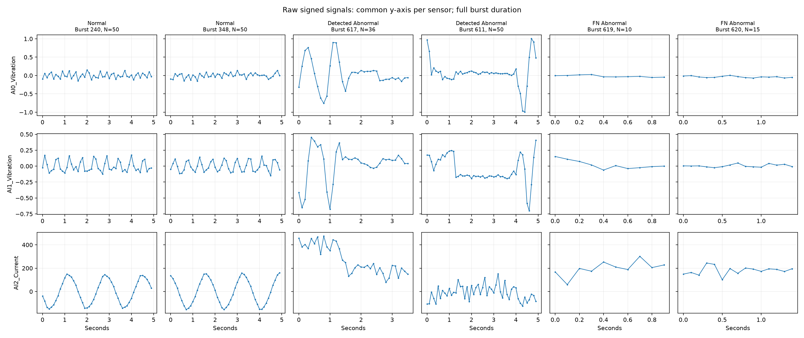
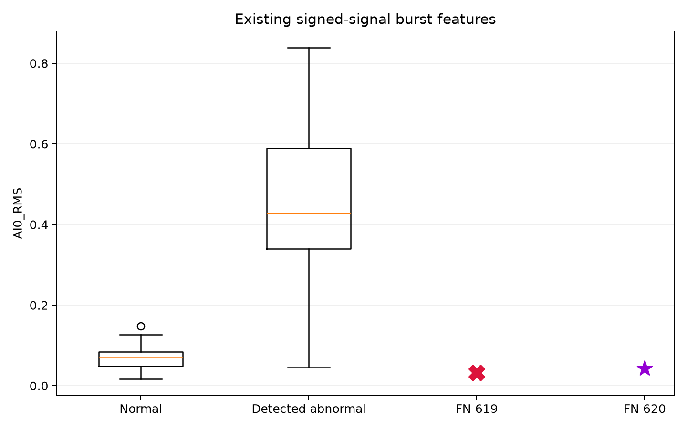
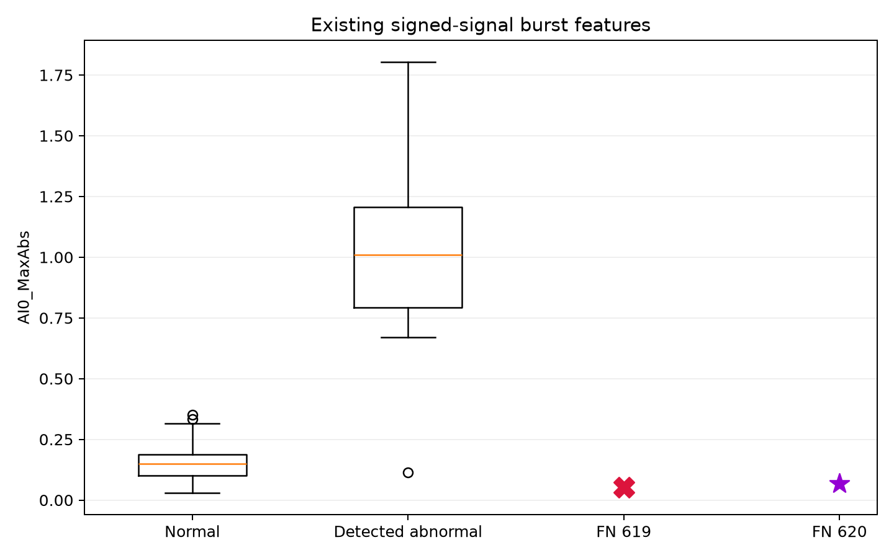
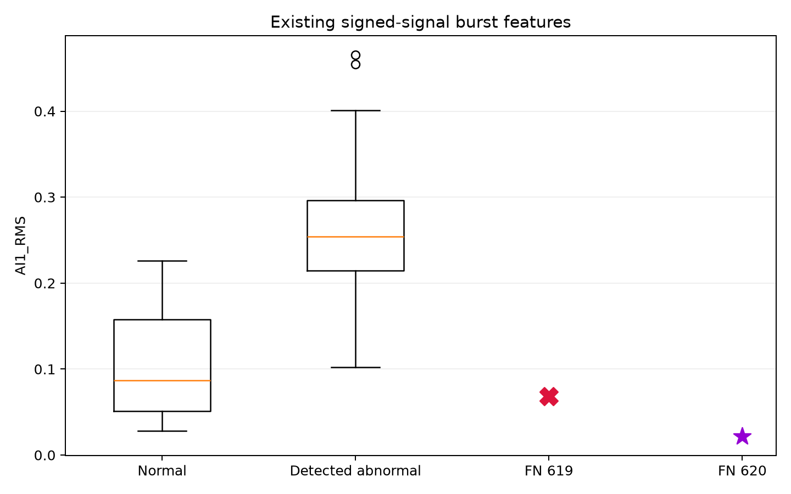
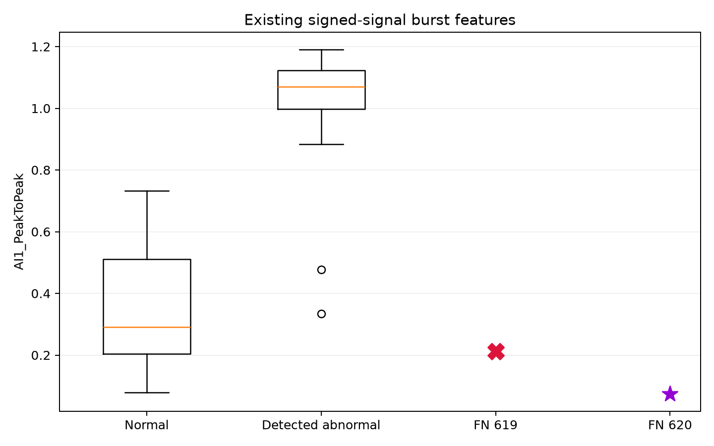
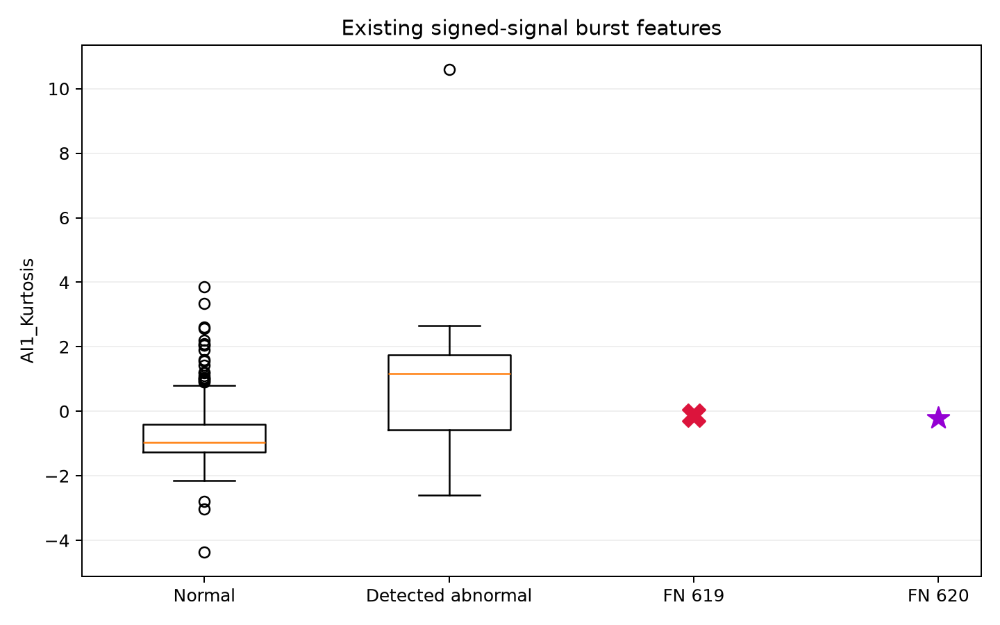
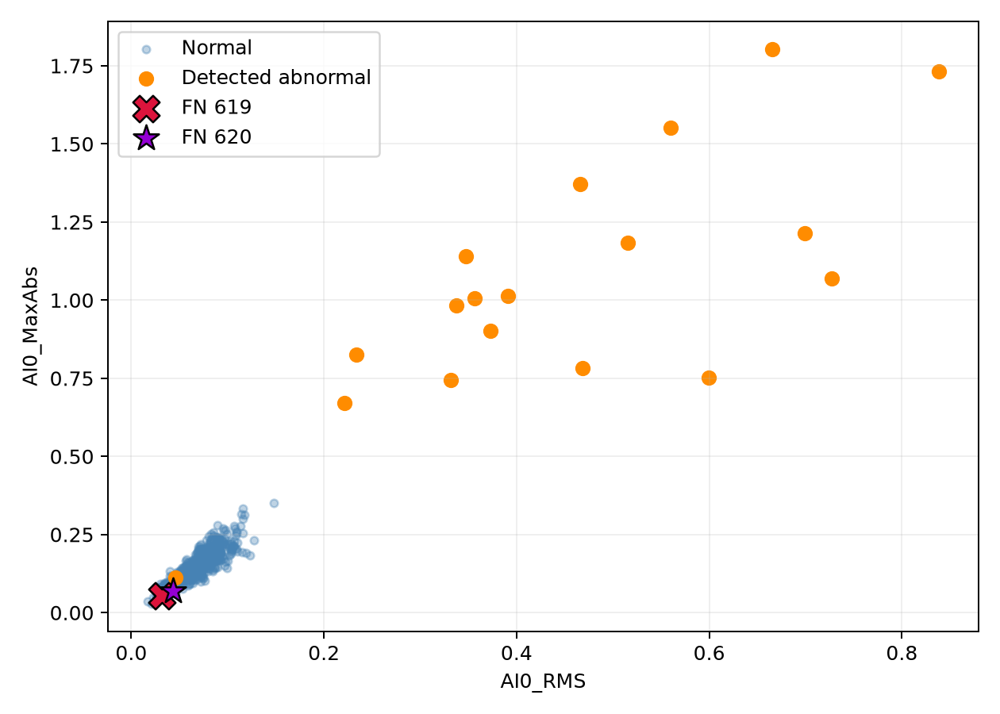
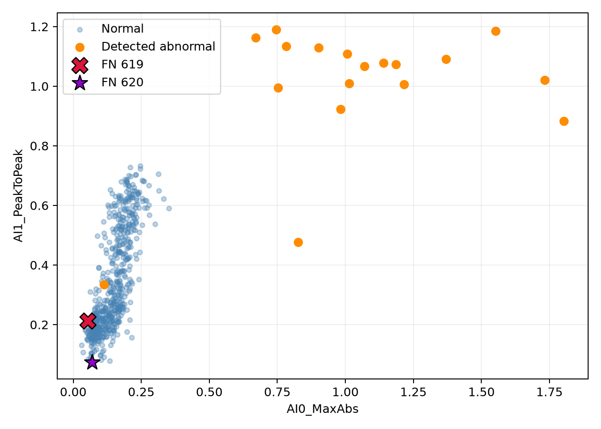
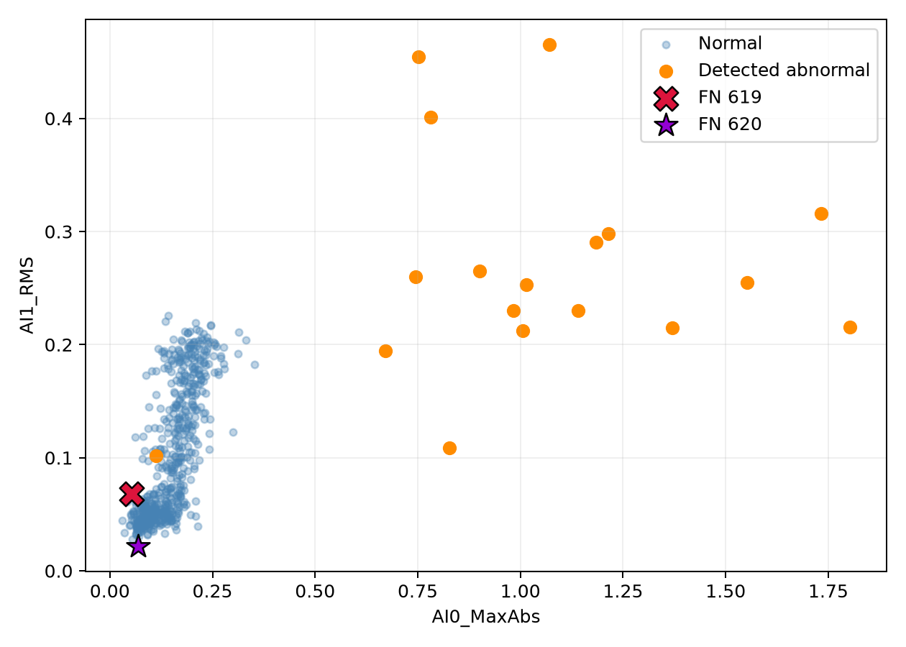

# FN burst 619/620: five-feature space diagnosis

입력: `['AI0_RMS', 'AI0_MaxAbs', 'AI1_RMS', 'AI1_PeakToPeak', 'AI1_Kurtosis']`. Notebook cell38 best5, AI0_Kurtosis 제외. Normal575, Detected Abnormal18, FN Abnormal2. 기존 signed preprocessing, burst 정의·길이4 기준 그대로. 모델 재학습·threshold tuning·모델 feature 추가 없음. 기존 None/threshold0.5의 OOF 결과만 설명한다.

## Group statistics (std ddof=1)

| group | feature | count | mean | median | std | min | Q1 | Q3 | max |
| --- | --- | --- | --- | --- | --- | --- | --- | --- | --- |
| Normal | AI0_RMS | 575 | 0.067451 | 0.069650 | 0.022075 | 0.016967 | 0.048354 | 0.083739 | 0.147791 |
| Normal | AI0_MaxAbs | 575 | 0.147818 | 0.149044 | 0.054972 | 0.029715 | 0.101999 | 0.187361 | 0.351699 |
| Normal | AI1_RMS | 575 | 0.103398 | 0.087148 | 0.058223 | 0.028191 | 0.050833 | 0.157937 | 0.225949 |
| Normal | AI1_PeakToPeak | 575 | 0.349980 | 0.290144 | 0.173464 | 0.079178 | 0.203269 | 0.510716 | 0.732354 |
| Normal | AI1_Kurtosis | 575 | -0.752696 | -0.970344 | 0.784077 | -4.362186 | -1.272351 | -0.411170 | 3.858327 |
| Detected Abnormal | AI0_RMS | 18 | 0.454306 | 0.428767 | 0.201893 | 0.045827 | 0.339928 | 0.589322 | 0.838542 |
| Detected Abnormal | AI0_MaxAbs | 18 | 1.047869 | 1.010318 | 0.405670 | 0.112750 | 0.793099 | 1.207218 | 1.803204 |
| Detected Abnormal | AI1_RMS | 18 | 0.264818 | 0.253949 | 0.098573 | 0.102027 | 0.214832 | 0.296050 | 0.465367 |
| Detected Abnormal | AI1_PeakToPeak | 18 | 0.992528 | 1.069724 | 0.230505 | 0.334480 | 0.997458 | 1.123441 | 1.190218 |
| Detected Abnormal | AI1_Kurtosis | 18 | 1.143896 | 1.169165 | 2.760763 | -2.600957 | -0.566182 | 1.753673 | 10.592134 |
| FN Abnormal | AI0_RMS | 2 | 0.037700 | 0.037700 | 0.007880 | 0.032128 | 0.034914 | 0.040486 | 0.043272 |
| FN Abnormal | AI0_MaxAbs | 2 | 0.061246 | 0.061246 | 0.011169 | 0.053349 | 0.057298 | 0.065195 | 0.069144 |
| FN Abnormal | AI1_RMS | 2 | 0.044956 | 0.044956 | 0.032804 | 0.021760 | 0.033358 | 0.056554 | 0.068152 |
| FN Abnormal | AI1_PeakToPeak | 2 | 0.143352 | 0.143352 | 0.098059 | 0.074014 | 0.108683 | 0.178021 | 0.212690 |
| FN Abnormal | AI1_Kurtosis | 2 | -0.166202 | -0.166202 | 0.049945 | -0.201519 | -0.183861 | -0.148544 | -0.130885 |

## FN values and distribution overlap

| burst_id | feature | value | normal_mean | normal_median | normal_std | normal_min | normal_Q1 | normal_Q3 | normal_max | detected_abnormal_mean | detected_abnormal_median | detected_abnormal_std | detected_abnormal_Q1 | detected_abnormal_Q3 | status | z_normal | z_detected_abnormal | median_distance_normal_std |
| --- | --- | --- | --- | --- | --- | --- | --- | --- | --- | --- | --- | --- | --- | --- | --- | --- | --- | --- |
| 619 | AI0_RMS | 0.032128 | 0.067451 | 0.069650 | 0.022075 | 0.016967 | 0.048354 | 0.083739 | 0.147791 | 0.454306 | 0.428767 | 0.201893 | 0.339928 | 0.589322 | inside normal range but outside IQR | -1.600157 | -2.091095 | 1.699787 |
| 619 | AI0_MaxAbs | 0.053349 | 0.147818 | 0.149044 | 0.054972 | 0.029715 | 0.101999 | 0.187361 | 0.351699 | 1.047869 | 1.010318 | 0.405670 | 0.793099 | 1.207218 | inside normal range but outside IQR | -1.718517 | -2.451552 | 1.740813 |
| 619 | AI1_RMS | 0.068152 | 0.103398 | 0.087148 | 0.058223 | 0.028191 | 0.050833 | 0.157937 | 0.225949 | 0.264818 | 0.253949 | 0.098573 | 0.214832 | 0.296050 | inside normal IQR | -0.605368 | -1.995125 | 0.326272 |
| 619 | AI1_PeakToPeak | 0.212690 | 0.349980 | 0.290144 | 0.173464 | 0.079178 | 0.203269 | 0.510716 | 0.732354 | 0.992528 | 1.069724 | 0.230505 | 0.997458 | 1.123441 | inside normal IQR | -0.791463 | -3.383164 | 0.446513 |
| 619 | AI1_Kurtosis | -0.130885 | -0.752696 | -0.970344 | 0.784077 | -4.362186 | -1.272351 | -0.411170 | 3.858327 | 1.143896 | 1.169165 | 2.760763 | -0.566182 | 1.753673 | inside normal range but outside IQR | 0.793047 | -0.461750 | 1.070633 |
| 620 | AI0_RMS | 0.043272 | 0.067451 | 0.069650 | 0.022075 | 0.016967 | 0.048354 | 0.083739 | 0.147791 | 0.454306 | 0.428767 | 0.201893 | 0.339928 | 0.589322 | inside normal range but outside IQR | -1.095329 | -2.035897 | 1.194959 |
| 620 | AI0_MaxAbs | 0.069144 | 0.147818 | 0.149044 | 0.054972 | 0.029715 | 0.101999 | 0.187361 | 0.351699 | 1.047869 | 1.010318 | 0.405670 | 0.793099 | 1.207218 | inside normal range but outside IQR | -1.431182 | -2.412615 | 1.453478 |
| 620 | AI1_RMS | 0.021760 | 0.103398 | 0.087148 | 0.058223 | 0.028191 | 0.050833 | 0.157937 | 0.225949 | 0.264818 | 0.253949 | 0.098573 | 0.214832 | 0.296050 | outside normal range | -1.402174 | -2.465761 | 1.123078 |
| 620 | AI1_PeakToPeak | 0.074014 | 0.349980 | 0.290144 | 0.173464 | 0.079178 | 0.203269 | 0.510716 | 0.732354 | 0.992528 | 1.069724 | 0.230505 | 0.997458 | 1.123441 | outside normal range | -1.590918 | -3.984782 | 1.245968 |
| 620 | AI1_Kurtosis | -0.201519 | -0.752696 | -0.970344 | 0.784077 | -4.362186 | -1.272351 | -0.411170 | 3.858327 | 1.143896 | 1.169165 | 2.760763 | -0.566182 | 1.753673 | inside normal range but outside IQR | 0.702962 | -0.487335 | 0.980548 |

z_normal은 normal mean/std 기준이고 median_distance_normal_std는 normal median과의 거리다. 둘은 다른 지표다. IQR/min-max 포함 여부는 개별 feature의 주변 분포에 관한 것이며 5D joint overlap을 증명하지 않는다.

## Feature pair selection

| feature_x | feature_y | descriptive_separation_score |
| --- | --- | --- |
| AI0_RMS | AI0_MaxAbs | 196.570215 |
| AI0_MaxAbs | AI1_PeakToPeak | 119.061282 |
| AI0_MaxAbs | AI1_RMS | 112.930627 |

Pair 순위는 Normal–Detected Abnormal의 pooled-SD mean difference 제곱합이며 모델 최적 feature 선택이 아니다. FN을 pair ranking에 사용하지 않았다. Correlated axes를 보정하지 않아 중복 설명력이 포함될 수 있다.

## 5D normal centroid distances

| burst_id | group | distance_mean | distance_std | distance_min | distance_max |
| --- | --- | --- | --- | --- | --- |
| 602 | Detected Abnormal | 9.454607 | 0.331186 | 9.003930 | 10.216294 |
| 606 | Detected Abnormal | 11.676527 | 0.428429 | 11.131607 | 12.380303 |
| 610 | Detected Abnormal | 10.363128 | 0.365726 | 9.817311 | 10.915931 |
| 613 | Detected Abnormal | 14.757476 | 0.541427 | 14.131356 | 15.740955 |
| 600 | Detected Abnormal | 12.392493 | 0.436049 | 11.805134 | 13.282030 |
| 603 | Detected Abnormal | 13.268189 | 0.294255 | 12.914624 | 13.735387 |
| 615 | Detected Abnormal | 8.358780 | 0.141536 | 8.139995 | 8.571632 |
| 619 | FN Abnormal | 1.271549 | 0.037576 | 1.208753 | 1.319869 |
| 607 | Detected Abnormal | 6.619085 | 0.151367 | 6.447475 | 6.899751 |
| 608 | Detected Abnormal | 7.163755 | 0.111273 | 7.005573 | 7.332608 |
| 612 | Detected Abnormal | 9.604519 | 0.281924 | 9.286937 | 9.987018 |
| 620 | FN Abnormal | 1.978236 | 0.029302 | 1.939539 | 2.024558 |
| 601 | Detected Abnormal | 7.565446 | 0.158434 | 7.329767 | 7.748911 |
| 616 | Detected Abnormal | 6.501892 | 0.124838 | 6.315060 | 6.682756 |
| 617 | Detected Abnormal | 7.652897 | 0.154926 | 7.359992 | 7.857950 |
| 618 | Detected Abnormal | 12.998551 | 0.186811 | 12.595504 | 13.129910 |
| 604 | Detected Abnormal | 11.154296 | 0.290702 | 10.710704 | 11.653381 |
| 609 | Detected Abnormal | 8.787874 | 0.248319 | 8.419144 | 9.344437 |
| 611 | Detected Abnormal | 7.615204 | 0.141384 | 7.426347 | 7.827888 |
| 614 | Detected Abnormal | 5.340304 | 0.150159 | 5.135961 | 5.589916 |

| group | count | mean | median | min | max |
| --- | --- | --- | --- | --- | --- |
| Detected Abnormal | 18 | 9.515279 | 9.121240 | 5.340304 | 14.757476 |
| FN Abnormal | 2 | 1.624892 | 1.624892 | 1.271549 | 1.978236 |

각 abnormal의 기존 validation fold에서 train-only StandardScaler 통계를 복원하고 그 fold train 정상 centroid와의 거리를 계산했다. 10회 OOF distance의 평균을 burst별로 비교한다. 다른 scaler로 전체 데이터에 새 model을 fit하지 않았다.

## Existing logistic decision decomposition

각 fold의 저장 계수를 사용한다. Scaler는 같은 train index에서 통계만 재계산했다. Intercept가 저장되어 있지 않아 nonsaturated validation probability에서 median(logit(p)−z·coef)로 복원했다. 이는 classifier 학습이 아닌 역산이다. 모든5950 validation probability의 최대 복원 오차=4.22e-15; 예측 일치도도 검사했다.

| burst_id | feature | standardized_value_mean | coefficient_mean | contribution_mean | contribution_std | contribution_min | contribution_max |
| --- | --- | --- | --- | --- | --- | --- | --- |
| 619 | AI0_RMS | -0.600205 | 0.968677 | -0.580686 | 0.030248 | -0.617622 | -0.512819 |
| 619 | AI0_MaxAbs | -0.681362 | 1.089245 | -0.742378 | 0.043986 | -0.803676 | -0.678945 |
| 619 | AI1_RMS | -0.602943 | -0.122524 | 0.073164 | 0.099104 | -0.169742 | 0.198838 |
| 619 | AI1_PeakToPeak | -0.749741 | 0.138982 | -0.104998 | 0.117635 | -0.411530 | -0.009353 |
| 619 | AI1_Kurtosis | 0.599461 | 0.765323 | 0.455717 | 0.049837 | 0.389142 | 0.571519 |
| 620 | AI0_RMS | -0.462065 | 0.795911 | -0.367726 | 0.018085 | -0.398715 | -0.343369 |
| 620 | AI0_MaxAbs | -0.592708 | 0.945375 | -0.560687 | 0.064574 | -0.700534 | -0.467016 |
| 620 | AI1_RMS | -1.317294 | 0.114961 | -0.151240 | 0.085869 | -0.359646 | -0.057796 |
| 620 | AI1_PeakToPeak | -1.424356 | 0.321406 | -0.458034 | 0.134361 | -0.764933 | -0.263770 |
| 620 | AI1_Kurtosis | 0.501126 | 0.849697 | 0.425740 | 0.032545 | 0.384150 | 0.501139 |

| burst_id | feature_sum_mean | intercept_mean | decision_score_mean | decision_score_min | decision_score_max | probability_mean |
| --- | --- | --- | --- | --- | --- | --- |
| 619 | -0.899180 | -5.835146 | -6.734326 | -8.588572 | -6.454302 | 0.001333 |
| 620 | -1.111948 | -5.897120 | -7.009068 | -8.979231 | -6.664782 | 0.001028 |

평균 contribution은 mean(z×coef)이며 mean(z)×mean(coef)와 같다고 가정하지 않는다. 평균 score와 평균 probability도 sigmoid 관계를 직접 적용하면 일치하지 않을 수 있다. Fold별 정확한 분해는 fn_feature_contributions.csv 및 fn_decision_scores.csv에 저장했다.

## Raw signal comparison

| group | burst_id | selection |
| --- | --- | --- |
| Normal | 240 | two closest to within-group feature median (standardized by group std) |
| Normal | 348 | two closest to within-group feature median (standardized by group std) |
| Detected Abnormal | 617 | two closest to within-group feature median (standardized by group std) |
| Detected Abnormal | 611 | two closest to within-group feature median (standardized by group std) |
| FN Abnormal | 619 | specified FN case |
| FN Abnormal | 620 | specified FN case |

대표는 각 그룹 feature median에 가장 가까운2개로 고정했으며 잘 분리되는 그림을 보고 골라낸 것이 아니다. 채널별 비교 그림은 같은 y축 범위를 사용하고 전체 burst 시간 구간을 유지한다. 짧은 FN burst의 추정치 변동에 유의한다.

## Key findings

- Normal median과의 평균 표준화 거리가 가장 작은 feature: AI1_RMS (0.7247).
- Detected Abnormal 기준 평균 |z|가 가장 큰 feature: AI1_PeakToPeak (3.6840).
- Burst 619: Normal IQR 포함 2/5, normal min-max 포함 5/5. 가장 큰 negative feature contribution: AI0_MaxAbs, mean=-0.7424.
- Burst 620: Normal IQR 포함 0/5, normal min-max 포함 3/5. 가장 큰 negative feature contribution: AI0_MaxAbs, mean=-0.5607.

FN은619/620에10회씩 반복된다. 확률이 threshold 주변에서 흔들리는 경우와 구별해 현재 5-feature/linear decision의 representation limitation 근거를 검토한다. 관찰만으로 feature 요약의 정보 손실과 linear model의 제약을 완전히 분리할 수 없다. 개별 범위 포함·centroid 근접·기존 negative score를 종합하며 라벨 오류를 단정하지 않는다.

## 질문별 결론

1. **Normal 분포와 겹치는가?** 619는5개 모두 정상 min-max 내부이고 AI1_RMS/AI1_PeakToPeak는 정상 IQR 내부다. 620은3개가 정상 min-max 내부이며 AI1_RMS/AI1_PeakToPeak는 정상 최솟값보다 낮다. 따라서 둘 모두 정상 분포와 완전히 같다고 할 수 없다. 620의 낮은 진동도 현재 linear decision에서는 이상 쪽으로 이동시키지 못한다.
2. **가장 정상에 가까운 feature?** Normal median 거리/normal std 기준 두 burst 평균은 AI1_RMS가 가장 작다. 개별로619는AI1_RMS,620은AI1_Kurtosis가 가장 가깝다.
3. **탐지된 이상18개와 가장 다른 feature?** 표준화된 차이로AI1_PeakToPeak가 가장 크다. 619의z=-3.3832,620의z=-3.9848이며 둘 모두 훨씬 작은 진동 폭이다. AI0_RMS/MaxAbs도 낮다.
4. **정상 쪽으로 미는 contribution?** 두 경우 모두AI0_MaxAbs가 가장 큰 음의 feature contribution이다 (619:-0.7424,620:-0.5607). AI0_RMS도 음의 기여이고,620은AI1_PeakToPeak도-0.4580이다. Intercept 약-5.8/-5.9도 score에 크게 작용한다. AI1_Kurtosis는 약+0.46/+0.43의 이상 쪽 기여여서 이를 상쇄하지 못한다.
5. **Threshold보다 representation 문제인가?** 기존 score 공간에서 두 경우는 경계가 아니라 정상 score 영역의 낮은 쪽이다. 정상 burst 평균 probability 중앙값은약0.003346이고,619/620의 평균은각각0.001333/0.001028이다. 정상 score 분포의 경험적CDF 위치도약4.17%/2.09%다. 이는단순한 경계 근처 오분류보다 현재5-feature/linear score가 두 이상 사례를 분리하지 못한다는 근거다. Threshold 변경의 효과를 실험하거나 불가능하다고 증명한 것은 아니다.

| burst_id | FN_mean_probability | normal_mean_probability_median | normal_empirical_CDF_at_FN_probability |
| --- | --- | --- | --- |
| 619 | 0.001333 | 0.003346 | 0.041739 |
| 620 | 0.001028 | 0.003346 | 0.020870 |

Raw에서FN619/620은10/15 sample의0.9/1.4초 짧은 burst이며 진동 크기가 작다. 선택한 정상 대표240/348과 달리 전류는FN의 관측 구간에서 양수이며 mean≈198.48/180.09다. 현재5개 모델 입력에는 전류가 없다. 이 관찰은 표현의 누락 가능성을 보여주지만 짧은 구간·수집 상태 영향과 분리되지 않았고, 전류를 추가하면 탐지된다는 증거도 아니다. 원자료 label은 그대로 유지하며 라벨 오류·고장 원인을 단정하지 않는다.
