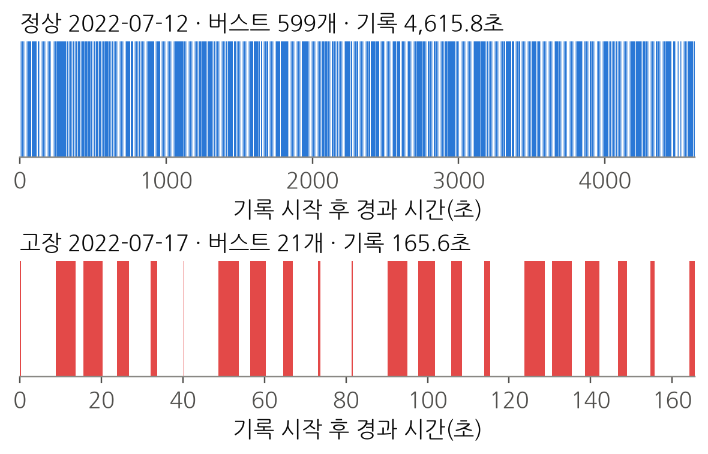
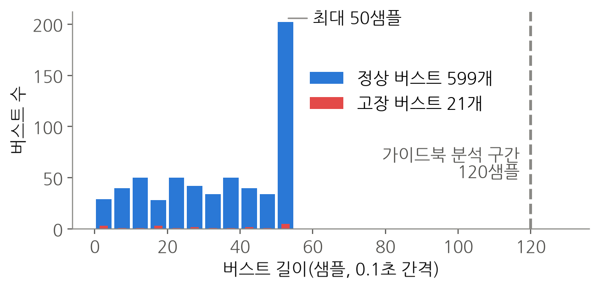
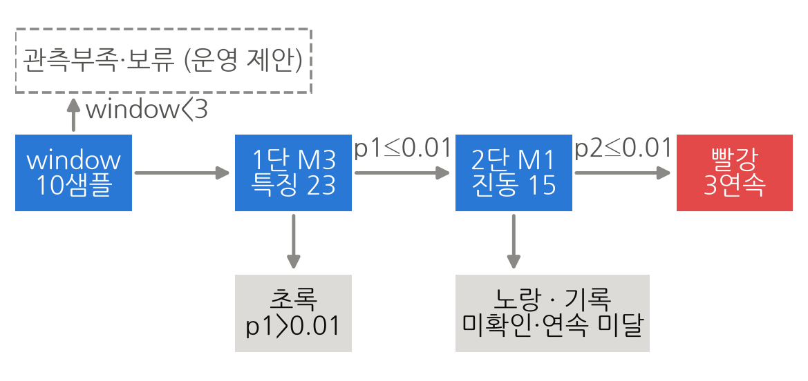
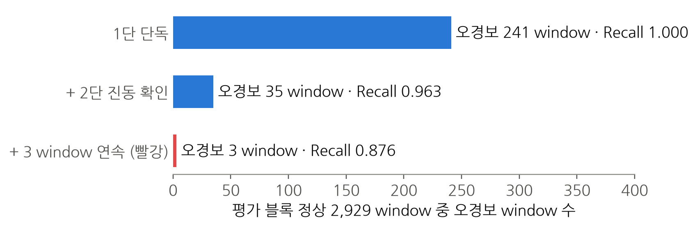
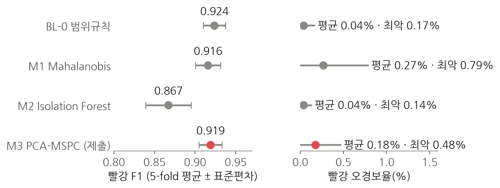
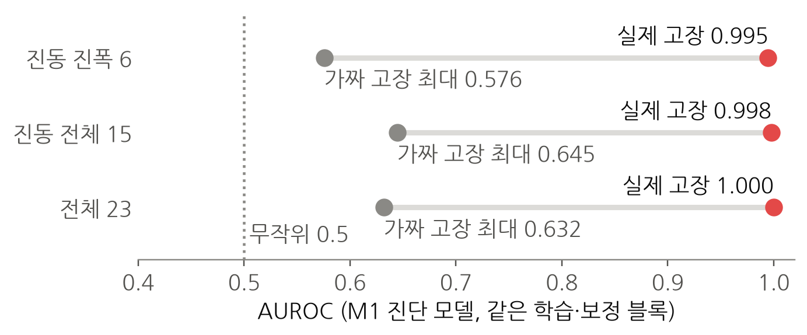
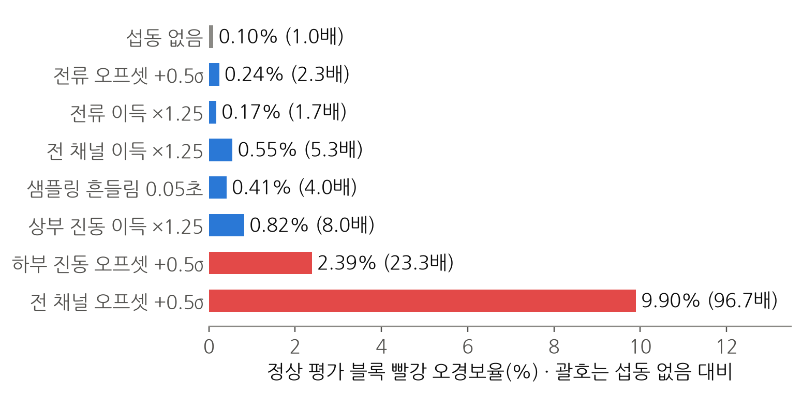

# 제6회 K-인공지능 제조데이터 분석 경진대회 보고서

> 일반국민/대학(원)생 부문

## 표지

| 항목 | 내용 |
|---|---|
| 프로젝트명 | CARE-Press: 불완전 수집 데이터에서 날짜·계측 교란을 통제하는 2단 확인 이상경보 |
| 팀명 | mechai |

### 내용요약

**진동으로 고장을 한 번 더 확인하는 2단 경보가 고장 버스트 17개 중 15개를 오경보율 0.10%로 잡았다.**

- **배경·목표**: 프레스 유압펌프 고장은 가동을 최대 2~3일 멈춘다. 고장 신호에만 반응하고 정상 운전변화에는 울리지 않는 경보가 목표다
- **데이터 진단**: 정상 20,000행은 공백 598개로 끊긴 연속 수집 구간(버스트) 599개다. 정상·고장의 수집 경로가 다르고 고장 전 구간이 0초라 1초 단위 실시간 판정으로 정의했다
- **모델**: 재현율 포화로 섭동 강건성 기준 1단 PCA-MSPC를 고르고, 전류를 뺀 진동 Mahalanobis 2단 확인과 window 3개 연속 규칙을 붙였다
- **성능(평가 블록)**: 빨강 F1 0.931(95% 0.892–0.955), 오경보 3 window(0.10%), 고장 버스트 15/17 탐지
- **교란 통제**: 전류 직류 이동 시 판정 변화 0, 진동 진폭 특징만으로 AUROC 0.995
- **현장 활용**: 빨강은 진동 센서 확인, 인접 버스트 연속 빨강은 정지 검토(정상 5개 블록 0회)
- **한계**: 고장 기록 1건, 정상·고장 수집일 상이, 선정 기준 사후 개정(원 기준 선정은 BL-0), 리드타임 측정 불가

상기 본인(팀)은 위의 내용과 같이 제6회 K-인공지능 제조데이터 분석 경진대회 결과 보고서를 제출합니다.

2026년 10월 8일

- 팀장 : 김신 (서명)
- 팀원 : 임창희 (서명)
- 팀원 : 최문석 (서명)

**(사)중소기업기술혁신협회 귀중**

---

## □ 제1장. 데이터 이해 및 진단 〔15점〕

**버스트 599개로 끊긴 기록에서 정상·고장은 수집 경로가 다르고 고장 전 구간이 0초라, 과제를 실시간 판정으로 정의한다.**

### 1.1 과제 배경과 목적

**유압펌프 고장은 최대 2~3일 가동 중단을 부르므로, 고장 신호에만 반응하고 정상 운전변화에는 울리지 않는 경보를 목표로 한다.**

데이터 출처는 KAMP(Korea AI Manufacturing Platform, 인공지능 제조 플랫폼)가 무료로 공개하는 제조AI데이터셋 중 「소성가공 예지보전 AI 데이터셋」[1]이다. 분석 절차의 비교 기준은 같은 데이터셋의 분석실습 가이드북이며, 이하 '가이드북'으로 쓴다.

파인블랭킹 프레스는 판재를 잡는 클램핑 힘, 위에서 찍는 펀치 힘, 아래서 밀어 주는 이젝터 힘으로 블랭크를 만들며, 유압펌프가 약 1,000톤의 힘을 프레스에 전달한다. 가이드북에 따르면 펌프 내부 기어가 마모되면 진동과 소음이 커지고 출력 유압이 약해져 불량품이 생기며 고장 시 수리비용과 부품 수급 때문에 가동이 최대 2~3일 멈춘다[1].

표 1-1. 현행 판단 방식의 한계와 과제 목표

| 구분 | 현재 (출제문, 가이드북[1]) | 출제문의 요구 | 보고서의 대응 (근거 절) |
|---|---|---|---|
| 판단 방식 | 주기점검, 숙련 작업자의 작동 소음 판단 | 진동·전류 시계열로 이상 조기탐지 | 진동 2채널·전류 1채널을 1초 단위로 판정 (2.7) |
| 미탐 위험 | 초기 이상징후를 놓침 | "이상을 많이 탐지" | 고장 버스트 17개 중 15개 탐지 (2.8) |
| 오경보 위험 | 정상 운전변화를 이상으로 오인 | "오경보를 줄이고 발생조건 분석" | 오경보 window 241개 → 3개 (2.8), 저부하 구간 집중 확인 (3.4) |
| 데이터 함정 | — | — | 정상·고장의 수집일·수집 경로 상이. 날짜·계측 차이를 고장으로 학습하는지 검사 (1.5, 3.2) |

표 1-2. 장별 질문과 답

| 장 | 질문 | 답 |
|---|---|---|
| 1 | 데이터로 무엇을 판정할 수 있는가 | 고장 전 구간 0초. 리드타임은 측정할 수 없고, 1초 단위 실시간 판정으로 정의 |
| 2 | 어떤 경보가 고장을 잡고 오경보를 줄이는가 | 1단 M3 + 2단 진동 M1 + 3 window 연속: 빨강 F1 0.931, 오경보 3 window |
| 3 | 경보는 어떤 조건에서 실패하는가 | 1단 오경보 85%가 저부하 구간, 빨강 미탐 62%가 버스트 첫 2 window, 진동 오프셋에 취약 |
| 4 | 현장에서 경보를 어떻게 쓰는가 | 빨강은 진동 센서 확인, 인접 버스트 연속 빨강은 정지 검토 |
| 5 | 무엇이 다른가 | 1단 모델 4종 모두에서 빨강 오경보율 0.27% 이하(평가 블록·섭동 없음)를 내는 2단 확인 구조, 교란 3중 검증 |
| 6 | 결과를 다시 만들 수 있는가 | 명령 1줄·약 3분, Python 3.11·3.13에서 표 84개가 상대오차 1e-6 이내로 일치 |

### 1.2 변수와 용어

**변수 5개 중 진동 2개는 1·2단에, 전류는 1단에만 입력하고 상태값은 평가에만 쓰며 용어 30개를 표 1-4로 정의한다.**

표 1-3. 변수 정의 (10 Hz 기록, 0.1초 간격)

| 변수 | 의미 | 사용 |
|---|---|---|
| `TimeStamp` | 수집 시각 | 버스트 분할, 시간블록 분할 |
| `AI0_Vibration` | 펌프 모터 상부 진동 | 1단·2단 입력 |
| `AI1_Vibration` | 펌프 모터 하부 진동 | 1단·2단 입력 |
| `AI2_Current` | 펌프 모터 전류 | 1단 입력 (2단 제외 근거는 3.2) |
| `Equipment_state` | 상태(0 정상, 1 이상). 파일 안에서 상수 | 평가에만 사용 |

표 1-4. 용어 (보고서 고유 용어 10개, 모델 6개, 지표·통계·신호·운영 14개)

| 구분 | 용어 | 뜻 |
|---|---|---|
| 고유 | 버스트 | 시각 간격 0.5초 이하로 이어진 연속 수집 구간. 정상 599개, 고장 21개. 번호는 파일별 시간순 0부터 |
| 고유 | window | 한 버스트 안의 연속 10샘플(1초). 판정 단위. 1샘플(0.1초)씩 밀어 만들므로 이웃 window는 9샘플(90%)을 공유 |
| 고유 | 시간블록·평가 블록 | 정상 기록을 버스트 단위로 시간순 5등분한 블록 0–4. 최종 모델은 블록 0–2로 학습, 블록 3으로 보정(임계값 산정), 블록 4로 평가 |
| 고유 | 1단·2단 | 1단 = 전체 특징 23개의 M3. 2단 = 전류를 뺀 진동 특징 15개의 M1 |
| 고유 | 노랑·빨강 | 노랑 = 1단 경보이나 빨강 조건 미충족. 빨강 = 1단·2단 동시 경보가 같은 버스트에서 3 window 연속 |
| 고유 | 섭동 | 데이터에 가한 계측 변화: 이득 ×0.8~1.25, 오프셋 +0.1~0.5σ, 극성 반전, 샘플링 흔들림 0.01~0.05초. 모델 선정(2.6)은 전 채널 14조건, 최종 시스템 시험(2.9·3.6)은 채널별 조건을 더한 35조건 |
| 고유 | 가짜 고장 | 정상 기록 안의 다른 시간대를 고장처럼 다룬 대조 과제. 같은 날 수집 시점 차이만으로 생기는 분리 정도를 잰다 |
| 고유 | 확인 지연 | 고장 버스트 시작부터 첫 빨강 window 시작까지의 시간. 판정은 window 끝(0.9초 뒤)에 나온다. 고장 시작 기준 탐지 지연이나 사전 예고시간이 아니다 |
| 고유 | 사건 | 같은 버스트에서 이어진 경보 window 묶음. 경보 빈도의 계산 단위 |
| 고유 | 동결 구성 | 최종 모델·임계값을 고정한 상태(학습 블록 0–2, 보정 블록 3) |
| 모델 | BL-0 | 학습 범위 이탈 규칙. 특징마다 학습 데이터의 최솟값·최댓값을 벗어나면 이상으로 본다 |
| 모델 | BL-1 | 가이드북의 LSTM 오토인코더. 시계열을 압축·복원하는 신경망으로, 복원 오차가 크면 이상으로 본다[2] |
| 모델 | M1 | Mahalanobis 거리. 변수 간 상관을 반영한 정상 중심과의 거리. 공분산은 Ledoit-Wolf 수축으로 안정화[5] |
| 모델 | M2 | Isolation Forest. 무작위 분할에서 적은 횟수로 고립되는 점을 이상으로 보는 트리 모델[6] |
| 모델 | M3 | PCA-MSPC(주성분 분석 기반 다변량 통계적 공정관리). 정상 상관 구조 안의 거리 T²와 구조 밖 잔차 SPE로 이상을 잰다[3, 4] |
| 모델 | M4 | 지도 로지스틱 회귀. 고장 라벨로 학습한 대조군 |
| 지표 | 재현율(Recall) | 실제 고장 window 중 경보로 잡은 비율. 높을수록 좋다 |
| 지표 | 정밀도(Precision) | 경보 window 중 실제 고장 비율. 높을수록 좋다 |
| 지표 | F1 | 정밀도와 재현율의 조화평균. 0~1, 높을수록 좋다 |
| 지표 | 오경보율(FPR) | 정상 window 중 경보 비율. 낮을수록 좋다 |
| 지표 | AUROC | 임계값과 무관한 정상·고장 점수의 순위 분리도. 0.5 = 무작위, 1 = 완전 분리 |
| 지표 | AP | 정밀도-재현율 곡선 아래 면적. 기준값이 유병률에 따라 달라진다 |
| 지표 | 유병률 | 평가 window 중 고장 window의 비율. 정밀도·F1은 유병률에 따라 바뀐다 |
| 통계 | conformal p | (1 + 새 점수 이상인 보정 블록 정상 점수 수) ÷ (보정 점수 수 + 1). 작을수록 정상과 다르다. p ≤ 0.01이면 경보[8, 9] |
| 통계 | σ | 정상 기록 전체 window의 채널별 표준편차. 섭동 크기의 단위 |
| 통계 | 부트스트랩 구간 | 버스트를 복원 추출로 5,000회 다시 뽑아 계산한 95% 범위 |
| 통계 | Brier 점수 | 예측 확률과 실제(0·1)의 제곱 오차 평균. 낮을수록 좋다 |
| 신호 | RMS | 신호 제곱평균의 제곱근. 진동 에너지의 크기 |
| 신호 | 자기상관(lag-k) | k샘플 떨어진 값끼리의 상관. 신호 리듬의 지표 |
| 운영 | 수집 비율 | 버스트 내부 시간 ÷ 벽시계 시간. 평가 블록 0.40 |

### 1.3 데이터 품질

**결측·시각 역행은 0건이지만 관측 기간은 10 Hz 연속 가정의 2.3배다.**

표 1-5. 품질 점검 (원본 행 기준)

| 항목 | 정상 | 고장 |
|---|---:|---:|
| 행 수 | 20,000 | 600 |
| 결측 / 시각 역행 | 0 / 0 | 0 / 0 |
| 중복 TimeStamp (처리: 유지) | 1 | 0 |
| 관측 기간 | 4,615.8초 | 165.6초 |
| 10 Hz 연속 가정 시 필요 시간 | 2,000.0초 | 60.0초 |
| 0.5초 초과 공백 | 598 | 20 |
| 상부 진동 \|z\|>4 행 비율 | 0.03% | 29.0% |

*근거: `e0_data_quality.csv`, `v1b_basic_stats.csv`. \|z\|는 정상 학습 블록 평균·표준편차 기준*

관측 기간과 연속 가정 시간의 차이 2,615.8초는 전부 수집 공백이다. 중복 TimeStamp 1행은 간격 0초라 같은 버스트에 남고 결과에 영향이 없어 삭제하지 않았다. 상부 진동 \|z\|>4(학습 평균에서 표준편차 4배 이상 벗어난 값) 비율은 고장 29.0%, 정상 0.03%로 고장 신호의 크기를 보여준다.

### 1.4 비연속 구조

**버스트 최장은 50샘플(4.9초)이라, 가이드북 분석 구간 120샘플이 들어가는 버스트는 0개다.**





표 1-6. window 길이별 버스트 내부 window 수 (정상, 잔존율 = 버스트 내부 ÷ 공백 무시)

| window 길이 | 버스트 내부 | 공백 무시 | 잔존율 | 사용 가능 고장 버스트 |
|---:|---:|---:|---:|---:|
| 5 | 17,652 | 19,996 | 88.3% | 18 |
| **10 (채택)** | **14,871** | 19,991 | **74.4%** | **17** |
| 20 | 9,978 | 19,981 | 49.9% | 13 |

*근거: `e0_burst_summary.csv`, `e1_window_sensitivity.csv`*

- 가이드북[1]은 20샘플 window에 100샘플 offset을 더해 "10초 뒤를 탐지"한다고 기술하지만 120샘플 버스트가 양쪽 파일 모두 0개다. offset 100샘플(10초)은 버스트 최장 4.9초의 2배를 넘으므로 다른 버스트의 값을 가리킨다.
- 공백을 무시한 window는 길이 10에서 25.6%, 길이 20에서 50.1%가 서로 다른 버스트를 이어 붙인 window다.
- 길이 10은 lag-2 자기상관을 계산할 수 있는 최소 길이이며 고장 버스트 17개를 유지한다. 고장 버스트 21개 중 4개는 10샘플 미만이라 평가에서 빠진다.

### 1.5 수집 경로 차이

**고장 파일은 전류가 1.192 간격 격자 위에 놓이고 진동 소수 자릿수가 6에서 8로 달라, 수집 경로가 다르다.**

표 1-7. 두 파일의 수집 지문 (수집·저장 경로가 값에 남긴 특성)

| 지표 | 정상 | 고장 |
|---|---:|---:|
| 전류 고유값 수 / 행 수 | 19,934 / 20,000 | 340 / 600 |
| 전류값 ÷ 1.1920929의 정수 격자 잔차 최대 | 0.50 (격자 없음) | 0.00005 (격자 위) |
| 진동값 소수 자릿수 중앙값 | 6 | 8 |
| 전류 평균 | +1.45 | +57.33 |

*근거: `v1a_acquisition_fingerprint.csv`, `e0_channel_stats.csv`*

고장 파일의 전류값은 1.1920929의 정수배에만 나타난다. 값이 일정 간격의 정수배에만 놓이는 양자화 격자는 측정·저장 장치의 해상도가 남긴 흔적이다. 고장 파일은 양자화 해상도와 저장 자릿수가 다른 경로를 거쳤다. 수집일 차이는 날짜 외에 계측 경로의 차이로도 데이터에 남아 있다. 판정이 수집 경로 차이에 기대는지는 3.2에서 검사한다.

### 1.6 정상 운전변화

**정상 기록 3,600–4,280초 구간의 버스트 79개는 세 채널 변동폭이 함께 줄어든 저부하 운전이다.**

표 1-8. 운전 상태별 버스트 평균 (10샘플 이상 버스트)

| 상태 | 버스트 | 상부 진동 RMS | 하부 진동 RMS | 전류 RMS | 상·하부 상관 |
|---|---:|---:|---:|---:|---:|
| 정상 주운전 | 451 | 0.073 | 0.114 | 122.1 | +0.315 |
| 정상 저부하 | 79 | 0.038 | 0.044 | 85.9 | −0.206 |
| 고장 | 17 | 0.380 | 0.208 | 150.4 | −0.274 |

*근거: `d1_operating_modes.csv`. 저부하 구간(3,600–4,280초)은 육안으로 정한 경계이며 79개 중 70개는 블록 4, 9개는 블록 3에 있다*

저부하 버스트는 `Equipment_state = 0`인 정상 운전변화다. 출제문이 요구한 "정상 운전변화를 이상으로 판단하는 오경보"의 실제 사례이며 3.4에서 오경보 조건으로 분석한다. 기록 안에서 한 번 나타난 구간이므로 운전모드의 일반 법칙으로 쓰지 않는다.

### 1.7 조기탐지 가능성과 일반화 한계

**고장 전 구간이 0초이므로 리드타임은 측정할 수 없고 과제를 실시간 이상 판정으로 정의한다.**

표 1-9. 조기탐지 가능성 측정

| 항목 | 값 |
|---|---|
| 정상↔고장 상태 전이 | 0건 |
| 고장 기록에서 고장 전 정상 구간 | 0.0초 |
| 고장 window 중 1단 미경보 | 0 / 428 (첫 평가 window부터 경보) |
| 고장 window의 1단 p값 고유값 | 1개 (최솟값으로 포화) |
| 경과시간과 1단·2단 점수의 순위상관 | −0.14, −0.25 (열화 누적이면 양수) |

*근거: `w3a_earliness_evidence.csv`*

- 독립 고장 기록은 1건이다. 고장 버스트 21개와 window 428개는 한 기록의 조각이다.
- 정상과 고장의 수집일이 달라 고장 효과와 수집 조건 효과를 데이터만으로 분리할 수 없다.
- 10 Hz 샘플링으로 관측할 수 있는 최고 주파수(Nyquist 주파수)는 5 Hz다. 기어 마모 진단에 쓰는 기어 물림 주파수(축 회전수 × 잇수)는 일반 유압 기어펌프 사양으로 추정하면 약 290~380 Hz로, 5 Hz의 58~76배다. 주파수 진단은 하지 않는다.

### 1.8 진단에서 검증 설계로

**진단 6개에 따라 window는 버스트 안 10샘플, 검증은 시간블록 5개, 2단 입력은 전류를 뺀 진동으로 정했다.**

표 1-10. 진단과 설계 결정

| 진단 | 설계 결정 |
|---|---|
| 버스트 599개 (1.4) | window를 버스트 내부로 제한. 버스트는 통째로 한 시간블록에 배정 |
| window 90% 중첩 (이웃 window가 9샘플 공유) | 무작위 K-fold의 성립 조건(오차 무상관)[12]이 깨지므로 무작위 K-fold 금지. 시간블록 5개 교차검증 |
| 수집 경로 차이 (1.5) | 적합·임계값에 고장 데이터 미사용. 전류를 뺀 진동 2단 확인 |
| 정상 운전변화 (1.6) | 부하·버스트 위치별 오경보율을 오류분석 축으로 사용 |
| 고장 기록 1건 (1.7) | window 단위 구간 대신 버스트 단위 부트스트랩 구간 보고 |
| 가이드북 전처리의 절댓값 변환 (입력 채널값에 절댓값을 취해 진폭으로 바꿈) | RMS는 불변이나 부호 있는 평균이 최대 277.93(전류 채널) 바뀜. 원신호 사용 |

*근거: `e9_abs_invariance.csv`*

---

## □ 제2장. AI 예측모델 개발 및 성능평가 〔40점〕

**이상탐지 5종의 탐지 지표가 포화되어, 계측 섭동 강건성으로 1단 M3를 선정하고 2단 진동 확인을 붙였다.**

### 2.1 평가 프로토콜

**모든 적합과 임계값은 정상 블록만으로 정하고 시간블록 5개 교차검증으로 평가한다.**

- **window**: 버스트 내부 10샘플, 간격 1샘플
- **특징 23개**: 4개 군으로 나뉜다.
    - 진폭 A 9개: 표준편차·최대최소차·RMS × 채널 3개
    - 형태 S 9개: lag-1·lag-2 자기상관·영교차율 × 채널 3개
    - 상·하부 관계 R 3개: 상관·절댓값상관·표준편차비
    - 전류 수준 O 2개: 평균·절댓값평균
    - 이름 형식은 `군_통계_채널`이며 채널은 AI0 상부 진동, AI1 하부 진동, CUR 전류다. 예: S_ac1_CUR = 전류의 lag-1 자기상관
- **분할**: 정상 20,000행을 버스트 단위로 시간순 5블록에 배정. fold마다 학습 3블록, 보정 1블록, 평가 1블록을 순환
- **임계값**: 보정 블록 정상 점수로 conformal p[8, 9]를 계산하고 p ≤ 0.01이면 경보

p_normal(x) = ( 1 + #{ i : sᵢ ≥ s(x) } ) / ( n + 1 )　(sᵢ: 보정 블록 정상 점수 n개, s(x): 새 window 점수)

- **누수 차단**: 스케일러·모델·임계값은 fold의 학습·보정 블록만으로 적합한다. 누수 차단 테스트가 강제한다(6.4).

### 2.2 비교 모델

**베이스라인 2종과 후보 3종을 같은 시간블록 5-fold로 비교하고 고장 라벨을 쓰는 M4 1종은 대조군으로만 둔다.**

표 2-1. 비교 모델

| ID | 모델 | 학습 데이터 | 역할 |
|---|---|---|---|
| BL-0 | 학습범위 이탈 규칙 (특징별 최소·최대) | 정상 | 설명 가능한 최저 기준선 |
| BL-1 | 가이드북 LSTM-Autoencoder [1, 2] | 정상 | 공식 기준선 |
| M1 | Ledoit-Wolf 수축 Mahalanobis 거리 [5] | 정상 | 화이트박스 후보 |
| M2 | Isolation Forest [6] | 정상 | 비선형 후보 |
| M3 | PCA-MSPC (T² + SPE) [3, 4] | 정상 | 제조현장 표준, 기여도 분해 |
| M4 | 지도 로지스틱 회귀 (모델 특징 23개 + 수집 품질 2개) | 정상 + 고장 | 대조군 (2.5) |

### 2.3 가이드북 LSTM-AE 재현

**가이드북 LSTM-AE는 F1 0.743으로 재현되며 같은 네트워크의 0.959와의 차이 +0.216 중 +0.106이 평가 설계 효과다.**

표 2-2. 가이드북 LSTM-AE 재현

| 조건 | Precision | Recall | F1 | FPR |
|---|---:|---:|---:|---:|
| 가이드북 문헌값 | 0.664 | 0.856 | 0.748 | 0.0195 |
| G0: 가이드북 조건 재현 (3시드) | 0.667 | 0.843 | 0.743 ± 0.029 | 0.0193 |
| G1: 같은 네트워크, 본 프로토콜 (1시드) | 0.922 | 1.000 | 0.959 | 0.0127 |

*근거: `e2_bl1_g0_guidebook.csv`, `e2_bl1_g1_planD.csv`*

F1 상승 +0.216은 두 성분으로 나뉜다. G0의 작동점(재현율 0.843, 오경보율 0.019의 쌍)을 그대로 두고 유병률만 G0 4.31%에서 G1 12.59%로 옮기면 F1이 0.852가 된다.

표 2-3. F1 상승의 분해

| 단계 | F1 | 변화 | 성분 |
|---|---:|---:|---|
| G0 가이드북 조건 | 0.743 | — | — |
| G0 작동점 + G1 유병률 | 0.852 | +0.109 | 유병률 효과 |
| G1 본 프로토콜 | 0.959 | +0.106 | 평가 설계 효과 |

*근거: `e2_bl1_g0_guidebook.csv`, `e2_bl1_g1_planD.csv`. 합 0.215와 0.216의 차 0.001은 반올림*

### 2.4 같은 조건 비교

**5종 중 4종이 Recall 1.000으로 포화되어, F1 최고 0.973인 범위규칙 BL-0도 최종 모델 선택의 근거가 되지 못한다.**

표 2-4. 시간블록 5-fold 교차검증 (window 단위, 유병률 12.6%)

| 모델 | Recall | Precision | F1 | AP | 평균 FP율 | 최악 블록 FP율 |
|---|---:|---:|---:|---:|---:|---:|
| BL-0 범위규칙 | 1.000 | 0.949 | **0.973** | 1.000 | 0.0080 | 0.0201 |
| M1 Mahalanobis | 1.000 | 0.935 | 0.965 | 1.000 | 0.0104 | 0.0219 |
| M2 Isolation Forest | 0.932 | 0.928 | 0.929 | 0.983 | 0.0107 | 0.0222 |
| M3 PCA-MSPC | 1.000 | 0.928 | 0.962 | 0.999 | 0.0116 | 0.0227 |
| BL-1 LSTM-AE (G1) | 1.000 | 0.922 | 0.959 | 1.000 | 0.0127 | 0.0268 |

*근거: `e2_model_comparison.csv`, `e3_normal_block_cv.csv`*

최소·최대만 학습하는 BL-0가 F1 최고다. 정상·고장의 분리는 AUROC 최대 0.9999996(BL-1)이며 1.5의 수집 경로 차이와 분리되지 않으므로 F1 최고 모델을 최종모델로 삼지 않았다.

### 2.5 지도학습 대조군과 음성대조

**지도학습 M4는 F1 0.997이지만 고장 기록 1건을 나눠 평가하므로 제외하고 정상끼리 가르는 음성대조 AUROC는 0.61~0.70이다.**

표 2-5. 대조 과제 (임계값 기준 F1과 순위 기준 AUROC)

| ID | 과제 | 고장 라벨 | F1 | 같은 유병률의 무작위 F1 | AUROC |
|---|---|---|---:|---:|---:|
| M4 | 고장 대 정상 (지도) | 사용 | 0.997 | 0.051 | 1.000 |
| NC-01 | 정상 블록 0 대 1 | 미사용 | 0.557 | 0.490 | 0.611 |
| NC-34 | 정상 블록 3 대 4 | 미사용 | 0.492 | 0.502 | 0.626 |
| NC-04 | 정상 블록 0 대 4 | 미사용 | 0.491 | 0.491 | 0.699 |

*근거: `v4c_control_threshold_free.csv`. NC는 블록 안을 시간순 절반으로 나눠 학습·평가. 무작위 F1 = 평가 유병률로 무작위 경보할 때의 F1*

- M4의 평가 표본은 같은 고장 기록의 조각이다. F1 0.997은 "새 고장을 잡는가"가 아니라 "같은 기록의 다른 조각을 맞히는가"를 잰다.
- 정상 블록끼리 가르는 음성대조 F1은 NC-34·NC-04가 무작위 F1과 같고(0.492 대 0.502, 0.491 대 0.491), NC-01은 0.557로 무작위 0.490보다 0.067 높다. AUROC는 0.61~0.70이므로 정상 기록 안의 시간대도 순위 기준으로 구분된다. 3.2의 가짜 고장 대조가 정상 시간대 간 분리 크기를 실제 고장 분리와 비교한다.

### 2.6 선정 기준과 결과

**교차검증 1단 섭동 오경보 한도를 17.0~89.7%p 어디에 두어도 M3가 선정되며 원 기준의 선정은 BL-0다.**

선정 기준은 다음 순서로 적용했다.

1. 수치 유효성
2. 섭동 강건성: 이상 Recall 하락 ≤ 20%p이고 정상 오경보 증가 ≤ 20%p
3. 최악 블록 오경보 ≤ BL-0 + 허용오차(상대 10% 또는 절대 0.005)
4. 고장 버스트 1개 이상 탐지
5. 운영 α 0.01에서 conformal 교정오차 ≤ 0.05

통과 모델 중 최악 블록 시간당 경보의 95% 상한이 가장 낮은 모델을 고른다.

표 2-6. 선정 기준의 정의와 한도

| 기준 | 정의 | 한도 |
|---|---|---|
| 1 수치 유효성 | 5-fold 평균 Recall·F1이 계산됨 (결측·무한값 없음) | — |
| 2 섭동 강건성 | 전 채널 섭동 14조건(이득 4·오프셋 3·극성 4·흔들림 3)을 가한 뒤 고장 Recall 하락과 정상 오경보율 증가의 fold × 조건 최악값 | 각 20%p 이하 |
| 3 최악 블록 오경보 | 평가 fold 5개 중 가장 높은 정상 window 오경보율 | BL-0 + max(상대 10%, 절대 0.005) = 0.0251 |
| 4 고장 버스트 탐지 | fold마다 경보가 1회 이상 난 고장 버스트 수의 최솟값 | 1개 이상 |
| 5 conformal 교정오차 | 운영 α(경보 기준 p ≤ 0.01)에서 정상 경보율과 0.01의 차이, fold별 절댓값의 평균 | 0.05 이하 (결과를 본 뒤 신설, 부록 A) |
| 정렬 키 | 최악 블록의 시간당 경보 사건 수 Poisson 95% 상한 (관측 k건일 때 참 발생률이 그보다 클 확률 5%) | 낮을수록 우선 |
| 동률 처리 | 정렬 키가 같으면 Recall, 설명 가능성 순 | — |

*근거: `e2_selection_gates.csv`*

표 2-7. 모델별 선정 기준 결과

| 모델 | 최악 블록 FP율 | 시간당 경보 95% 상한 | 섭동 Recall 하락 | 섭동 오경보 증가 | 원 기준 | 최종 기준 |
|---|---:|---:|---:|---:|:---:|:---:|
| BL-0 | 0.0201 | 566 | 0.00%p | **61.28%p** | **선정** | 탈락 |
| M1 | 0.0219 | 341 | 0.23%p | **89.72%p** | 탈락 | 탈락 |
| M2 | 0.0222 | 555 | 2.57%p | 22.34%p | 탈락 | 탈락 |
| **M3** | 0.0227 | 363 | 2.34%p | **16.98%p** | 탈락 | **선정** |
| BL-1 | 0.0268 | 509 | 미평가 | 미평가 | 탈락 | 탈락 |

*근거: `r1_gate_before_after.csv`, `e2_selection_gates.csv`, `r12_selection_by_rule.csv`*

표 2-8. 선정 기준 민감도

| 바꾼 기준 | 범위 | 선정 |
|---|---|---|
| 섭동 오경보 한도 | 16.98%p 미만 | 통과 모델 없음 (코드는 기본값 BL-0 반환) |
| 섭동 오경보 한도 | 17.0 ~ 89.7%p | **M3** |
| 섭동 오경보 한도 | 89.8%p 이상 | M1 |
| 최악 섭동 오경보 증가 최소화 | — | **M3** (17.0 대 22.3·61.3·89.7) |

*근거: `v4a_selection_sensitivity.csv`, `v4b_selection_principles.csv`*

섭동 한도를 22.4%p 이상으로 늘리면 M2, 61.3%p 이상이면 BL-0도 통과한다. 통과 모델 중 정렬 기준인 최악 블록 시간당 경보 95% 상한은 M3 363이 M2 555, BL-0 566보다 낮아 M3가 남는다. 89.8%p 이상에서는 M1(341)이 통과해 선정된다.

> **결과를 본 뒤의 기준 개정.** 원 기준은 섭동 시 이상 Recall 하락만 보았고 Recall이 포화되어 BL-0가 선정되었다. 원 기준에는 허용오차가 없어 M1·M2·M3는 최악 블록 오경보가 BL-0(0.0201)보다 높아 탈락했다. 1차 결과를 본 뒤 정상측 오경보 증가·허용오차·교정 기준을 추가했고 교정오차의 fold 간 부호 상쇄를 절댓값 평균으로 바로잡고 판정 수준을 α 0.10에서 운영 α 0.01로 바꿨다. 최종 기준에서 M3를 남기는 근거는 섭동 기준이며 BL-0는 이득 변화에 오경보가 +61.3%p 늘어 탈락한다. BL-1은 fold별 재학습(5-fold 학습 1회 1.4시간)과 섭동 14조건 재채점이 필요해 계산예산상 섭동·교정 기준을 생략하고 최악 블록 오경보(0.0268 > 한도 0.0251)로만 판정했다. 적합과 임계값에는 고장 데이터를 쓰지 않았으나, 선정 기준 2·4와 동률 처리에는 고장 라벨을 썼으므로 선정에 쓴 자료의 성능에는 선정 편향[11]이 들어 있다. 변경 기록은 부록 A에 있다.

### 2.7 최종 시스템

**최종 시스템은 1단 M3 포착, 2단 진동 M1 확인, 3 window 연속으로 빨강을 내며 평가 블록 4는 최종 적합에 쓰지 않았다.**



표 2-9. 경보 규칙

| 경보 | 조건 |
|---|---|
| 초록 | 1단 p1 > 0.01 |
| 노랑 | 1단 p1 ≤ 0.01이고 빨강 조건 미충족 |
| 빨강 | p1 ≤ 0.01 그리고 p2 ≤ 0.01이 같은 버스트에서 3 window 연속 |
| 관측부족 (운영 제안) | 버스트 window 3개 미만. 현 코드 출력은 초록·노랑·빨강 3종 |

최종 적합은 학습 블록 0–2, 보정 블록 3이다. 평가 블록 4는 최종 모델의 적합·임계값에 쓰지 않았다. 다만 모델 선정 단계에서 블록 4는 교차검증의 평가 fold(1개), 학습 블록(fold 3개), 보정 블록(fold 1개)과 BL-0 기준 오경보 한도 산정에 쓰였다. 2단 M1은 1단 후보 시험에서 오프셋 섭동 오경보 증가가 +89.7%p로 최대였던 모델이며 2단 위치에서의 대가는 3.6에서 측정한다.

3 window 연속 규칙은 이진 경보의 지속 조건이며 EWMA[14]·CUSUM[13] 같은 점수 누적 감시가 아니다. 누적 감시를 채택하지 않은 근거는 2가지다.

- 버스트 최장 50샘플, 공백 598개: 누적 상태를 버스트마다 초기화해야 한다. 공백을 넘겨 누적하면 관측하지 않은 구간을 증거로 세게 된다.
- 고장 전 구간 0초: 같은 오경보 부담에서 탐지 지연을 비교할 고장 시작 시각이 없다.

### 2.8 운영 성능

**평가 블록에서 빨강 F1은 0.931(95% 0.892–0.955), 오경보는 3 window이며 블록별 빨강 경보율은 0.00~0.73%다.**

표 2-10. 평가 블록 성능 (정상 2,929 + 고장 428 window, 유병률 12.75%)

| 판정 | TP | FP | FN | F1 [95% 구간] | FPR [95% 구간] |
|---|---:|---:|---:|---|---|
| 1단 단독 | 428 | 241 | 0 | 0.780 [0.702, 0.842] | 8.23% [6.13, 10.43] |
| **빨강** | **375** | **3** | **53** | **0.931 [0.892, 0.955]** | **0.10% [0.00, 0.28]** |

*근거: `r2_operational_performance.csv`, `v3a_burst_bootstrap_ci.csv`. 구간 = 정상 버스트 106개 × 고장 버스트 17개 층화 부트스트랩 5,000회. 고장 버스트는 한 기록의 조각이므로 구간은 기록 안의 변동만 반영한다*



오경보 3 window는 버스트 569(2 window)와 버스트 598(1 window)에서 나왔다. 95% 구간은 고장 기록 1건 안 버스트의 변동만 반영한다. 빨강 Recall은 0.876(95% 0.812–0.920)이고 버스트 단위 사건 평가[10]로는 고장 버스트 17개 중 15개를 잡는다. 2단 진동 확인이 오경보 window를 241개에서 35개로(6.9배), 3 window 연속 규칙이 35개에서 3개로(11.7배) 줄인다.

표 2-11. 블록별 경보율 (같은 모델·임계값)

| 블록 | 역할 | 1단 경보율 | 빨강 경보율 |
|---:|---|---:|---:|
| 0 | 학습 | 3.27% | 0.73% |
| 1 | 학습 | 2.06% | 0.31% |
| 2 | 학습 | 1.20% | 0.00% |
| 3 | 보정 | 0.94% | 0.00% |
| **4** | **평가** | **8.23%** | **0.10%** |
| 정상 전체 | — | 3.14% | 0.24% |

*근거: `c3_block_alarm_rates.csv`. 블록 0–3은 적합·보정에 쓴 구간*

평가 블록의 1단 대비 빨강 오경보 감소는 80배이고 정상 전체로는 3.14%에서 0.24%로 13배다. 학습 블록 0의 빨강 경보율 0.73%가 평가 블록 0.10%보다 높으므로, 운영 계획은 0.00~0.73% 범위를 기준으로 세운다.

### 2.9 같은 구조 안의 후보 비교

**같은 구조에서 1단 후보 4종의 5-fold 빨강 F1은 0.867~0.924, 섭동 시 빨강 최악은 M2 1.30%, M3 9.90%다.**



표 2-12. 1단 후보별 전체 시스템 성능

| 1단 | 평가 블록 1단 경보율 | 평가 블록 FP | 평가 블록 F1 | 5-fold F1 | 5-fold FPR |
|---|---:|---:|---:|---:|---:|
| BL-0 | 6.08% | 0 | 0.934 | 0.924 | 0.04% |
| M1 | 1.67% | 8 | 0.925 | 0.916 | 0.27% |
| M2 | 3.07% | 5 | 0.878 | 0.867 | 0.04% |
| **M3 (제출)** | 8.23% | 3 | 0.931 | 0.919 | 0.18% |

*근거: `v2a_frozen_split_full_system.csv`, `v2c_cv_full_system_summary.csv`, `v2d_stress_by_stage1.csv`*

표 2-13. 1단 후보별 전체 시스템의 섭동 시험 (평가 블록, 섭동 35조건 중 최악)

| 1단 | 1단 경보율 최악 | 빨강 경보율 최악 | 고장 빨강 Recall 최저 |
|---|---:|---:|---:|
| BL-0 | 46.7% | 8.33% | 0.867 |
| M1 | 96.3% | 71.32% | 0.867 |
| M2 | 18.4% | 1.30% | 0.771 |
| **M3 (제출)** | 27.5% | 9.90% | 0.867 |

*근거: `v2d_stress_by_stage1.csv`. 섭동 조건은 3.6과 같다*

- 빨강 성능은 1단 모델 선택보다 2단 진동 확인과 3연속 구조가 만든다. 범위규칙 BL-0를 1단에 넣어도 빨강 F1 0.924, FPR 0.04%다.
- 1단 M3의 실익은 두 가지다. 섭동 시 1단 경보율 최악이 BL-0의 46.7%보다 낮은 27.5%이고 conformal 점수에 등급이 있다. BL-0는 보정 점수의 98.6%가 동점(0)이라 위험 순위·확인 후보를 만들 수 없다.
- 섭동 시 빨강 경보율 최악은 M3 9.90%로 BL-0 8.33%보다 높고 M2 1.30%가 가장 낮다. M2는 빨강 Recall이 0.792(섭동 시 최저 0.771)로 가장 낮다.
- 2.6의 선정 기준(교차검증 1단 섭동 증가: M2 22.3%p, M3 17.0%p)과 표 2-13(최종 구성 1단 최악: M2 18.4%, M3 27.5%)은 M2·M3 순위가 반대다. 두 시험은 학습·보정 블록 구성과 조건 집합(14조건 대 35조건)이 다르다. 공통 14조건만 보아도 최종 구성에서 M2 18.4%, M3 26.4%로 순위가 반대이므로, 1단 섭동 순위는 블록 구성에 따라 바뀐다.
- 선정은 2.6의 기준대로 유지한다. 표 2-12·2-13은 선정 후에 수행한 비교다. 빨강 최악 9.90%는 진동 오프셋 조건에서 나오며(3.6), 4.3의 빨강 조치는 진동 센서 확인을 첫 단계로 둔다.

### 2.10 확률 출력

**고장 window의 1단 p값은 최솟값 1개로 포화되어, 고장 확률은 유병률 가정별 사후확률로 제시한다.**

예측파일은 두 값을 용도별로 출력한다.

표 2-14. 확률 출력 2종의 용도와 유효 범위

| 출력 | 용도 | Brier | 유효 범위 |
|---|---|---:|---|
| `risk_score` = 1 − p1 | 위험 순위 | 0.487 (상수예측 0.111) | 순위 전용. 고장 window 사이 순위 없음 |
| `anomaly_prob_cal` | 기록 안 Platt 보정 확률[7] (점수를 로지스틱 함수로 확률로 바꿈) | 0.0025 | 같은 고장 기록 안 |

*근거: `r13_probability_calibration.csv`, `r3_risk_score_calibration.csv`*

- `risk_score`를 확률로 쓰면 Brier 0.487로 상수예측 0.111보다 크다. 정상 window의 1 − p1이 0~1 전 범위에 퍼지기 때문이다. 고장 window 428개의 p1은 모두 같은 최솟값이라 고장 window 사이의 순위도 없다.
- `anomaly_prob_cal`의 고장 window는 같은 기록의 다른 버스트로 학습한 보정기를 쓴다. 정상 window는 고장 428 window 전체로 학습한 보정기를 쓰며 음성 학습 표본에는 학습 블록 점수가 들어 있으므로 `anomaly_prob_cal`은 같은 고장 기록 안에서만 유효하다.

표 2-15. 빨강 경보의 고장 사후확률 P(고장 | 빨강)

| window당 고장 유병률 가정 | 점추정 | 보수적 추정 |
|---:|---:|---:|
| 1% | 0.896 | 0.747 |
| 0.1% | 0.461 | 0.226 |
| 0.01% | 0.079 | 0.028 |

*근거: `v3b_posterior_bootstrap.csv`, `r13_probability_calibration.csv`. 보수적 추정 = 부트스트랩 TPR 2.5% 분위(0.812)와 FPR 97.5% 분위(0.28%)*

현장 고장 유병률이 window당 0.1%이면 빨강 경보 중 고장 비율은 46%, 보수적으로 23%다. 4장에서 빨강 단건을 정지로 연결하지 않는 근거다.

---

## □ 제3장. 영향요인 및 오류분석 〔15점〕

**직류 이동 시 판정 변화 0이고 1단 오경보 85%는 저부하 구간, 빨강 미탐 62%는 버스트 첫 2 window에 있다.**

### 3.1 기여 1위 특징

**고장 window의 71.7%에서 1단 기여 1위가 전류 특징이며 개별 1위는 전류 0.1초 자기상관(36.2%)이다.**

표 3-1. 영향변수 상위 8개 (1단 M3 기여도 1위 비중, 평가 블록)

| 특징 | 의미 | 고장 1위 비중 | 정상 1위 비중 | 단일 AUROC |
|---|---|---:|---:|---:|
| S_ac1_CUR | 전류 0.1초 간격 자기상관 | 36.2% | 4.7% | 0.986 |
| R_stdratio | 상·하부 진동 진폭비 | 21.7% | 25.8% | 0.805 |
| S_ac2_CUR | 전류 0.2초 간격 자기상관 | 20.6% | 0.3% | 0.879 |
| O_absmean_CUR | 전류 절댓값 평균 | 9.1% | 0.3% | 0.545 |
| A_rms_AI0 | 상부 진동 RMS | 5.6% | 1.1% | 0.881 |
| S_zcr_CUR | 전류 부호 변화 빈도 | 3.0% | 18.3% | 0.920 |
| A_std_CUR | 전류 표준편차 | 1.9% | 1.4% | 0.694 |
| A_p2p_AI0 | 상부 진동 최대최소차 | 0.5% | 3.0% | 0.739 |

*근거: `v6_feature_importance.csv`. 특징 1개를 빼고 다시 적합해도 고장 Recall 변화 0, AP 변화 0.001 미만(탐지 포화)*

고장 window 428개 중 71.7%에서 1단 기여 1위가 전류 특징이다(4.6의 71.5%는 고장 빨강 375 window 기준).

표 3-2. 특징군별 분리력 (M3, 고장 대 정상)

| 특징군 | 단독 AP (M3) | 제외 후 나머지 군 AP |
|---|---:|---:|
| 진폭 A | 0.977 | 0.998 |
| 형태 S | 0.996 | 0.981 |
| 관계 R | 0.692 | 1.000 |
| 전류 수준 O | 0.506 | 0.999 |

*근거: `e4_feature_ablation.csv`. 시간블록 5-fold 평균 AP*

분리 신호는 2개 이상의 특징군에 나뉘어 있다.

### 3.2 교란 분해

**전류 직류 이동 시 판정 변화 0이고 진동 진폭 특징 6개의 AUROC 0.995는 같은 특징의 가짜 고장 최대 0.576을 넘는다.**

표 3-3. 수집 경로 차이를 지운 반사실 시험 (최종 시스템, 평가 블록)

| 조건 | 1단 AUROC | 정상 1단 경보율 | 빨강 Recall | 빨강 F1 |
|---|---:|---:|---:|---:|
| 변환 없음 | 1.0000 | 8.23% | 0.876 | 0.9305 |
| 고장 전류 직류를 정상 수준으로 이동 | 1.0000 | 8.23% | 0.876 | 0.9305 |
| 정상 전류를 고장 격자로 양자화 | 1.0000 | 8.26% | 0.876 | 0.9305 |

*근거: `v1c_dc_quantization_counterfactual.csv`*



- 전류 직류 이동은 판정을 바꾸지 않는다. 격자 양자화는 정상 1단 경보를 1 window(8.23% → 8.26%) 늘리고 빨강 판정은 바꾸지 않는다. 1단 분리력은 전류 파형 형태에서 온다. 단일 특징 1위 S_ac1_CUR의 중앙값은 정상 0.81, 고장 −0.03이다(AUROC 0.986).
- 전류 특징 8개만으로 1단 AUROC 0.999다. 1.5의 격자 양자화는 전류 채널에 있으므로 2단에서 전류를 뺀다. 진동 채널도 저장 자릿수가 6에서 8로 달라 수집 경로 차이가 있고 진동 센서 이득 차이는 직류 이동·양자화 시험으로 배제하지 못한다(3.6).
- 전류를 뺀 진동 진폭 특징 6개만으로 AUROC 0.995다. 같은 모델·같은 특징으로 정상 기록 안의 다른 시간대를 고장처럼 다룬 가짜 고장 과제는 최대 0.576이다. 진동 전체 15특징은 0.645, 전체 23특징은 0.632이고, 2.5의 정상 블록 음성대조 AUROC는 최대 0.699다. 같은 날 시간대 차이로 생기는 분리는 0.58~0.70 범위이며 실제 고장 0.995~1.000과 떨어져 있다. 진동 진폭의 분리 크기는 같은 날 77분 안의 시간대 차이로 생기는 크기의 범위 밖이다. 수집일 5일 차이와 수집 경로 차이의 효과는 가짜 고장 대조로 확인할 수 없다.
- 진동 센서의 재부착·감도 변경은 가짜 고장 대조로 배제할 수 없다.

### 3.3 변수 간 상호작용

**1단 오경보율은 전류 RMS 하위 구간에서 5.7~11.3%, 상위 구간에서 0%로, 전류 수준의 주효과다.**

표 3-4. 상부 진동 RMS × 전류 RMS 구간별 1단 경보율 (정상 평가 블록)

| 상부 진동 RMS | 전류 하 | 전류 중 | 전류 상 |
|---|---:|---:|---:|
| 하 | 10.95% (1,626) | 5.05% (515) | 0.00% (56) |
| 중 | 11.30% (177) | 1.31% (153) | 0.00% (90) |
| 상 | 5.71% (35) | 8.02% (162) | 0.00% (115) |

*근거: `i1_vib_x_current.csv`, `i3_interaction_size.csv`. 괄호 = window 수. 구간 경계는 학습 블록 0–2의 3분위: 상부 진동 RMS 0.059·0.080, 전류 RMS 90.3·145.1*

- 두 변수의 주효과만 넣은 로지스틱 모형의 예상과 실제의 차이는 9칸 중 8칸에서 ±2.7%p 이내다. 상호작용보다 전류 수준의 주효과가 1단 오경보를 정한다. 예외 칸(진동 상·전류 하, −8.1%p)은 35 window로 정상 평가 블록의 1.2%다.
- 빨강 오경보 3 window는 버스트 569(2 window)와 버스트 598(1 window)의 2건이다. 사례 2건으로는 빨강 오경보의 상호작용을 판정할 수 없다.

### 3.4 오경보 집중 조건

**1단 오경보 241개 중 204개(85%)가 window 65%인 저부하 구간에 있고 경보율은 구간 밖의 2.9배다.**

표 3-5. 동결 구성의 조건별 경보율 (정상 평가 블록)

| 조건 | window | 1단 경보율 | 빨강 경보율 |
|---|---:|---:|---:|
| 부하 하위 3분위 | 1,847 | 10.83% | 0.05% |
| 부하 중위 3분위 | 821 | 4.99% | 0.24% |
| 부하 상위 3분위 | 261 | 0.00% | 0.00% |
| 버스트 첫 1초 | 1,052 | 8.65% | 0.19% |
| 버스트 1초 이후 | 1,877 | 7.99% | 0.05% |

*근거: `c2_fp_conditions_frozen.csv`. 부하 = 세 채널 RMS의 평균이며 전류 RMS가 값을 결정한다. 3분위 경계는 학습 블록 기준*

표 3-6. 부하 하위 3분위와 1.6 저부하 구간의 겹침 (정상 평가 블록)

| 구분 | window (비중) | 버스트 | 1단 오경보 (비중) | 1단 경보율 | 빨강 경보율 |
|---|---:|---:|---:|---:|---:|
| 부하 하위 3분위 | 1,847 (63%) | 85 | 200 (83%) | 10.83% | 0.05% |
| 1.6 저부하 구간 | 1,914 (65%) | 70 | 204 (85%) | 10.66% | 0.00% |
| 두 집합의 교집합 | 1,474 (50%) | 70 | 176 (73%) | 11.94% | 0.00% |
| 저부하 구간 밖 | 1,015 (35%) | 36 | 37 (15%) | 3.65% | 0.30% |

*근거: `i6_lowload_overlap.csv`. 저부하 구간 = 버스트 시작 시각 3,600–4,280초(1.6과 같은 정의)*

- 부하 하위 3분위 window 1,847개 중 1,474개(80%)가 1.6 저부하 구간 버스트 70개에 속한다. 1단 경보율은 저부하 구간 10.66%, 구간 밖 3.65%다. 정상 운전변화가 1단 오경보를 만드는 경로다.
- 2단 진동 확인 후 저부하 구간의 빨강 경보율은 0.00%다. 빨강 오경보 3 window는 모두 저부하 구간 밖에 있다.
- 버스트 위치별 1단 경보율은 첫 1초 8.65%, 이후 7.99%로 0.66%p 차이다.
- 교차검증 fold(학습 1–3, 보정 0)와 최종 구성(학습 0–2, 보정 3)은 같은 블록 4에서 1단 오경보율 0.27%와 8.23%로 30배 다르다. 학습·보정 블록 구성이 다르면 블록 4의 저부하 운전에 대한 임계값이 달라진다. 교차검증 오경보율은 시스템 성능으로 쓰지 않는다.

### 3.5 미탐 집중 조건

**빨강 미탐 53 window 중 33개(62%)는 각 버스트의 첫 2 window로, 3연속 규칙이 만든 미탐이다.**

표 3-7. 버스트 위치별 고장 빨강 Recall

| 대상 | window | 버스트 | 빨강 Recall | 미탐 window |
|---|---:|---:|---:|---:|
| 버스트 첫 1초 전체 | 165 | 17 | 0.715 | 47 |
| 첫 1초 중 각 버스트 첫 2 window | 33 | 17 | 0.000 | 33 |
| 첫 1초 중 3번째 window부터 | 132 | 16 | 0.894 | 14 |
| 버스트 1초 이후 | 263 | 13 | 0.977 | 6 |

*근거: `i5_start_misses_and_red_fp.csv`, `r9_burst_detection.csv`*

- 각 버스트의 첫 2 window는 3연속 규칙상 빨강이 될 수 없다. 3번째 window부터 보면 첫 1초 Recall은 0.894다.
- 버스트 단위로는 17개 중 15개를 탐지한다. 놓친 버스트 19는 window 1개라 관측량이 부족하고 버스트 20은 window 6개가 모두 1단 경보였으나 2단 진동 확인이 0개였다.
- 연속 규칙을 바꾼 비교(부록 B)에서 연속 1은 버스트 16/17, 오경보 35 window이고 연속 3은 15/17, 오경보 3 window다. 확인 지연은 연속 1의 0.0초에서 연속 3의 중앙값 0.2초로 늘어난다(판정 시각 기준 0.9초 → 1.1초).

### 3.6 계측 섭동에 대한 강건성

**전류 단독 계측 변화 8조건은 빨강 오경보를 2.3배 이내로, 하부 진동 오프셋은 23.3배, 전 채널 오프셋은 96.7배로 늘린다.**



표 3-8. 섭동 35조건의 빨강 오경보 배수 (최종 시스템, 평가 블록, 섭동 없음 0.10% 대비)

| 섭동 그룹 | 조건 수 | 빨강 배수 | 최악 조건 | 최악 빨강 경보율 | 1단 경보율 최대 | 고장 빨강 Recall 최저 |
|---|---:|---:|---|---:|---:|---:|
| 전류 단독 (오프셋 3·이득 4·극성 1) | 8 | 1.0~2.3배 | 오프셋 +0.5σ | 0.24% | 27.5% | 0.876 |
| 상부 진동 단독 | 8 | 0.3~8.0배 | 이득 ×1.25 | 0.82% | 12.1% | 0.867 |
| 하부 진동 단독 | 8 | 1.0~23.3배 | 오프셋 +0.5σ | 2.39% | 14.4% | 0.867 |
| 전 채널 동시 | 8 | 0.3~96.7배 | 오프셋 +0.5σ | 9.90% | 26.4% | 0.874 |
| 샘플링 흔들림 | 3 | 1.3~4.0배 | 0.05초 | 0.41% | 15.8% | 0.886 |

- 전류 단독 변화는 1단 경보를 최대 27.5%까지 늘리지만 2단에서 걸러진다. 하부 진동 오프셋 +0.5σ에서는 2단 경보율이 83.75%로 올라 2단이 거르지 못한다.
- 전 채널 오프셋 +0.5σ의 빨강 경보율 9.90%(96.7배)가 35조건 중 최악이다. 고장 빨강 Recall의 35조건 최저값은 0.867이다. 1단 후보 시험에서 M1의 오프셋 섭동 오경보 증가 +89.7%p가 2단 위치에서도 같은 방향으로 나타난다.
- 최종 시스템은 전류 계측 변화와 설비 이상을 분리하지만 진동 센서의 오프셋·이득·극성 변화와 설비 이상은 분리하지 못한다. 4.3의 빨강 조치는 진동 센서 확인을 첫 단계로 둔다.

*근거: `r6_frozen_system_stress.csv`. σ = 정상 기록 채널 표준편차*

### 3.7 실패 지도

**실패 조건 6개를 운영 조치 6개에 연결하며 그중 관측부족 보류 1개는 현 코드에 없는 운영 제안이다.**

표 3-9. 실패 조건과 운영 조치

| 실패 | 집중 조건 | 원인 | 운영 조치 |
|---|---|---|---|
| 1단 오경보 | 부하 하위 3분위 | 보정 블록 3의 저부하 버스트 9개 | 노랑 = 기록만 |
| 빨강 오경보 | 버스트 569·598 (2건) | 진동 2단의 단발 확인 | 빨강 → 센서 확인 → 재측정 |
| 빨강 급증 | 진동 오프셋 +0.5σ | 2단 M1의 오프셋 민감성 | 진동 센서 직류 점검 우선 |
| 미탐 | 버스트 첫 2 window | 3연속 규칙 | 다음 버스트에서 확인 |
| 미탐 | window 3개 미만 버스트 | 관측량 부족 | 관측부족 보류 (운영 제안) |
| 미탐 | 진동 확인 0개 버스트 | 2단이 전류를 보지 않음 | 노랑 누적 비율로 정비 통보 |

---

## □ 제4장. 현장 활용방안 〔10점〕

**3상태 경보로 교대당 빨강 61건을 확인 업무로 두고 정지 검토 규칙은 고장 기록에서 판정 시각 8.0초에 발동한다.**

### 4.1 판단 방식의 변화

**숙련자의 소음 판단을 10 Hz 계측 기반 판정으로 바꾸고 정지는 사람이 승인한다.**

현재 공정은 주기점검과 작업자 경험으로 설비상태를 판단하며 가이드북은 숙련 작업자의 작동 소음 판단을 이상징후 판별 수준으로 기술한다. 펌프 고장 1건은 최대 2~3일의 생산 중단으로 이어지므로, 미탐 방지와 고장이 아닌 정지의 방지를 함께 설계한다. 자동 정지는 고장 기록 1건으로 비용·안전성을 검증할 수 없어 권고하지 않는다.

표 4-1. 현재와 제안의 판단 방식

| 항목 | 현재 (출제문, 가이드북[1]) | 제안 |
|---|---|---|
| 판단 근거 | 숙련 작업자의 작동 소음 | 진동 2채널·전류 1채널, 1초 단위 판정 |
| 판단 주기 | 주기점검 | 샘플(0.1초) 도착마다 갱신, 버스트 시작 후 0.9초부터 판정 (4.2) |
| 정지 결정 | 고장 발생 후 | 정지 검토 규칙 S2(인접 버스트 연속 빨강, 4.5) 발동 시 설비담당자 승인 |

### 4.2 실시간 판정 흐름과 재생 검증

**판정은 샘플이 도착할 때마다 과거 10샘플만으로 이루어지며, 기록을 한 샘플씩 재생한 판정이 일괄 예측 12,424 window와 모두 같다.**

판정기는 수집장치(DAQ)가 10 Hz로 내보내는 샘플 흐름에 연결하도록 설계했다. 현장 연동 구현과 통신 검증은 시범운영 단계에서 한다. 판정기는 샘플 1개가 도착할 때마다 표 4-2의 4단계를 수행한다.

표 4-2. 샘플 도착 시 판정기의 처리 순서

| 단계 | 처리 | 사용하는 정보 |
|---|---|---|
| 1 버스트 판단 | 직전 샘플과의 간격이 0.5초를 넘으면 새 버스트로 보고 버퍼·연속 카운터를 초기화 | 직전 샘플 시각 |
| 2 window 구성 | 버퍼에 샘플을 더하고 10샘플(1초)이 차면 최근 10샘플로 window 1개 구성 | 현재 버스트의 과거 10샘플 |
| 3 점수·p값 | 특징 23개 → 1단 M3·2단 M1 점수 → 고정된 보정 점수로 conformal p | 학습 후 고정한 모델·보정 점수 |
| 4 경보 | p1 ≤ 0.01이고 p2 ≤ 0.01인 window가 같은 버스트에서 3개 연속이면 빨강 | 현재 버스트의 직전 판정 2개 |

- 판정에 미래 샘플과 파일 전체 통계를 쓰지 않는다. 첫 판정은 버스트 시작 후 10번째 샘플(0.9초)이 도착한 직후에 나오고, 이후 0.1초마다 갱신된다.
- 실시간 판정이 일괄 예측과 같은지 검증하려고 원본 기록을 시각 순서대로 한 샘플씩 재생했다(표 4-3).

표 4-3. 한 샘플씩 재생한 판정과 일괄 예측의 대조

| 대상 | window | 경보 상태 일치 | p값 최대 차이 | 빨강 (재생 / 일괄) |
|---|---:|---:|---:|---:|
| 정상 학습 블록 0–2 | 9,067 | 9,067 | 0 | 32 / 32 |
| 정상 평가 블록 4 | 2,929 | 2,929 | 0 | 3 / 3 |
| 고장 기록 | 428 | 428 | 0 | 375 / 375 |

*근거: `s1_stream_replay.csv`, `stream_replay.py`. 보정 블록 3(2,875 window)은 대조에서 제외: 이 window의 점수는 보정 점수 집합에 자기 자신이 들어 있어, 재생·일괄 점수의 부동소수점 끝자리 차이(약 1e-16)가 동점 비교를 1순위(1/2,876) 바꾼다. 운영 중 새 데이터는 보정 점수 집합에 들어 있지 않다. 테스트 1건이 고장 기록 428 window의 일치를 매 실행 검사. 처리시간: `stream_replay_timing.json`*

- window 1개의 처리시간은 중앙값 1.4 ms, 99분위 2.5 ms로 샘플 간격 100 ms의 3% 이하다(Python 3.13, CPU 1코어). 처리시간은 실행 환경에 따라 달라진다.
- 재생 검증은 녹화 기록으로 했다. 수집장치와의 통신 지연과 결측 처리는 시범운영에서 확인한다.

### 4.3 3상태 경보와 작업자 조치

**예측파일 경보는 3상태이고 빨강 410행(고장 375, 정상 35) 모두 권고 문구 ①번이 진동 센서 확인이다.**

표 4-4. 경보 상태별 조치 (판정 흐름은 그림 2-1)

| 상태 | 작업자 조치 | 이관 |
|---|---|---|
| 초록 | 계속 운전 | 없음 |
| 관측부족 (운영 제안) | 다음 버스트 대기 | 반복 시 수집장치 점검 |
| 노랑 | 작업자 알림 없이 기록·누적만 | 버스트 대비 노랑 비율이 시범운영 기준선의 2배 초과 시 정비 통보 |
| 빨강 | ① 진동 센서 직류 수준을 모니터 화면에서 확인·기록 ② 같은 교대 반복 또는 정지 검토 규칙(4.5) 발동 시 현장 체결 확인과 재측정 ③ 정지 검토 규칙 발동 시 생산일정 조정 후 펌프 정밀점검 | 설비담당자 승인 |

- 노랑은 정상 평가 블록 window의 8.13%, 버스트 106개 중 54개에서 울린다. 노랑을 즉시 점검으로 정의하면 정상 버스트 51%가 점검 대상이 되므로 누적 비율로만 읽는다.
- 예측파일의 빨강 410행은 고장 기록 375행과 정상 블록 0–4의 35행이다.
- 빨강의 첫 조치가 센서 확인인 근거는 3.6의 하부 진동 오프셋 23.3배, 전 채널 오프셋 96.7배다. 예측파일 `recommended_action`은 빨강에 "① 진동 센서 직류·체결 확인 ② (2단 기여 1위 문구)"를 쓴다.
- 관측부족 보류는 현 코드 출력에 없는 운영 제안이며 window 3개 미만 버스트는 현재 초록 또는 노랑으로 출력된다.

### 4.4 경보 빈도

**현재 수집 방식이면 8시간 교대당 노랑은 4,124건, 빨강은 61건(95% 상한 192건)이다.**

표 4-5. 정상 평가 블록의 경보 빈도

| 경보 | 사건 | 수집 1시간당 | 8시간 교대당 | 교대당 95% 상한 |
|---|---:|---:|---:|---:|
| 노랑 | 135 | 1,287 | 4,124 | 4,758 |
| 빨강 | 2 | 19 | 61 | 192 |

*근거: `v5a_alarm_per_shift.csv`, `r7_alarm_event_rates.csv`. 사건 = 같은 버스트에서 이어진 경보 window 묶음. 수집 비율(버스트 내부 시간 / 벽시계 시간) 0.40을 반영해 교대 단위로 환산. 연속 수집이면 비율 1로 다시 계산한다*

8시간 교대 환산에는 평가 블록의 수집 비율 0.40을 곱한다. 빨강 단건은 교대당 61건(95% 상한 192건)이고 정상 5개 블록 전체 기준으로는 62건(95% 상한 106건)이므로 확인 대상으로 두고 정지 검토는 4.5의 규칙으로 정한다. 확인 1건의 소요 시간은 데이터에 없으므로 시범운영에서 측정해 교대당 업무량을 정한다.

### 4.5 정지 검토 규칙

**정지 검토 규칙 S2는 정상 5개 블록(수집 32분)에서 0회, 고장 기록에서 판정 시각 8.0초에 발동해 채택한다.**

규칙 정의: S1 = 빨강 사건 1건. S2 = 버스트 번호가 연속한 두 버스트(사이 수집 공백 1개)에서 각각 빨강 사건 1건 이상. S3 = 10분 안에 빨강 사건 2건.

표 4-6. 정지 검토 규칙 후보의 발동 횟수

| 규칙 | 정상 평가 블록 | 정상 전체 5블록 | 고장 기록 첫 발동 |
|---|---:|---:|---:|
| S1 빨강 1건 | 2 | 10 | 0.2초 |
| **S2 인접 버스트 연속 빨강** | **0** | **0** | **7.1초** |
| S3 10분 안에 빨강 2건 | 1 | 7 | 7.1초 |

*근거: `v5b_stop_rule_triggers.csv`, `v5a_alarm_per_shift.csv`. 첫 발동 시각 = 발동 window 시작 − 첫 평가 window 시작(원본 기록 시작 후 8.78초). 판정 시각(window 끝)은 0.9초 뒤인 8.0초. 정상 블록 0–3은 적합·보정 구간. 정상 전체는 벽시계 77분·수집 32분, 평가 블록은 벽시계 16분·수집 6.3분*

S1은 정상에서 10회, S3는 7회 발동한다. S2의 발동 판정 시각(window 끝)은 첫 평가 window 시작 후 8.0초다. S2의 0회는 수집 0.53시간 관측이며 5개 블록 중 블록 0–3은 적합·보정 구간이다. 0회의 Poisson 95% 상한(0건 관측 시 3.0 ÷ 관측시간)은 수집 1시간당 5.7회, 8시간 교대당 18.7회(정상 전체 수집 비율 0.41)다. 정상 기록의 S2·S3는 블록별로 세므로 블록 경계를 넘는 버스트 쌍은 세지 않는다. 현장 유병률이 window당 0.1%이면 빨강 단건의 고장 사후확률은 0.461(보수 0.226)이므로(표 2-15), 단건 정지 대신 S2를 운영 기준으로 쓴다. "2개 교대 연속" 같은 교대 단위 규칙은 정상 기록(벽시계 77분)으로 평가할 수 없어 시범운영에서 정한다.

### 4.6 점검 순서

**빨강 권고 문구는 센서 확인 뒤 2단 진동 기여 1위 문구를 붙이며 고장 빨강의 98.1%가 '진동 진폭 상승'이다.**

표 4-7. 기여 특징별 권고 문구와 고장 빨강 비율

| 기여 특징 | 권고 문구 | 1단 기준 | 2단 기준 |
|---|---|---:|---:|
| 진동 진폭 (A) | 진동 진폭 상승 - 부하·소재·금형 변경 여부 확인 | 6.4% | **98.1%** |
| 진동 관계 (R) | 상·하부 진동 관계 이상 - 체결·정렬·베어링 유격 점검 | 21.9% | 0.8% |
| 진동 형태 (S) | 진동 시간구조 이상 - DAQ 시각 동기화와 샘플링 확인 | 0.3% | 1.1% |
| 전류 | 전류 수준/형태 이상 - 전류센서 이득·오프셋·결선 확인 | 71.5% | — |

*근거: `v5c_reason_distribution.csv`. 고장 빨강 375 window 기준. 예측파일 `recommended_action`은 빨강에 "① 진동 센서 직류·체결 확인 ② " + 2단 기준 문구, 노랑·초록에 1단 기준 문구를 쓴다*

권고 문구는 원인 판정이 아니라 우선 확인 순서다. 진동 진폭 상승은 부하·소재·금형 변경으로도 생기므로 문구는 운전조건 확인을 앞에 둔다. 1단 기준이면 고장 빨강의 71.5%가 전류센서 점검으로 안내되므로, 2단 진동 확인을 거친 빨강에는 2단 기여로 문구를 만든다.

### 4.7 재교정과 추가 수집

**현재 고장 전 구간은 0초이므로, 조기 경보 검증에는 고장 전 구간을 포함한 독립 고장 기록이 필요하다.**

- **주간 지표**: 노랑·빨강 사건 수, 버스트 대비 노랑 비율, 부하 구간별 경보율
- **재교정 조건**: 노랑 비율이 기준의 2배 이상이거나 학습 블록에 없던 부하 구간이 나타날 때. 작업자의 경보 무시·강제 점검 기록을 다음 재교정의 라벨로 쓴다
- **추가 수집**
  - 정상과 고장이 같은 날 함께 있는 기록 (수집일 교란 해소)
  - 고장 전 정상 → 열화 → 고장 전이를 포함한 독립 고장 기록. 건수는 리드타임 분산의 목표 정밀도로 정한다 (현재 1건으로는 분산 추정 불가)
  - 연속 기록과 고장 시작 시각을 확보하면 같은 1단 점수에 순간 임계값·EWMA·CUSUM을 붙여 같은 오경보 부담에서 탐지 지연을 비교한다
  - 부하 3분위 구간 3개와 교대 3개를 모두 포함한 정상 기록 3.0시간 이상 (오경보 0건일 때 시간당 95% 상한 1건)
  - 센서 교체·이득·수집장치 설정 메타데이터, 기어 물림 주파수(약 290~380 Hz) 관측용 1 kHz 이상 샘플링 진동 채널

---

## □ 제5장. 창의성 및 차별성 〔10점〕

**차별성 4가지(5.2~5.5) 중 핵심인 2단 확인 구조는 평가 블록에서 1단 후보 4종 모두의 빨강 오경보율을 0.27% 이하로 둔다.**

### 5.1 평가지표 예시 방법과의 대응

**평가지표 예시 방법 5개와 선정 축 재정의 1개를 구현했고 앙상블(2단 AND + 3연속)이 오경보 window를 241개에서 3개로 줄였다.**

대회 평가지표의 창의성·차별성 항목은 불균형 학습, 앙상블, 불확실성 추정, 확률보정, 제조지식 결합 5가지를 예로 든다.

표 5-1. 차별화 요소와 기여

| 방법 | 구현 | 기여 (근거 절) |
|---|---|---|
| 불균형 학습 | 정상만으로 적합·임계값. 지표마다 유병률 명시 | 고장 1건 과적합 회피. 지도학습 F1 0.997의 검증 불가를 대조로 제시 (2.5) |
| 앙상블 | 입력 채널이 다른 2개 모델의 AND 결합 + 3연속 | 오경보 window 241 → 3, 전류 섭동 시 빨강 증가 2.3배 이내 (2.8, 3.6) |
| 불확실성 추정 | conformal p, 버스트 단위 부트스트랩 구간 | 성능을 점이 아니라 구간으로 보고 (2.8) |
| 확률 보정 | 기록 안 Platt 보정 + 유병률별 사후확률 | 확률의 적용 범위를 수치로 한정 (2.10) |
| 제조지식 결합 | 정상 운전변화 진단, 고장 서명 대조, 센서 확인 선행 | 실패 조건 6개를 운영 조치 6개로 연결 (3.7, 4.3) |
| 선정 축 재정의 (추가) | 포화된 F1 대신 계측 섭동 시 오경보 증가 | 섭동 한도 17.0~89.7%p 전 구간에서 같은 선정. 최종 구성 섭동에서는 M2·M3 순위 반대 (2.6, 2.9) |

### 5.2 2단 확인 구조의 기여

**평가 블록·섭동 없음 기준으로 1단 후보 4종 모두 같은 2단·3연속 구조 안에서 빨강 오경보율 0.27% 이하를 낸다.**

표 5-2. 1단 단독 대비 2단·3연속 구조의 오경보율 (평가 블록, 섭동 없음)

| 1단 | 1단 단독 경보율 | 빨강 오경보율 | 빨강 오경보 window |
|---|---:|---:|---:|
| BL-0 | 6.08% | 0.00% | 0 |
| M1 | 1.67% | 0.27% | 8 |
| M2 | 3.07% | 0.17% | 5 |
| M3 (제출) | 8.23% | 0.10% | 3 |

*근거: `v2a_frozen_split_full_system.csv`, `v2d_stress_by_stage1.csv`*

1단을 범위규칙·Mahalanobis·Isolation Forest·PCA-MSPC 중 무엇으로 바꿔도 평가 블록 빨강 오경보율은 0.00~0.27%이고 1단 단독 경보율은 1.67~8.23%다. 오경보 통제의 원천은 특정 모델이 아니라 "전류를 뺀 진동 확인 + 연속 확인" 구조다. 섭동이 있으면 1단 선택이 결과를 바꾼다. 섭동 시 빨강 최악은 1단 M2 1.30%, M1 71.32%다(표 2-13). 다른 설비에서 같은 감소 배율이 나오는지는 독립 기록으로만 검증할 수 있다.

### 5.3 교란 3중 검증

**검증 3가지 모두 진동 고장 신호 가설과 어긋나지 않으나, 수집일·진동 자릿수·진동 센서 이득 3가지는 배제하지 못한다.**

검증 대상 가설은 "판정이 날짜·계측 경로가 아니라 진동에 실린 고장 신호에 반응한다"이다.

표 5-3. 교란 3중 검증

| 검증 | 결과 (3.2) |
|---|---|
| 수집 경로 차이 제거 | 직류 이동 후 판정 변화 0, 격자 양자화 후 빨강 판정 변화 0 (1단 +1 window) |
| 채널 분리 | 전류를 뺀 진동 진폭 6개만으로 AUROC 0.995 |
| 가짜 고장 대조 | 같은 날 정상 시간대 간 분리 최대 0.576(진동 진폭 6특징, M1), 다른 특징셋 0.632~0.645, 실제 고장 0.995 |
| 배제하지 못한 교란 | 수집일 5일 차이, 진동 저장 자릿수 6 → 8, 진동 센서 이득·오프셋 (3.6: 빨강 최악 96.7배) |

### 5.4 고장 신호 해석

**고장 기록은 상부 진동 RMS 5.2배, 첨도 +1.67, lag-1 자기상관 0.024 → 0.628의 기계적 이상 서명을 보인다.**

표 5-4. 정상 주운전 대비 고장 기록의 신호 서명

| 지표 | 정상 주운전 | 고장 | 변화 |
|---|---:|---:|---:|
| 상부 진동 RMS | 0.073 | 0.380 | 5.2배 |
| 상부 진동 첨도 (분포 꼬리 두께, 충격성 진동이 많을수록 큼) | −0.40 | +1.27 | +1.67 |
| 상부 진동 lag-1 자기상관 | 0.024 | 0.628 | +0.604 |
| 상·하부 진동 상관 | +0.315 | −0.274 | 부호 반전 |
| 전류 RMS | 122.1 | 150.4 | 1.23배 |

*근거: `d3_failure_signature.csv`*

상·하부 상관의 음수는 정상 저부하(−0.206, 표 1-8)에도 있으므로 고장 고유 서명에서 제외한다. 진동 RMS 5.2배·첨도 +1.67·lag-1 자기상관 +0.604의 조합은 가이드북이 상정한 기어 마모 계열과 일관된다. 마모·캐비테이션·정렬불량을 가르는 주파수 대역은 10 Hz 기록에 없으므로, 고장 기전은 "진동 에너지 증가와 리듬 변화를 동반한 기계적 이상"으로만 규정한다.

### 5.5 결과 공개 원칙

**결과를 본 뒤의 결정 24건을 일시와 함께 부록 A에 공개하고 선정에 반하는 사후 비교 7건을 본문에 실었다.**

표 5-5. 본문에 실은 선정에 반하는 결과

| 결과 | 위치 |
|---|---|
| 선정 기준 개정, 원 기준의 선정은 BL-0 | 2.6 |
| 선정 단계의 고장 라벨 사용 | 2.6 |
| 교차검증과 운영 오경보율의 30배 차이 | 3.4 |
| 평가 블록 1개에 의존하는 오경보율 | 2.8 |
| 같은 구조 안에서 1단 BL-0의 사후 우위 | 2.9 |
| 섭동 시 빨강 최악 M3 9.90% > BL-0 8.33% | 2.9 |
| 2단의 진동 센서 오프셋 취약성 (최악 96.7배) | 3.6 |

---

## □ 제6장. 코드 구성 및 재현성 〔10점〕

**명령 1줄로 표 84개·예측파일·그림을 약 3분에 다시 만들며 Python 3.11과 3.13에서 결과가 같다.**

### 6.1 실행 방법

**설치 1줄, 실행 1줄, 검사 3줄로 전처리부터 보고서 수치 검사까지 재현한다.**

```bash
pip install -r requirements.txt          # 정확한 재현은 requirements-lock.txt
python run_all.py --config config.yaml --mode quick    # 약 3분: 표 84개·예측파일·그림
python -m pytest tests -q                              # 불변식·실시간 재생 테스트 14건
python report/check_numbers.py                         # 보고서 수치 ↔ CSV 대조
python report/check_style.py                           # 보고서 작성 규약 검사
```

`quick` 실행이 데이터 점검 → window·특징 → 5-fold 비교 → 선정 → 최종 적합 → 예측파일 → 진단표 → 그림 → 실시간 재생 검증을 순서대로 수행한다. `--mode full`은 LSTM-AE 재현(약 3.6시간, TensorFlow 또는 PyTorch 필요)을 추가한다. 보고서 PDF 재생성(`report/build_report_pdf.py`)에는 markdown·playwright가 추가로 필요하다. LSTM-AE 결과 파일이 동봉되어 있으면 `quick`에서도 비교표에 들어간다. 한국어 Windows 콘솔(cp949)에서 멈추지 않도록 출력 인코딩을 고정했다.

### 6.2 디렉터리 구성

**진입점 1개가 원천 모듈 11개와 보충·진단 표 스크립트 11개와 실시간 재생 검증 1개를 차례로 실행해 표 84개를 만든다.**

```
CARE-Press/ (제출 저장소 루트)
├─ README.md  requirements.txt  requirements-lock.txt  config.yaml
├─ decision_log.md            결과를 본 뒤의 결정 기록
├─ run_all.py                 단일 진입점
├─ make_*.py                  보충·진단 표 11개 (모델 불변)
├─ data/raw/                  원본 CSV 2개 (수정하지 않음)
├─ src/                       data windows features models calibration
│                             evaluation explain selection plotting deep bl1
├─ stream_replay.py           실시간 재생 검증 (4.2)
├─ tests/                     window·누수·출력 형식·실시간 재생 테스트 14건
├─ outputs/                   predictions.csv  run_manifest.json  tables/  figures/
└─ report/                    결과보고서, 그림 생성, 수치·규약 검사, PDF 빌드
```

### 6.3 예측 결과 파일

**예측파일은 window 15,299행이며 경보 상태·점수·확률·권고 문구를 함께 담는다.**

표 6-1. `outputs/predictions.csv` 주요 열 (정상 14,871 + 고장 428 window)

| 열 | 의미 |
|---|---|
| `source` `block` `split` | 정상·고장 / 시간블록 / fit·calibration·holdout·fault |
| `burst_id` `original_row_start/end` `time_start/end` | 원본 행과 시각 추적 |
| `score_stage1/2` `p_normal_stage1/2` | 1·2단 점수와 conformal p |
| `risk_score` | 위험 순위 (확률 아님) |
| `anomaly_prob_cal` | 기록 안 보정 확률 (2.10의 범위) |
| `alarm_level` | green / yellow / red |
| `top_reason_1/2` `recommended_action` | 1단 기여 상위 특징, 권고 문구(빨강은 센서 확인 + 2단 기준) |
| `label` | 평가용 정답 |

운영 성능은 `split`이 `holdout`·`fault`인 행만으로 다시 계산할 수 있다.

### 6.4 재현성 장치

**새 환경 2종에서 표 84개가 저장본과 상대오차 1e-6 이내로 같고 테스트 14건이 통과한다.**

표 6-2. 재현성 장치와 검증 결과

| 항목 | 내용 |
|---|---|
| 시드 | `config.yaml`의 `seed: 20261004` |
| 원본 무결성 | 원본 미수정. SHA-256을 `run_manifest.json`에 기록 |
| 새 환경 재실행 | `outputs/`를 지운 사본에서 1명령 실행. Python 3.13(numpy 2.5.3)과 Python 3.11(numpy 2.4.6, `requirements.txt` 최소 요구로 설치) 모두 표 84개·예측파일이 저장본과 상대오차 1e-6 이내(최대 1.1e-9) |
| 불변식 테스트 | window가 공백을 넘지 않음, 버스트가 블록에 쪼개지지 않음, 적합은 학습 블록만, p값 균등, 출력 형식, 절대경로 0건 |
| 보고서 검사 | `check_numbers.py`가 본문 수치를 CSV와 대조, `check_style.py`가 작성 규약 검사 |
| 테스트 결과 | pytest 14건 통과 (Python 3.11·3.13) |
| 결정 기록 | 결과를 본 뒤의 변경 24건을 `decision_log.md`에 일시와 함께 기록 |

---

## □ 부록 A. 결과를 본 뒤의 결정 기록

일시는 `decision_log.md` 기록 기준이다(시각 미기록 항목은 날짜만). 모델·특징·임계값·경보 규칙을 바꾼 항목은 선정 기준 개정(DL-001~003)과 선정 로직 정정(DL-016)이며 정정 후에도 선정은 M3로 같다.

| ID | 일시 | 내용 | 영향 |
|---|---|---|---|
| DL-001~003 | 10-04 01:30~01:31 | 선정 기준 개정: 정상 오경보 증가 병행, 허용오차, 교정 기준 | 원 기준 BL-0 → M3 |
| DL-004 | 10-04 01:36 | BL-1 5-fold 교차검증을 1시드로 평가 | BL-1 시드 분산 미평가 |
| DL-005 | 10-04 05:14 | BL-1의 섭동·교정 기준 미평가 공개 | 없음 |
| DL-006 | 10-04 | 동결 시스템 섭동, 경보 빈도, 단계 분해, 미탐 원인, 사후확률, 채널 음성대조 표 | 진단 |
| DL-007 | 10-05 03시 | 전류 'RMS' 열이 평균 제거 표준편차였음을 정정 | 고장 전류 RMS 1.23배로 서술 정정 |
| DL-008 | 10-05 03시 | 기록 안 Platt 확률 보정 출력 추가 | 출력 열 추가, 판정 불변 |
| DL-009 | 10-05 03시 | 보조 스크립트를 단일 진입점에 연결 | 재현성 |
| DL-010 | 10-05 04시 | 음성대조를 같은 유병률의 무작위 수준과 비교 | "정상끼리도 갈린다" 결론 철회 |
| DL-011 | 10-05 04시 | 오경보 조건을 동결 구성에서 재계산 | "버스트 시작부 1.6배" 철회(1.08배) |
| DL-012 | 10-05 04시 | 블록별 경보율 공개 | 오경보율을 범위로 제시 |
| DL-013 | 10-05 04시 | 1·2단 순위상관 0.905 공개 | 2단 '독립 증거' 주장 철회 |
| DL-014 | 10-05 04시 | 저부하 구간을 사후 관측으로 한정 | 설계 근거에서 제외 |
| DL-015 | 10-05 04시 | 버스트 번호 체계 정리 | 미탐 버스트 2개로 정정 |
| DL-016 | 10-05 03시 | 선정 로직의 교정오차 부호 상쇄·미기재 BL-0 배제 정정 | 선정 불변(M3) |
| DL-017 | 10-05 | 변수 간 상호작용 진단표 | 진단 |
| DL-018 | 10-05 | 수집 경로·교란 분해·후보 비교·부트스트랩·선정 민감도·운영 지표·영향변수 진단표 | 진단 |
| DL-019 | 10-05 | 조기탐지 가능성 진단표 | 진단 |
| DL-020 | 10-05 | 1단 후보별 전체 시스템 섭동 시험 | 진단 |
| DL-021 | 10-06 | CV 유병률 하드코딩 정정, 상호작용 표 보강 | 보고 수치 정정 |
| DL-022 | 10-06 | 빨강 권고 문구를 2단 진동 기여 기준으로 변경 | 문구 열만 변경, 판정 불변 |
| DL-023 | 10-06 | 부하 하위 3분위와 저부하 구간의 겹침 진단표 | 진단 |
| DL-024 | 10-06 | 빨강 권고 문구 앞에 진동 센서 확인 추가 | 문구 열만 변경, 판정 불변 |

## □ 부록 B. 연속 규칙 전체 비교

표 B-1. N중 M 규칙별 맞바꿈 (고장 버스트 17개, 정상 평가 블록 2,929 window)

| 규칙 | 탐지 버스트 | window Recall | 오경보 window | 오경보 사건 | 확인 지연 중앙/최대 |
|---|---:|---:|---:|---:|---|
| 연속 1 | 16/17 | 0.963 | 35 | 23 | 0.0 / 0.0초 |
| 연속 2 | 15/17 | 0.916 | 12 | 9 | 0.1 / 0.6초 |
| 3중 2 | 15/17 | 0.893 | 23 | 8 | 0.2 / 0.6초 |
| **연속 3 (제출)** | 15/17 | 0.876 | **3** | **2** | 0.2 / 0.7초 |
| 4중 3 | 15/17 | 0.853 | 8 | 3 | 0.3 / 0.7초 |
| 5중 3 | 15/17 | 0.829 | 15 | 5 | 0.4 / 0.7초 |
| 5중 4 | 15/17 | 0.811 | 4 | 1 | 0.4 / 1.4초 |
| 연속 5 | 14/17 | 0.799 | 0 | 0 | 0.4 / 1.5초 |

*근거: `d4_mofn_tradeoff.csv`, `w4b_confirmation_delay.csv`. 진단 전용. 연속 3은 분석 계획서에 명시한 값이며 계획 수립 전 사전실험에서 고장 데이터를 관찰했다*

## □ 부록 C. 사후 탐색: 교란 불변 대안 구조

표 C-1. 교란 불변 대안 구조와 제출 구조 (평가 블록, 사후 탐색)

| 구성 | 빨강 FP | 빨강 Recall | 빨강 F1 | 가짜 고장 빨강률 최대 | 탐지 버스트 |
|---|---:|---:|---:|---:|---:|
| 제출 구조 | 3 | 0.876 | 0.931 | 0.44% | 15/17 |
| 대안 A: window 중앙값·MAD 표준화 형태·관계 1단 + 진동 진폭 2단 | 0 | 0.785 | 0.880 | 0.00% | 15/17 |

*근거: `w5_proposed_two_stage.csv`, `w2_pseudo_fault_confound.csv`*

대안 A는 가짜 고장 빨강을 0으로 만들지만 Recall이 0.091 낮다. 대안 A는 가짜 고장 표를 본 뒤 고른 구성이므로 일반화를 주장하지 않으며 제출 모델은 바꾸지 않았다. 독립 기록으로 검증할 향후 과제로 남긴다.

---

## □ 부록 D. 참고문헌

1. 중소벤처기업부, Korea AI Manufacturing Platform(KAMP), 소성가공 예지보전 AI 데이터셋, 스마트제조혁신추진단(㈜인터엑스), 2022.12.23., www.kamp-ai.kr
2. Malhotra, P., Ramakrishnan, A., Anand, G., Vig, L., Agarwal, P., Shroff, G. (2016). LSTM-based Encoder-Decoder for Multi-sensor Anomaly Detection. ICML Anomaly Detection Workshop.
3. Jackson, J. E., Mudholkar, G. S. (1979). Control Procedures for Residuals Associated with Principal Component Analysis. Technometrics, 21(3), 341–349.
4. Qin, S. J. (2003). Statistical Process Monitoring: Basics and Beyond. Journal of Chemometrics, 17(8–9), 480–502.
5. Ledoit, O., Wolf, M. (2004). A Well-conditioned Estimator for Large-dimensional Covariance Matrices. Journal of Multivariate Analysis, 88(2), 365–411.
6. Liu, F. T., Ting, K. M., Zhou, Z.-H. (2008). Isolation Forest. IEEE International Conference on Data Mining (ICDM).
7. Platt, J. (1999). Probabilistic Outputs for Support Vector Machines and Comparisons to Regularized Likelihood Methods. Advances in Large Margin Classifiers, MIT Press, 61–74.
8. Vovk, V., Gammerman, A., Shafer, G. (2005). Algorithmic Learning in a Random World. Springer.
9. Angelopoulos, A. N., Bates, S. (2023). Conformal Prediction: A Gentle Introduction. Foundations and Trends in Machine Learning, 16(4), 494–591.
10. Tatbul, N., Lee, T. J., Zdonik, S., Alam, M., Gottschlich, J. (2018). Precision and Recall for Time Series. Advances in Neural Information Processing Systems 31.
11. Cawley, G. C., Talbot, N. L. C. (2010). On Over-fitting in Model Selection and Subsequent Selection Bias in Performance Evaluation. Journal of Machine Learning Research, 11, 2079–2107.
12. Bergmeir, C., Hyndman, R. J., Koo, B. (2018). A Note on the Validity of Cross-validation for Evaluating Autoregressive Time Series Prediction. Computational Statistics & Data Analysis, 120, 70–83.
13. Page, E. S. (1954). Continuous Inspection Schemes. Biometrika, 41(1–2), 100–115.
14. Lucas, J. M., Saccucci, M. S. (1990). Exponentially Weighted Moving Average Control Schemes: Properties and Enhancements. Technometrics, 32(1), 1–12.

---

## □ 경진대회 만족도 조사 완료 페이지 캡쳐 화면 (필수)

\- 만족도 조사 url : https://naver.me/FetWt7SN

<!-- 캡쳐 이미지 첨부 -->
